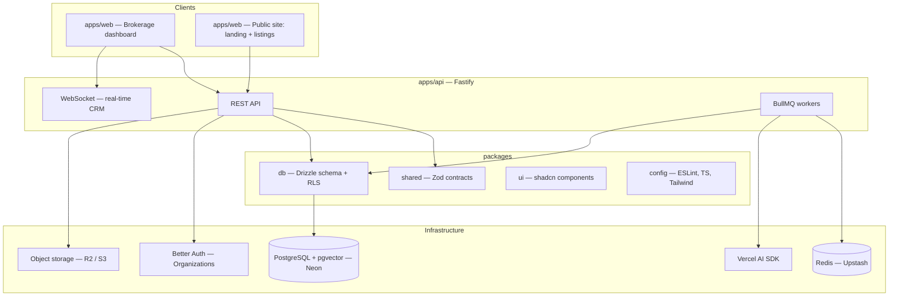

# PropAI OS

**An AI-powered Real Estate Operating System for US brokerages.**

**Status:** Phases 1–7 complete; **Phase 8 in progress** (DevOps, tests, deploy) — CI + Docker image builds, security hardening, unit tests, and a mobile-responsive pass on the landing site. The standalone marketplace app was consolidated into `apps/web` (its public listings live under the `(marketing)` route group). Latest tag `ui-v0.1.0`. Full breakdown: [docs/PROJECT-STATUS.md](docs/PROJECT-STATUS.md).

**Milestones:** [Foundation sign-off](docs/FOUNDATION-SIGNOFF.md) · [Backend checklist](docs/BACKEND-FOUNDATION-CHECKLIST.md) · tags `foundation-v0.1.0` · `ai-v0.1.0` · `ui-v0.1.0`

---

## Problem

US brokerages run on fragmented tools: a CRM here, a listing site there, spreadsheets for pipeline, and email for scheduling. Agents context-switch constantly; managers lack a single view of leads, listings, and performance; tenant data isolation is often enforced only in application code. Public marketplaces rarely feed the CRM in real time, and search stays keyword-based while buyers think in natural language. The result is slower deals, duplicated work, and weak visibility from first touch to close.

## Solution

PropAI OS is an AI-powered Real Estate Operating System built for US brokerages and their teams. It unifies multi-tenant CRM, deal pipeline, and a property marketplace in one platform, with semantic search that understands natural-language intent and analytics that turn activity into actionable insight. From lead capture to close, PropAI OS gives agents, brokers, and operators a single workspace to run the business—faster decisions, cleaner workflows, and intelligence embedded where work actually happens.

**Product scope:** SaaS dashboard (brokerages) · public marketplace (SEO) · API + workers · premium landing page.

**Language & market:** English only (en-US), built for the US real estate market.

---

## Live demo
> A public staging deploy lands in **Phase 8**. Until then, the full product runs
> locally end to end: dashboard, marketplace, and landing site.

```bash
pnpm dev:all      # API :3333 + web :3000 (dashboard + public site)
pnpm db:seed      # demo tenant (Summit Realty Group) with listings + leads
```

Local demo credentials (owner): `demo@propai.io` / `DemoPass123!` — see
[Demo data](#demo-data). Buyers can also self-register at `/account/register`
(a client-side demo session — see [Marketing site & accounts](#marketing-site--accounts)).

---

## Architecture

High-level system view (target monorepo):



### Target monorepo structure

```
propai-os/
├── apps/
│   ├── api/              # Fastify — REST + WebSocket + worker entry
│   └── web/              # Next.js — dashboard + public site (landing, listings)
├── packages/
│   ├── db/               # Drizzle schema, migrations, RLS policies
│   ├── shared/           # Zod contracts, enums, constants, helpers
│   ├── ui/               # Shared shadcn-based components
│   └── config/           # ESLint, TSConfig, Tailwind presets
├── docs/
│   ├── architecture.md
│   ├── adr/              # Architecture Decision Records
│   ├── demo-script.md
│   └── legal/            # Privacy, Terms, Fair Housing
├── docker/
├── docker-compose.yml
├── .github/workflows/
└── README.md
```

> **Note (as-built):** `packages/db` (Drizzle schema, 13 migrations, RLS policies)
> and `packages/shared` (Zod contracts) are live. Shared UI lives inside
> `apps/web` (shadcn/ui components) rather than a separate `packages/ui`. Object
> storage uses presigned uploads (`uploads` module).

---

## Tech stack

| Layer         | Technology                                                         |
| ------------- | ------------------------------------------------------------------ |
| Monorepo      | Turborepo, pnpm workspaces                                         |
| API           | Fastify, Zod validation, WebSocket                                 |
| Frontend      | Next.js, React, TypeScript, Tailwind CSS, shadcn/ui                |
| UI polish     | Inspira UI, GSAP, Lenis                                            |
| Database      | PostgreSQL (Neon), Drizzle ORM, Row-Level Security (RLS), pgvector |
| Auth          | Better Auth (Organizations)                                        |
| Jobs & cache  | BullMQ, Redis (Upstash)                                            |
| AI            | Vercel AI SDK (vision, embeddings, lead scoring)                   |
| Storage       | Cloudflare R2 or AWS S3 (presigned uploads)                        |
| Email         | Resend                                                             |
| Billing       | Stripe                                                             |
| Observability | Sentry                                                             |
| DevOps        | Docker, GitHub Actions, Vercel                                     |
| Testing       | Vitest, Playwright                                                 |

---

## Core capabilities (delivered — Phases 1–7)

- **Multi-tenant CRM** — organizations, roles (owner, manager, agent, viewer), PostgreSQL RLS, audit log
- **Pipeline** — Kanban stages with GSAP FLIP, real-time updates via WebSocket
- **Properties** — US fields (sq ft, USD, state/ZIP), photo uploads, map picker, AI-assisted listing generation
- **Public site & listings** — SSR listing/detail pages in `apps/web`, semantic query, lead capture into the CRM (`POST /public/leads`)
- **AI** — photo analysis (vision), pgvector semantic search, lead scoring, price estimates
- **Analytics & billing** — funnel metrics, agent leaderboard, CSV export, Stripe Free / Pro plans + feature gates
- **Marketing site** — cinematic landing, self-contained pages (listings, insights, about, contact, legal), buyer + agent accounts

See [docs/PROJECT-STATUS.md](docs/PROJECT-STATUS.md) for the day-by-day breakdown (Days 1–75 shipped; Days 76–90 = Phase 8).

---

## Monorepo structure

| Path | Package | Description |
| ---- | ------- | ----------- |
| `apps/web` | `@propai/web` | Brokerage SaaS dashboard + public site: landing & listings (Next.js) |
| `apps/api` | `@propai/api` | REST API entry (Fastify) — WebSocket/workers later |
| `packages/shared` | `@propai/shared` | Zod contracts, constants, shared types |
| `packages/db` | `@propai/db` | Drizzle schema, migrations, RLS (Phase 1) |
| `packages/config` | `@propai/config` | Shared TypeScript / tooling presets |

Managed with **pnpm workspaces** and **Turborepo**.

## What's built (Phases 1–7)

| Phase | Days | Delivered |
| ----- | ---- | --------- |
| **1 — Foundation** | 6–15 | PostgreSQL RLS multi-tenancy, Better Auth (organizations), Fastify API scaffold, audit logs, health/ready probes, Docker Compose dev |
| **2 — Properties** | 16–25 | Properties schema + CRUD API, presigned photo uploads, dashboard scaffold, list/create/edit UI, map picker, photo uploader |
| **3 — AI** | 26–35 | Vision image analysis, BullMQ + Redis, pgvector embeddings, "Generate with AI", semantic search API, lead scoring, price estimator |
| **4 — CRM & pipeline** | 36–45 | Leads schema + API, Kanban board with GSAP FLIP, real-time WebSocket sync, lead detail, visits scheduling, async confirmation emails, in-app notifications |
| **5 — Marketplace** | 46–55 | SSR listings + filters, detail pages (gallery, map, JSON-LD), lead capture, semantic search UI, clustered map, hybrid ranking, Redis cache, legal pages |
| **6 — Analytics & billing** | 56–65 | Analytics views (RLS `security_invoker`), dashboard (Recharts), CSV export, Stripe checkout/portal/webhooks, Free/Pro feature gates, onboarding, team management, branding |
| **7 — Landing & polish** | 66–75 | Cinematic landing (GSAP + Lenis), a11y pass, US localization, error boundaries, demo seed, performance pass, middleware→proxy |

**Post-Phase-7 landing revamp** (see [docs/tasks/PHASE-7-LANDING-REVAMP.md](docs/tasks/PHASE-7-LANDING-REVAMP.md)): the marketing site was made fully self-contained (its own `/listings`, `/insights`, `/about`, `/contact`, `/privacy`, `/terms` pages), a separate **buyer account** identity was added alongside the brokerage/agent login, and all auth screens moved to a premium split-screen layout.

Details: [docs/PROJECT-STATUS.md](docs/PROJECT-STATUS.md) · [docs/architecture.md](./docs/architecture.md)

---

## Getting started

**Prerequisites:** Node 20 LTS, pnpm 9+, Docker Desktop (Windows or macOS).

**Start here:** [docs/LOCAL-DEV.md](./docs/LOCAL-DEV.md) — fresh clone, Docker, migrate, `pnpm dev`, smoke tests, troubleshooting.

```bash
git clone https://github.com/MAGAIVERH/propai-os.git
cd propai-os
pnpm install
pnpm setup:local       # .env + Docker + migrations
# Set BETTER_AUTH_SECRET in .env (min 32 chars) if using auth
pnpm dev               # API :3333 + dashboard :3000
```

Verify (second terminal while `pnpm dev` is running):

```bash
curl -s http://localhost:3333/health
curl -s http://localhost:3333/ready    # expect HTTP 200
curl -s -o /dev/null -w "%{http_code}" http://localhost:3000
pnpm dev:smoke --spawn-api            # smoke without pnpm dev (spawns temp API)
# or: pnpm dev (terminal 1) + pnpm dev:smoke (terminal 2)
```

| Command | Apps |
| ------- | ---- |
| `pnpm dev` | API + web (default — Turbo filters `@propai/api` + `@propai/web`) |
| `pnpm dev:all` | All packages via Turbo (currently API + web) |
| `pnpm setup:local` | `.env` + `docker:up` + `db:migrate` |

Run a single app:

```bash
pnpm --filter @propai/web dev          # http://localhost:3000
pnpm --filter @propai/api dev          # http://localhost:3333
```

### Demo data

Seed a realistic US demo tenant (**Summit Realty Group**, Denver, CO) — owner,
agent, 6 listings, 12 leads across the pipeline, and scheduled visits:

```bash
pnpm db:seed     # requires Docker Postgres + pnpm db:migrate
```

Then sign in at http://localhost:3000 with the demo credentials. The default
password is **not** committed — override via env for anything shared:

```bash
DEMO_EMAIL=demo@propai.io DEMO_PASSWORD='your-strong-password' pnpm db:seed
```

Defaults (local only): `demo@propai.io` / `DemoPass123!` (owner) and
`john.martinez@summit-realty.demo` / `DemoPass123!` (agent). The seed is
idempotent — it skips if the demo tenant already exists. See
[docs/tasks/PHASE-7-DAY-73-MANUAL.md](./docs/tasks/PHASE-7-DAY-73-MANUAL.md).

Docker Compose optional API container: `docker compose --profile api up -d` (see `docker-compose.yml`).

Quality checks (also run in CI on every PR):

```bash
pnpm lint
pnpm typecheck
pnpm test:api    # requires Docker Postgres + pnpm db:migrate
```

See [docs/LOCAL-DEV.md](./docs/LOCAL-DEV.md) (onboarding) and [docs/dev-setup.md](./docs/dev-setup.md) (editor, cloud, auth tables).  
API scaffold (Day 12): [docs/api/api-scaffold.md](./docs/api/api-scaffold.md)

| App | Default URL |
| --- | ----------- |
| Web — dashboard + public site (`apps/web`) | http://localhost:3000 |
| API (`apps/api`) | http://localhost:3333 |

---

## AI features

PropAI OS ships four AI capabilities, each behind a feature flag so they can be enabled independently without affecting CI or demo environments that lack API keys.

| Feature | Flag | Model | Endpoint |
| ------- | ---- | ----- | -------- |
| Property image analysis | `ENABLE_AI_VISION` | Gemini Flash 2.0 | `POST /v1/ai/analyze-property-images` |
| Semantic property search | `ENABLE_SEMANTIC_SEARCH` | text-embedding-3-small | `GET /search/semantic` |
| Lead scoring | `ENABLE_AI_SCORING` | gpt-4o-mini | `POST /v1/ai/score-lead` |
| Price estimation | `ENABLE_AI_PRICING` | gpt-4o-mini | `POST /v1/ai/estimate-price` |

All flags default to `false`. When a flag is off, the API returns a deterministic mock response so the UI and tests work without real credentials.

### Enabling AI in local dev

```bash
# .env — add the keys for the features you want to test
GEMINI_API_KEY=...                # vision
OPENAI_API_KEY=...                # embeddings, scoring, pricing

ENABLE_AI_VISION=true             # async Gemini via BullMQ
ENABLE_SEMANTIC_SEARCH=true       # pgvector cosine search
ENABLE_AI_SCORING=true            # gpt-4o-mini lead scoring
ENABLE_AI_PRICING=true            # gpt-4o-mini price estimator
```

Redis (Upstash or local Docker) is required when `ENABLE_AI_VISION=true` or `ENABLE_SEMANTIC_SEARCH=true` (BullMQ queues). All four flags can run with local Docker (`docker compose up -d`).

### Cost summary

| Feature | Model | Est. cost per operation |
| ------- | ----- | ----------------------- |
| Image analysis (10 photos) | Gemini Flash 2.0 | ~$0.001 |
| Embedding (property publish) | text-embedding-3-small | ~$0.000004 |
| Semantic search query | text-embedding-3-small | ~$0.000002 |
| Lead scoring | gpt-4o-mini | ~$0.0001 |
| Price estimation | gpt-4o-mini | ~$0.0002 |

Rate limits: image analysis is capped at **10 analyses per tenant per hour** to prevent runaway costs.

See [ADR 006](docs/adr/006-ai-vision-listings.md) (vision) and [ADR 007](docs/adr/007-semantic-search-pgvector.md) (semantic search) for architecture and trade-off details.

---

## Documentation

| Document               | Description                                             |
| ---------------------- | ------------------------------------------------------- |
| `docs/PROJECT-STATUS.md` | **Where the project stands** — per-phase status, Days 1–90 |
| `docs/tasks/` | **Per-day delivery notes** — `PHASE-X-DAY-NN.md` for Days 1–75 |
| `docs/tasks/PHASE-7-LANDING-REVAMP.md` | Post-Phase-7 self-contained landing + buyer accounts |
| `docs/MARKETPLACE-CHECKLIST.md` | Phase 5 marketplace sign-off |
| `docs/ANALYTICS-BILLING-CHECKLIST.md` | Phase 6 analytics + billing sign-off |
| `docs/LOCAL-DEV.md`    | **Fresh clone** — Docker, migrate, dev, smoke, troubleshooting |
| `docs/FOUNDATION-SIGNOFF.md` | **Executive summary** — what v0.1 proved / excluded |
| `docs/BACKEND-FOUNDATION-CHECKLIST.md` | **Phase 1 sign-off** — Days 6–15, pre-tag verification |
| `docs/releases/foundation-v0.1.0.md` | **Release notes** — tag `foundation-v0.1.0` |
| `docs/adr/README.md` | **ADR index** — 001 RLS, 002 identity, 003 audit, 006 AI vision, 007 semantic search |
| `docs/PHASE-2-PLAN.md` | **Properties** — Days 16–25 roadmap |
| `docs/REQUIREMENTS.md` | **v1 product scope** — flows, AI, fields, MVP lock      |
| `docs/architecture.md` | Actors, brokerage flow, **RLS diagrams** (Foundation v0.1) |
| `docs/api/api-scaffold.md` | Fastify layout, `/health` vs `/ready`, K8s probes   |
| `docs/adr/`            | Architecture Decision Records                           |
| `docs/legal/`          | [Privacy, Terms, Fair Housing](./docs/legal/) (draft)   |

---

## Public listings & marketplace API (Phase 5)

> **Consolidated in Phase 8:** the standalone `apps/marketplace` app (`:3001`)
> was removed and its public browsing folded into `apps/web` (`/listings`). The
> public API surface below (`/public/*`, `/search/semantic`) is unchanged and
> still powers the listing pages and lead capture. The rest of this section
> documents what Phase 5 shipped.

The public, SEO-first listings experience lets visitors browse and convert into
CRM leads — no auth required.

- **SSR listing grid** with URL-bound filters (`/properties?city=Austin&beds=2`) and cursor "Load more".
- **Detail pages** with a photo gallery, location map, `RealEstateListing` JSON-LD, and Open Graph/Twitter cards.
- **AI search** (`/search`) — describe a home in plain English; results ranked by a hybrid score (semantic 40% + price 20% + distance 20% + recency 20%, see [ADR 008](./docs/adr/008-hybrid-search-ranking.md)) with sort options. Degrades gracefully when the flag is off.
- **Clustered map** (`/properties/map`) with list ↔ map selection sync.
- **Lead capture** — `POST /public/leads` with IP rate limiting (Redis, fail-open), a honeypot, and a live `lead:created` push so the lead lands on the dashboard Kanban within seconds.
- **Fair Housing** disclaimer site-wide, `/privacy` + `/terms`, and a cookie notice.

**Performance — Redis listing cache (Day 53):** `GET /public/properties`
responses are cached for 5 minutes and tagged with an `X-Cache: HIT|MISS`
header; a cache `HIT` skips the DB round-trip entirely (single-digit ms vs the
live query) and is invalidated on any property create/update/delete. See
[docs/tasks/PHASE-5-DAY-53-MANUAL.md](./docs/tasks/PHASE-5-DAY-53-MANUAL.md) to
measure before/after.

Full sign-off: [docs/MARKETPLACE-CHECKLIST.md](./docs/MARKETPLACE-CHECKLIST.md).

---

## Marketing site & accounts

The brokerage's marketing site (`apps/web`, the `(marketing)` route group) is a
premium, **self-contained** experience — every link resolves to a real page in
the same app, so it runs on `pnpm dev` alone:

- **Landing** — cinematic photographic hero (GSAP + Lenis), featured listings,
  an interactive services rail, an editorial testimonials marquee, markets,
  insights, and FAQ.
- **Pages** — `/listings` (+ `/listings/[slug]` detail), `/insights`
  (+ `/insights/[slug]` article), `/about`, `/contact`, `/privacy`, `/terms`.

**Two separate identities** (see [PHASE-7-LANDING-REVAMP.md](docs/tasks/PHASE-7-LANDING-REVAMP.md)):

| Identity | Auth | Entry | Lands on |
| -------- | ---- | ----- | -------- |
| **Brokerage / agent** | Real (Better Auth) | "Agent login" → `/login` | Dashboard |
| **Buyer / renter** | Client-side demo session | "Sign in" → `/account/login` | Stays on the site; one-click tour requests |

Brokerage self-serve signup is intentionally discreet (a link on `/login`, not a
public CTA); buyer CTAs like "Book a consultation" go to the `/contact` lead form.
All four auth screens share a premium split-screen layout.

---

## License

TBD.

---

## Status

**Phases 1–7 complete** (Days 1–75) — multi-tenant backend, AI, real-time CRM,
public marketplace, analytics & billing, and a premium landing site with buyer +
agent accounts. Latest tag `ui-v0.1.0`.

**Phase 8 in progress (Days 76–90):** DevOps, tests, and launch — staging deploy
config, Docker production image + CI build, security hardening, unit tests
(Day 82), and a mobile-responsive pass on the landing site with the unused
`apps/marketplace` app removed and consolidated into `apps/web` (Day 83). Still
ahead: staging/production deploys (Vercel + Railway/Neon/Upstash), Sentry
observability, Playwright suites, and the `v1.0.0` release.

Full breakdown and per-phase status: [docs/PROJECT-STATUS.md](docs/PROJECT-STATUS.md).
See [docs/architecture.md](./docs/architecture.md) for actors, the RLS data plane,
and the brokerage flow.
