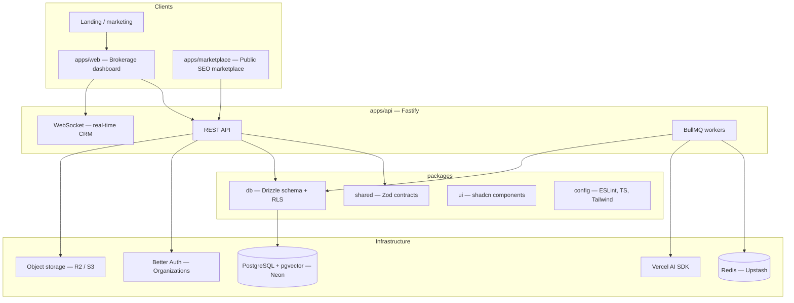

# PropAI OS

**An AI-powered Real Estate Operating System for US brokerages.**

---

## Problem

US brokerages run on fragmented tools: a CRM here, a listing site there, spreadsheets for pipeline, and email for scheduling. Agents context-switch constantly; managers lack a single view of leads, listings, and performance; tenant data isolation is often enforced only in application code. Public marketplaces rarely feed the CRM in real time, and search stays keyword-based while buyers think in natural language. The result is slower deals, duplicated work, and weak visibility from first touch to close.

## Solution

PropAI OS is an AI-powered Real Estate Operating System built for US brokerages and their teams. It unifies multi-tenant CRM, deal pipeline, and a property marketplace in one platform, with semantic search that understands natural-language intent and analytics that turn activity into actionable insight. From lead capture to close, PropAI OS gives agents, brokers, and operators a single workspace to run the business—faster decisions, cleaner workflows, and intelligence embedded where work actually happens.

**Product scope:** SaaS dashboard (brokerages) · public marketplace (SEO) · API + workers · premium landing page.

**Language & market:** English only (en-US), built for the US real estate market.

---

## Live demo

**URL:** [https://demo.propai-os.com](https://demo.propai-os.com) _(TBD — placeholder)_

Demo credentials will be documented here once staging is deployed.

---

## Architecture

High-level system view (target monorepo):



### Target monorepo structure

```
propai-os/
├── apps/
│   ├── api/              # Fastify — REST + WebSocket + worker entry
│   ├── web/              # Next.js — SaaS dashboard (brokerages)
│   └── marketplace/      # Next.js — public property search (SEO/SSR)
├── packages/
│   ├── db/               # Drizzle schema, migrations, RLS policies
│   ├── shared/           # Zod contracts, enums, constants, helpers
│   ├── ui/               # Shared shadcn-based components
│   └── config/           # ESLint, TSConfig, Tailwind presets
├── docs/
│   ├── architecture.md
│   ├── adr/              # Architecture Decision Records
│   ├── demo-script.md
│   └── legal/            # Privacy, Terms, Fair Housing
├── docker/
├── docker-compose.yml
├── .github/workflows/
└── README.md
```

> **Note:** Monorepo scaffold is active. `packages/ui` and full Drizzle/RLS in `packages/db` ship in Phase 1 (Days 6+).

---

## Tech stack

| Layer         | Technology                                                         |
| ------------- | ------------------------------------------------------------------ |
| Monorepo      | Turborepo, pnpm workspaces                                         |
| API           | Fastify, Zod validation, WebSocket                                 |
| Frontend      | Next.js, React, TypeScript, Tailwind CSS, shadcn/ui                |
| UI polish     | Inspira UI, GSAP, Lenis                                            |
| Database      | PostgreSQL (Neon), Drizzle ORM, Row-Level Security (RLS), pgvector |
| Auth          | Better Auth (Organizations)                                        |
| Jobs & cache  | BullMQ, Redis (Upstash)                                            |
| AI            | Vercel AI SDK (vision, embeddings, lead scoring)                   |
| Storage       | Cloudflare R2 or AWS S3 (presigned uploads)                        |
| Email         | Resend                                                             |
| Billing       | Stripe                                                             |
| Observability | Sentry                                                             |
| DevOps        | Docker, GitHub Actions, Vercel                                     |
| Testing       | Vitest, Playwright                                                 |

---

## Core capabilities (roadmap)

- **Multi-tenant CRM** — organizations, roles (owner, manager, agent, viewer), audit log
- **Pipeline** — Kanban stages, real-time updates via WebSocket
- **Properties** — US fields (sq ft, USD, state/ZIP), photos, map, AI-assisted listing generation
- **Marketplace** — SSR property search, semantic query, lead capture into CRM
- **AI** — photo analysis, pgvector semantic search, lead scoring, price estimates
- **Analytics & billing** — funnel metrics, CSV export, Stripe Free / Pro plans

---

## Monorepo structure

| Path | Package | Description |
| ---- | ------- | ----------- |
| `apps/web` | `@propai/web` | Brokerage SaaS dashboard (Next.js) |
| `apps/marketplace` | `@propai/marketplace` | Public property search (Next.js, SEO) |
| `apps/api` | `@propai/api` | REST API entry (Fastify) — WebSocket/workers later |
| `packages/shared` | `@propai/shared` | Zod contracts, constants, shared types |
| `packages/db` | `@propai/db` | Drizzle schema, migrations, RLS (Phase 1) |
| `packages/config` | `@propai/config` | Shared TypeScript / tooling presets |

Managed with **pnpm workspaces** and **Turborepo**.

## Getting started

**Prerequisites:** Node 20 LTS, pnpm 9+, Docker Desktop (Windows or macOS).

**Full guide:** [docs/LOCAL-DEV.md](./docs/LOCAL-DEV.md) — fresh clone, troubleshooting, Day 14 checklist.

```bash
git clone https://github.com/MAGAIVERH/propai-os.git
cd propai-os
pnpm install
pnpm setup:local       # .env + Docker + migrations
# Set BETTER_AUTH_SECRET in .env (min 32 chars) if using auth
pnpm dev               # API :3333 + dashboard :3000
```

Verify (second terminal while `pnpm dev` is running):

```bash
curl -s http://localhost:3333/health
curl -s http://localhost:3333/ready    # expect HTTP 200
curl -s -o /dev/null -w "%{http_code}" http://localhost:3000
pnpm dev:smoke                        # optional PASS/FAIL regression
```

| Command | Apps |
| ------- | ---- |
| `pnpm dev` | API + dashboard (default — Turbo filters `@propai/api` + `@propai/web`) |
| `pnpm dev:all` | API + dashboard + marketplace (`:3001`) |
| `pnpm setup:local` | `.env` + `docker:up` + `db:migrate` |

Run a single app:

```bash
pnpm --filter @propai/web dev          # http://localhost:3000
pnpm --filter @propai/marketplace dev  # http://localhost:3001
pnpm --filter @propai/api dev          # http://localhost:3333
```

Docker Compose optional API container: `docker compose --profile api up -d` (see `docker-compose.yml`).

Quality checks (also run in CI on every PR):

```bash
pnpm lint
pnpm typecheck
pnpm test:api    # requires Docker Postgres + pnpm db:migrate
```

See [docs/LOCAL-DEV.md](./docs/LOCAL-DEV.md) (onboarding) and [docs/dev-setup.md](./docs/dev-setup.md) (editor, cloud, auth tables).  
API scaffold (Day 12): [docs/api/api-scaffold.md](./docs/api/api-scaffold.md)

| App | Default URL |
| --- | ----------- |
| Dashboard (`apps/web`) | http://localhost:3000 |
| Marketplace (`apps/marketplace`) | http://localhost:3001 |
| API (`apps/api`) | http://localhost:3333 |

---

## Documentation

| Document               | Description                                             |
| ---------------------- | ------------------------------------------------------- |
| `docs/LOCAL-DEV.md`    | **Fresh clone** — Docker, migrate, dev, smoke, troubleshooting |
| `docs/REQUIREMENTS.md` | **v1 product scope** — flows, AI, fields, MVP lock      |
| `docs/architecture.md` | Actors, brokerage flow, diagrams, links to requirements |
| `docs/api/api-scaffold.md` | Fastify layout, `/health` vs `/ready`, K8s probes   |
| `docs/adr/`            | Architecture Decision Records                           |
| `docs/legal/`          | [Privacy, Terms, Fair Housing](./docs/legal/) (draft)   |

---

## License

TBD.

---

## Status

**Early development** — Turborepo monorepo, Docker Compose, and `apps/web` dashboard active. See [docs/architecture.md](./docs/architecture.md) for actors and brokerage flow.
