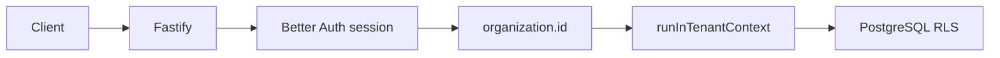

# Foundation v0.1 — Executive sign-off

**Tag:** [`foundation-v0.1.0`](https://github.com/MAGAIVERH/propai-os/releases/tag/foundation-v0.1.0)  
**Date:** 2026-06-04  
**Audience:** Engineering leads, portfolio / interview reviewers

One-page summary of what Phase 1 proved, what ships in v0.1, and what intentionally waits for later phases.

---

## What we proved

| Capability | Evidence |
| ---------- | -------- |
| **Tenant isolation at the database** | PostgreSQL RLS on `test_items` and `audit_logs`; `pnpm db:rls-test` (8/8); ADR [001](./adr/001-rls-multi-tenancy.md) |
| **Session → tenant mapping** | Better Auth `activeOrganizationId` → `organization.id`; Fastify `tenant-context` + `runInTenantContext` |
| **Auth POC (brokerage)** | Two-org sign-up, invite/accept, protected `/v1/*`; [AUTH-POC-FEEDBACK](./AUTH-POC-FEEDBACK.md) — **GO** |
| **API operations** | `GET /health`, `GET /ready`; Fastify modules/plugins scaffold |
| **Audit trail** | Append-only `audit_logs`, RLS, `GET /v1/audit-logs` (owner/manager); ADR [003](./adr/003-audit-logs.md) |
| **Reproducible local dev** | Docker Compose, `pnpm setup:local`, `pnpm dev`, pre-tag gate green — [checklist](./BACKEND-FOUNDATION-CHECKLIST.md#pre-tag-verification-t15-4-release-gate) |

**Automated proof (2026-06-04):** `pnpm test:api` **30/30**, `pnpm test:shared` **8/8**, `pnpm auth:poc` **6/6**, CI `test-api` job required on PRs.

---

## What is in Foundation v0.1

- Monorepo: `@propai/db`, `@propai/shared`, `@propai/api`, `@propai/web` (dashboard shell)
- Drizzle migrations `0000`–`0006`, `propai_app` DB role
- Better Auth + organization plugin (sign-up, invite, session cookies)
- Demo routes: `/v1/test-items`, `/v1/audit-logs`, `/v1/organization/me`
- Documentation: architecture RLS diagrams, ADRs 001–003, [LOCAL-DEV](./LOCAL-DEV.md), [Phase 2 plan](./PHASE-2-PLAN.md)

---

## What is not in v0.1 (by design)

| Area | Planned in |
| ---- | ---------- |
| **Properties** CRUD, photos, map UI | Phase 2 — [PHASE-2-PLAN.md](./PHASE-2-PLAN.md) |
| **CRM / pipeline / leads** | Later phases |
| **Marketplace** lead sync + semantic search | Later phases |
| **Stripe billing** | Later phases |
| **Dashboard login UI** (`apps/web` wired to session) | Phase 2+ (API auth works; web login not productized) |
| **Resend email**, production **Neon** sign-off | Staging/production hardening |
| **AI workers** (vision, embeddings, scoring) | Phase 3+ |

---

## Architecture snapshot

Full diagrams: [architecture.md — Multi-tenancy & RLS](./architecture.md#multi-tenancy--row-level-security-foundation-v01)

---

## Next step

**Phase 2 — Properties (Days 16–25):** schema + RLS → CRUD API → R2 uploads → dashboard UI.

Kickoff: [PHASE-2-PLAN.md](./PHASE-2-PLAN.md) · ADR index: [adr/README.md](./adr/README.md)

---

## References

| Link | Description |
| ---- | ----------- |
| [BACKEND-FOUNDATION-CHECKLIST.md](./BACKEND-FOUNDATION-CHECKLIST.md) | Day-by-day checklist (100% complete) |
| [releases/foundation-v0.1.0.md](./releases/foundation-v0.1.0.md) | Release notes |
| [AUTH-POC-FEEDBACK.md](./AUTH-POC-FEEDBACK.md) | Auth GO record |
