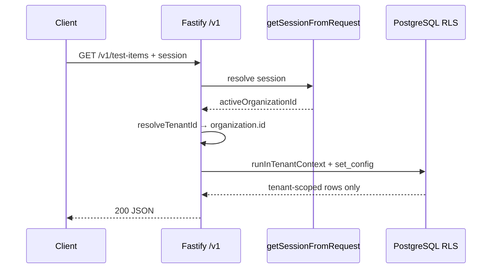

# ADR 001: Row-Level Security (RLS) for multi-tenancy

**Status:** Accepted (POC validated)  
**Date:** 2026-06-02  
**Context:** Phase 1 Day 7 — prove tenant A cannot read tenant B data at the PostgreSQL layer.

---

## Decision

PropAI OS will isolate tenant-owned business data using:

1. **`tenant_id UUID NOT NULL`** on every business table (FK to `organization.id`).
2. **PostgreSQL RLS** with a session variable: `app.current_tenant`.
3. **Application code** sets tenant scope per request/transaction via `set_config('app.current_tenant', …, true)` (transaction-local).
4. **Non-superuser DB role** for runtime queries (`propai_app` locally; dedicated Neon role in cloud).

POC table: `test_items`. Production CRM/listing tables follow the same pattern in later phases.

---

## RLS policy (POC)

```sql
ALTER TABLE test_items ENABLE ROW LEVEL SECURITY;
ALTER TABLE test_items FORCE ROW LEVEL SECURITY;

CREATE POLICY test_items_tenant_isolation ON test_items
  FOR ALL
  TO PUBLIC
  USING (tenant_id = nullif(current_setting('app.current_tenant', true), '')::uuid)
  WITH CHECK (tenant_id = nullif(current_setting('app.current_tenant', true), '')::uuid);
```

**Why `nullif(..., '')`?** When `app.current_tenant` is unset, PostgreSQL can return an empty string. Casting `''::uuid` throws `22P02`. `nullif` yields `NULL`, the comparison becomes unknown, and the row is hidden (zero rows) instead of erroring.

**Why `FORCE ROW LEVEL SECURITY`?** Table owners bypass RLS by default. `FORCE` ensures policies apply even to the owning role.

**Why a non-superuser role?** Superusers **always** bypass RLS, regardless of `FORCE`. Local Docker user `propai` is a superuser — RLS POC tests use `propai_app` instead.

---

## Session tenant context

SQL helper (migration `0001`):

```sql
SELECT app.set_current_tenant('00000000-0000-0000-0000-000000000001'::uuid);
-- wraps: set_config('app.current_tenant', uuid::text, true)
```

TypeScript (`@propai/db`):

```typescript
import { withTenantContext, getAppDb } from "@propai/db";

await withTenantContext(tenantId, async (tx) => {
  return tx.select().from(testItems);
});
```

Runtime connections must use `getAppDb()` / `DATABASE_APP_URL` (non-superuser). Admin/migrations use `getDb()` / `DATABASE_URL`.

---

## POC test procedure

Environment: Docker Postgres (`pnpm docker:up`), migrations applied (`pnpm db:migrate`).

```bash
pnpm db:rls-test
```

Script: `packages/db/scripts/rls-poc-test.ts`

1. Truncate `test_items` and `tenants` (admin role).
2. Insert two tenants (admin role).
3. Insert two `test_items` rows per tenant (app role + tenant context).
4. Assert isolation (app role).

---

## Test results (2026-06-02, local Docker)

| Check | Expected | Result |
| ----- | -------- | ------ |
| Tenant A sees only own rows | 2 rows, all `tenant_id = A` | **PASS** (2 rows) |
| Tenant B sees only own rows | 2 rows, all `tenant_id = B` | **PASS** (2 rows) |
| No tenant context | 0 rows | **PASS** (0 rows) |
| Tenant A filter on tenant B id | 0 rows | **PASS** (0 rows) |

**Conclusion:** Tenant isolation holds at the database layer when using the app role and `app.current_tenant`.

---

## API integration (Day 8)

### Session → tenant mapping

| Layer | Responsibility |
| ----- | -------------- |
| Better Auth session | `session.activeOrganizationId` (organization plugin) |
| `resolveTenantId()` | Maps `activeOrganizationId` → `organization.id` (tenant root for RLS) |
| Fastify middleware | Sets `request.tenantId` from session only — never from request body/query |
| Route handlers | All tenant DB work via `runInTenantContext(request.tenantId, …)` |

Better Auth is configured in `apps/api/src/modules/auth/better-auth.ts` (organization plugin). Dashboard login UI in `apps/web` is deferred; integration tests use `Authorization: Bearer mock-session:<org-uuid>` when `NODE_ENV=test`.

### Request flow



Unauthenticated `/v1/*` requests return **401**; session without valid organization returns **403**. `/health` stays public.

### Automated API tests

Requires Docker Postgres (`pnpm docker:up`) and migrations (`pnpm db:migrate`).

```bash
pnpm test:api
# or
pnpm --filter @propai/api test
```

Tests (`apps/api/src/test-items.integration.test.ts`):

- Seed two tenants + `test_items` rows (admin db)
- Tenant A session sees A only; tenant B sees B only
- No session → 401
- Unknown organization → 403
- Raw `getAppDb()` query without context → 0 rows

### API test results (2026-06-02, local Docker)

| Check | Result |
| ----- | ------ |
| Unauthenticated GET `/v1/test-items` | **PASS** (401) |
| Tenant A isolation | **PASS** (2 rows) |
| Tenant B isolation | **PASS** (2 rows) |
| Unknown organization | **PASS** (403) |
| POST scoped to session tenant | **PASS** |
| App db without tenant context | **PASS** (0 rows) |

---

## Consequences

### Positive

- Defense in depth: even if API forgets a `WHERE tenant_id = …`, RLS still filters rows.
- Aligns with product docs (`organization_id` / tenant boundary in `docs/REQUIREMENTS.md`).

### Negative / follow-ups

- Every business table needs `tenant_id`, RLS enabled, and policies (Day 8+).
- ~~API middleware must call `withTenantContext` (or equivalent) on every tenant-scoped request.~~ **Done (Day 8)** — Fastify middleware + `runInTenantContext`.
- ~~Better Auth database adapter + login UI in `apps/web` (Day 9+).~~ **Adapter + schema done (Day 9)** — login UI still deferred.
- Neon/production: create a non-superuser role; never run app queries as superuser.
- Auth tables (`user`, `session`, etc.) stay outside RLS; business rows use `tenant_id` → `organization.id`.

---

## References

- `packages/db/drizzle/0001_thick_goblin_queen.sql` — `test_items` + RLS
- `packages/db/drizzle/0002_propai_app_role.sql` — `propai_app` role
- `packages/db/drizzle/0004_identity_organizations.sql` — tenants → organization + Better Auth tables
- `packages/db/drizzle/0006_audit_logs.sql` — `audit_logs` + RLS (see [ADR 003](./003-audit-logs.md))
- `packages/db/src/tenant-context.ts` — TypeScript helper
- `apps/api/src/plugins/tenant-context.ts` — Fastify middleware
- `apps/api/src/modules/auth/resolve-tenant-id.ts` — session → `organization.id`
- `apps/api/src/modules/auth/better-auth.ts` — Better Auth config
- [ADR 002 — Identity & roles](./002-identity-organizations-roles.md)
- [ADR index](./README.md)
- [PostgreSQL RLS documentation](https://www.postgresql.org/docs/current/ddl-rowsecurity.html)
