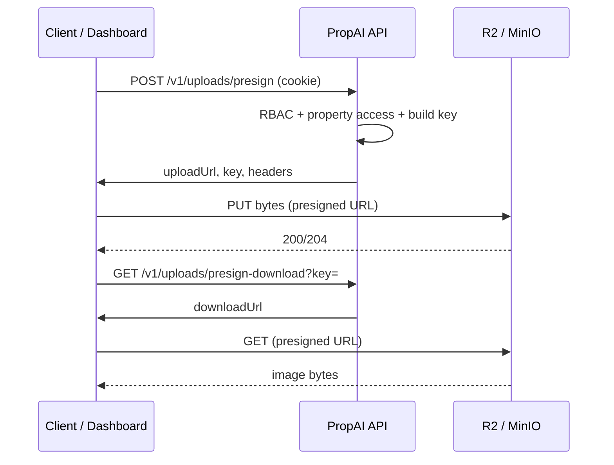

# ADR 005: Object storage (R2) for listing photos

**Status:** Accepted  
**Date:** 2026-06-05  
**Context:** Phase 2 Day 18 — secure property photo upload/download via presigned URLs; binary never flows through the API.

---

## Decision

Property photos are stored in a **private** S3-compatible bucket (**Cloudflare R2** in production, **MinIO** locally). The API issues short-lived presigned URLs; clients upload and download **directly** to/from object storage.

| Topic | Choice |
| ----- | ------ |
| SDK | `@aws-sdk/client-s3` + `@aws-sdk/s3-request-presigner` |
| Bucket ACL | **Private** — no public read, no anonymous listing |
| Access pattern | Presigned PUT (upload) and GET (download) only |
| Max object size | **10 MB** — validated before presign (`contentLength` in request body) |
| Content-Type | **`image/*` only** — reject non-image types before presign |
| Presign TTL | Default **900s** (15 min) — override via `S3_PRESIGN_EXPIRES_SECONDS` |
| DB persistence | **Deferred** — `property_images` rows confirmed in Day 19+ flow |

### Object key format (strict)

```
tenant/{tenantId}/property/{propertyId}/{uuid}.{ext}
```

| Segment | Source |
| ------- | ------ |
| `tenantId` | Server-side from `request.tenantId` — never trust client |
| `propertyId` | Request body (`POST presign`) or parsed from key (`GET presign-download`) |
| `uuid` | `randomUUID()` at presign time |
| `ext` | Derived from `contentType` (`image/jpeg` → `.jpg`, `image/png` → `.png`, `image/webp` → `.webp`) |

Validation regex (download / parse):

```text
^tenant/[0-9a-f-]{36}/property/[0-9a-f-]{36}/[0-9a-f-]{36}\.(jpg|jpeg|png|webp)$
```

Reject path traversal (`..`), leading `/`, wrong segment count, and keys whose tenant prefix does not match the session tenant.

### API endpoints

| Method | Path | RBAC | Purpose |
| ------ | ---- | ---- | ------- |
| `POST` | `/v1/uploads/presign` | `properties:write` | Issue presigned PUT URL + object key |
| `GET` | `/v1/uploads/presign-download?key=` | `properties:write` | Issue presigned GET URL for existing key |

Both routes require session cookie + active organization (tenant context). Property must exist, not soft-deleted, and pass agent scope via `assertPropertyAccess` (same rules as Day 17 properties CRUD).

**Upload request body:**

```json
{
  "propertyId": "uuid",
  "contentType": "image/jpeg",
  "contentLength": 12345
}
```

**Upload response:**

```json
{
  "uploadUrl": "https://…",
  "key": "tenant/…/property/…/….jpg",
  "expiresAt": "2026-06-05T12:15:00.000Z",
  "headers": { "Content-Type": "image/jpeg" }
}
```

The presigned PUT signature binds `Content-Type` — the client **must** send the same header on PUT.

**Download response:**

```json
{
  "downloadUrl": "https://…",
  "expiresAt": "2026-06-05T12:15:00.000Z"
}
```

If any required `S3_*` env var is missing, both routes return **503** (`Object storage is not configured.`).

### Environment variables

| Variable | Required | Notes |
| -------- | -------- | ----- |
| `S3_ENDPOINT` | Yes | R2: `https://<ACCOUNT_ID>.r2.cloudflarestorage.com`; MinIO: `http://localhost:9000` |
| `S3_REGION` | Yes | `auto` (R2) or `us-east-1` (MinIO) |
| `S3_BUCKET` | Yes | e.g. `propai-uploads` |
| `S3_ACCESS_KEY_ID` | Yes | R2 API token or MinIO access key |
| `S3_SECRET_ACCESS_KEY` | Yes | Secret (never commit) |
| `S3_PRESIGN_EXPIRES_SECONDS` | No | Default `900` |

S3 client uses `forcePathStyle: true` for R2/MinIO compatibility.

### CORS (browser uploads)

The dashboard uploads directly to the bucket via presigned PUT. CORS must allow the dashboard origin — **CORS does not make the bucket public**.

```json
[
  {
    "AllowedOrigins": ["http://localhost:3000", "https://your-dashboard.vercel.app"],
    "AllowedMethods": ["PUT", "GET", "HEAD"],
    "AllowedHeaders": ["Content-Type", "Content-Length"],
    "ExposeHeaders": ["ETag"],
    "MaxAgeSeconds": 3600
  }
]
```

See [object-storage.md](../infra/object-storage.md) for R2 and MinIO setup.

### Flow



---

## Security

| Check | Implementation |
| ----- | -------------- |
| Tenant isolation | Key prefix must match session `tenantId` |
| No path traversal | Reject `..`, invalid segment layout |
| Property ownership | Agent scope via `assertPropertyAccess` |
| Content binding | Presigned PUT signed with fixed `Content-Type` |
| Size limit | Reject `contentLength > 10 MB` before presign |
| Private bucket | No public read; download only via presigned GET |
| Short TTL | 15 min default |

Cross-tenant or invalid keys on download return **404** (not 403) to avoid leaking object existence.

---

## Explicitly deferred (not Day 18)

| Item | Target |
| ---- | ------ |
| `POST /v1/properties/:id/photos/confirm` + `property_images` row | Day 19+ |
| Audit `photo.uploaded` | Day 19+ |
| Photo reorder / delete API | Later |
| Image resize / virus scan | v2 |
| CDN public URLs for marketplace | Later phase |

---

## Consequences

### Positive

- API never handles binary payloads — lower latency, memory, and attack surface.
- Private bucket + presigned URLs align with multi-tenant isolation.
- S3-compatible SDK works for R2 (prod) and MinIO (local) with one code path.
- Shared Zod contracts in `@propai/shared` ready for Day 25 web upload UI.

### Follow-ups

- Day 19+: confirm upload → persist `property_images`, audit event.
- Wire gallery component to presign flow in dashboard (Day 25).
- Consider lifecycle rules (orphan object cleanup) if confirm flow is delayed.

---

## References

- `apps/api/src/modules/uploads/` — routes module
- `apps/api/src/lib/s3-client.ts` — presign helpers
- `apps/api/src/lib/object-key.ts` — key builder / tenant validation
- `apps/api/src/lib/storage-config.ts` — env parsing
- `packages/shared/src/uploads/presign.ts` — Zod contracts
- [object-storage.md](../infra/object-storage.md) — infra runbook
- [upload-curl.md](../api/upload-curl.md) — manual curl flow
- [PHASE-2-DAY-18.md](../tasks/PHASE-2-DAY-18.md)
- [ADR 004 — Properties schema](./004-properties-schema.md)
