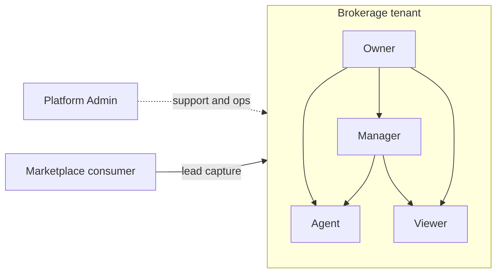
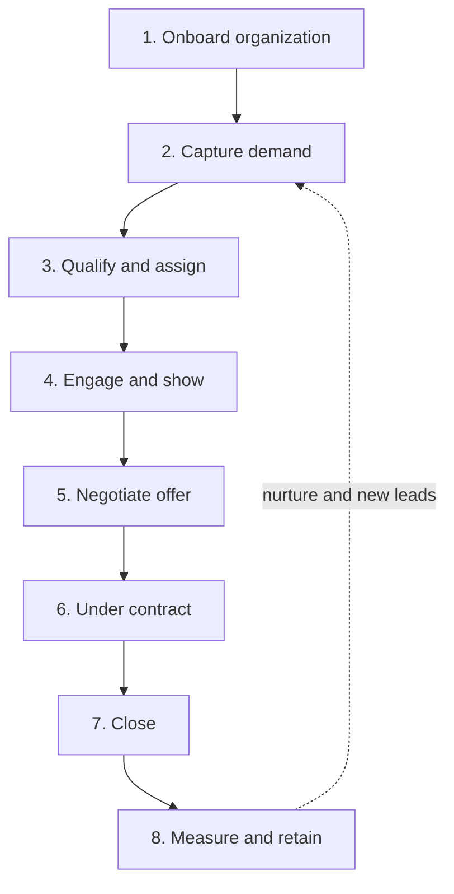

# PropAI OS — Architecture

Product architecture for the US brokerage SaaS platform. This document defines **who** uses the system and **how** a typical brokerage runs deals end to end. Technical stack details live in the root [README](../README.md).

---

## Actors

PropAI OS serves a multi-tenant B2B product (brokerages) plus a public marketplace (consumers). Five primary actors interact with the platform:

| Actor              | Scope                            | Primary goals                                                                                                                                                                                        |
| ------------------ | -------------------------------- | ---------------------------------------------------------------------------------------------------------------------------------------------------------------------------------------------------- |
| **Platform Admin** | Cross-tenant (PropAI operations) | Operate the SaaS: tenant health, support escalations, feature flags, compliance tooling, and incident response. Does not access brokerage deal data except under audited support flows.              |
| **Owner**          | Single brokerage (organization)  | Own the account: billing (Stripe), plan limits, invite/remove members, brokerage profile, integrations, and org-wide settings. Full visibility across CRM, pipeline, listings, and analytics.        |
| **Manager**        | Single brokerage                 | Run the team: assign and reassign leads, manage pipeline stages, approve listings, monitor agent activity, and read org-level reports. May manage users below Owner except billing and org deletion. |
| **Agent**          | Single brokerage                 | Day-to-day production: work assigned leads, log activities, schedule showings, create and edit listings, upload media, and move deals through pipeline stages they own or are assigned to.           |
| **Viewer**         | Single brokerage                 | Read-only access for assistants, transaction coordinators, or compliance review: view leads, properties, pipeline, and reports without mutating records.                                             |

### Actor relationships

**Marketplace consumers** (buyers and renters) are not brokerage members. They search public listings, save favorites, and submit lead forms that create or enrich CRM records inside the brokerage tenant via the marketplace app and API.

### Authorization model (target)

- **Tenant boundary:** every business row is scoped to `organization_id`; Row-Level Security (RLS) enforces isolation in PostgreSQL.
- **Role hierarchy:** Owner ⊃ Manager ⊃ Agent; Viewer is parallel read-only.
- **Defense in depth:** API and dashboard always pass tenant context; never rely on UI alone for isolation.

---

## Brokerage flow

Eight steps describe the default lifecycle from onboarding a brokerage to measurable outcomes after close. Steps map to CRM, pipeline, marketplace, and analytics modules.

| Step  | Name                     | What happens                                                                                                                                                                            | Primary actors           |
| ----- | ------------------------ | --------------------------------------------------------------------------------------------------------------------------------------------------------------------------------------- | ------------------------ |
| **1** | **Onboard organization** | Brokerage signs up, selects plan, completes profile (license, markets, branding). Owner invites Managers and Agents. Demo or production tenant is provisioned with RLS policies active. | Owner, Platform Admin    |
| **2** | **Capture demand**       | Leads enter via public marketplace forms, manual CRM entry, CSV import, or integrations. Source, budget, and timeline are stored; duplicates are flagged.                               | Agent, Manager, Consumer |
| **3** | **Qualify and assign**   | Manager or rules engine scores the lead; record is assigned to an Agent or team queue. Status moves from _new_ to _qualified_ or _nurture_.                                             | Manager, Agent           |
| **4** | **Engage and show**      | Agent contacts the lead, logs calls and messages, schedules showings, and links interested parties to active listings. Activity timeline and tasks stay in the CRM.                     | Agent                    |
| **5** | **Negotiate offer**      | Deal enters pipeline stage _offer_ / _negotiation_: price, contingencies, and key dates tracked. Real-time updates via dashboard WebSocket where enabled.                               | Agent, Manager           |
| **6** | **Under contract**       | Stage _under contract_ / _pending_: escrow milestones, document checklist, and compliance notes. Managers monitor aging and blockers.                                                   | Agent, Manager, Viewer   |
| **7** | **Close**                | Stage _closed won_: final sale price, close date, and commission-relevant fields captured. Listing status syncs to marketplace (sold/off-market).                                       | Agent, Manager           |
| **8** | **Measure and retain**   | Analytics dashboards: funnel conversion, agent performance, listing velocity, and semantic search quality. Owner reviews billing usage; nurture loops for past clients.                 | Owner, Manager           |

### Flow diagram

### Pipeline alignment (target)

Default Kanban stages align with steps 3–7:

`New` → `Qualified` → `Active` → `Offer` → `Under contract` → `Closed won` (or `Closed lost`)

Listings follow a separate lifecycle (`Draft` → `Active` → `Pending` → `Sold` / `Off-market`) but link to deals when a property is under contract.

### AI and async work (cross-cutting)

- Vision, embeddings, lead scoring, and price hints run in **BullMQ workers**, never blocking HTTP.
- Feature flag `ENABLE_AI_VISION` gates costly calls for demos and cost control.
- Semantic search (pgvector) serves marketplace and dashboard with shared contracts in `packages/shared`.

---

## Public flow (summary)

The public marketplace (`apps/marketplace`) is SEO-friendly and unauthenticated. Visitors browse listings, run semantic search, open property detail, and submit interest forms. Successful submissions create tenant-scoped CRM leads that must appear on the brokerage dashboard in **real time** (WebSocket), not poll-only.

**Full step-by-step flow, acceptance criteria, and WebSocket expectations:** see [REQUIREMENTS.md](./REQUIREMENTS.md#public-flow-marketplace).

---

## Scope boundaries

**v1 out of scope (5 items):** MLS integration, mortgage calculator, 3D virtual tours, native mobile apps, multi-language i18n.

**v2 backlog (reference):** Google Calendar sync, outbound webhooks, MLS/IDX feeds, public API keys, advanced analytics exports.

**AI (v1), US property fields, MVP acceptance:** see [REQUIREMENTS.md](./REQUIREMENTS.md).

---

## Related documents

| Document                             | Purpose                                                        |
| ------------------------------------ | -------------------------------------------------------------- |
| [REQUIREMENTS.md](./REQUIREMENTS.md) | **v1 scope lock** — actors, flows, AI, fields, in/out of scope |
| [dev-setup.md](./dev-setup.md)       | Local tooling and scripts                                      |
| [../README.md](../README.md)         | Product pitch, stack, monorepo layout                          |
| `docs/adr/`                          | Architecture Decision Records (as added)                       |
