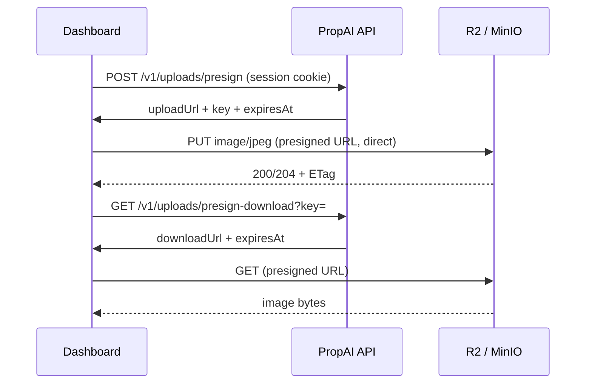

# Object storage — private bucket + CORS (Day 18)

Property photos are stored in **Cloudflare R2** (production) or **MinIO** (local dev). The bucket is **always private** — browsers and clients upload/download only via **presigned URLs** issued by the API. Binary data never flows through Fastify.

**Related:** [PHASE-2-DAY-18.md](../tasks/PHASE-2-DAY-18.md) · `.env.example` · [LOCAL-DEV.md](../LOCAL-DEV.md)

---

## Architecture (summary)



| Rule | Detail |
| ---- | ------ |
| Bucket ACL | **Private** — no public read, no anonymous listing |
| Access | Presigned PUT (upload) and GET (download) only |
| Max size | 10 MB per object (validated before presign) |
| Content-Type | `image/*` only (`image/jpeg`, `image/png`, `image/webp`, …) |
| Object key | `tenant/{tenantId}/property/{propertyId}/{uuid}.{ext}` |
| Presign TTL | Default **900s** (15 min) — `S3_PRESIGN_EXPIRES_SECONDS` |

---

## Environment variables

| Variable | Required | Example (local MinIO) | Purpose |
| -------- | -------- | ----------------------- | ------- |
| `S3_ENDPOINT` | Yes | `http://localhost:9000` | S3-compatible API endpoint |
| `S3_REGION` | Yes | `us-east-1` (MinIO) / `auto` (R2) | Region passed to SDK |
| `S3_BUCKET` | Yes | `propai-uploads` | Bucket name |
| `S3_ACCESS_KEY_ID` | Yes | `minioadmin` | Access key |
| `S3_SECRET_ACCESS_KEY` | Yes | `minioadmin` | Secret key |
| `S3_PRESIGN_EXPIRES_SECONDS` | No | `900` | Presigned URL lifetime (default 900) |

If any required `S3_*` value is missing, upload routes return **503** (`Object storage is not configured.`).

Copy placeholders from `.env.example` — never commit real secrets.

---

## Cloudflare R2 (production / staging)

### 1. Create a private bucket

1. [Cloudflare dashboard](https://dash.cloudflare.com/) → **R2** → **Create bucket**.
2. Name: `propai-uploads` (or match `S3_BUCKET`).
3. **Location:** pick a region close to your API/users.
4. Leave the bucket **private** — do **not** enable public access or custom domains for object reads.

### 2. Create API token (S3 credentials)

1. R2 → **Manage R2 API Tokens** → **Create API Token**.
2. Permissions: **Object Read & Write** on the target bucket (or account-scoped if your policy model requires it).
3. Copy **Access Key ID** and **Secret Access Key** (shown once).

### 3. Set `S3_ENDPOINT`

R2 S3 API endpoint format:

```text
https://<ACCOUNT_ID>.r2.cloudflarestorage.com
```

Find `<ACCOUNT_ID>` in the R2 overview URL or account settings.

Example `.env` (production):

```env
S3_ENDPOINT=https://abc123def456.r2.cloudflarestorage.com
S3_REGION=auto
S3_BUCKET=propai-uploads
S3_ACCESS_KEY_ID=<r2-access-key-id>
S3_SECRET_ACCESS_KEY=<r2-secret-access-key>
S3_PRESIGN_EXPIRES_SECONDS=900
```

### 4. Configure CORS (browser direct upload)

The dashboard uploads **directly** to R2 using the presigned PUT URL. R2 must allow the dashboard **origin** in CORS.

R2 → your bucket → **Settings** → **CORS policy** → paste:

```json
[
  {
    "AllowedOrigins": [
      "http://localhost:3000",
      "https://your-dashboard.vercel.app"
    ],
    "AllowedMethods": ["PUT", "GET", "HEAD"],
    "AllowedHeaders": ["Content-Type", "Content-Length"],
    "ExposeHeaders": ["ETag"],
    "MaxAgeSeconds": 3600
  }
]
```

| Field | Why |
| ----- | --- |
| `AllowedOrigins` | Dashboard origins that run `fetch` PUT to the presigned URL |
| `PUT` | Upload via presigned URL |
| `GET` / `HEAD` | Download / verify via presigned GET |
| `Content-Type` | Must match the value bound in the presigned PUT signature |
| `ETag` | Lets the client confirm upload success |

**Important:** CORS does **not** make the bucket public. It only allows browsers from listed origins to call presigned URLs. Objects remain private.

### 5. Verify (after Day 18 API routes exist)

See [upload-curl.md](../api/upload-curl.md) (Day 18 T6) for the full presign → PUT → download flow.

---

## Local dev — MinIO (optional)

MinIO is an S3-compatible server for local curl and dashboard testing without a Cloudflare account.

### Start MinIO

```bash
docker compose --profile storage up -d
```

| Service | Host port | Purpose |
| ------- | --------- | ------- |
| `minio` | 9000 | S3 API (`S3_ENDPOINT=http://localhost:9000`) |
| `minio` | 9001 | Web console — http://localhost:9001 (`minioadmin` / `minioadmin`) |

The `minio-init` job (same profile) creates bucket `propai-uploads` and keeps it **private**. CORS for local dev is set via `MINIO_API_CORS_ALLOW_ORIGIN=http://localhost:3000` on the MinIO service (see `docker-compose.yml`). Optional bucket CORS XML lives in `docker/minio/init/cors.xml` for reference.

### Local `.env` values

```env
S3_ENDPOINT=http://localhost:9000
S3_REGION=us-east-1
S3_BUCKET=propai-uploads
S3_ACCESS_KEY_ID=minioadmin
S3_SECRET_ACCESS_KEY=minioadmin
S3_PRESIGN_EXPIRES_SECONDS=900
```

Restart the API after changing `S3_*` variables.

### Stop MinIO

```bash
docker compose --profile storage down
# or stop everything:
pnpm docker:down
```

Data persists in Docker volume `propai_minio_data` until removed with `docker compose down -v`.

---

## Object key format (reference)

Keys are built server-side only — clients never choose the tenant segment.

```text
tenant/{tenantId}/property/{propertyId}/{uuid}.{ext}
```

Example:

```text
tenant/550e8400-e29b-41d4-a716-446655440000/property/6ba7b810-9dad-11d1-80b4-00c04fd430c8/a1b2c3d4-e5f6-7890-abcd-ef1234567890.jpg
```

Extension mapping: `image/jpeg` → `.jpg`, `image/png` → `.png`, `image/webp` → `.webp`.

---

## Security checklist

| Check | Implementation |
| ----- | -------------- |
| Private bucket | No public ACL; `mc anonymous set none` on MinIO |
| Tenant isolation | Key prefix `tenant/{tenantId}/` must match session org |
| No path traversal | Reject `..`, wrong segment count |
| Content binding | Presigned PUT signed with fixed `Content-Type` |
| Size limit | API rejects `contentLength > 10 MB` before presign |
| Short TTL | 15 min default; rotate via `S3_PRESIGN_EXPIRES_SECONDS` |

---

## Troubleshooting

### API returns 503 on presign

| Cause | Fix |
| ----- | --- |
| `S3_*` unset in `.env` | Fill all required variables (see table above) |
| API not restarted | Restart `pnpm dev` after editing `.env` |
| MinIO not running | `docker compose --profile storage up -d` |

### Browser PUT to presigned URL fails (CORS)

| Cause | Fix |
| ----- | --- |
| Dashboard origin missing from CORS | Add `http://localhost:3000` (local) or production URL |
| Wrong `Content-Type` header | Must match value sent to `POST /v1/uploads/presign` |
| Bucket public access assumed | CORS ≠ public bucket; use presigned URL as returned |

### MinIO init did not create bucket

```bash
docker compose --profile storage logs minio-init
docker compose --profile storage up minio-init
```

### R2 signature errors

| Cause | Fix |
| ----- | --- |
| Wrong endpoint | Use `https://<ACCOUNT_ID>.r2.cloudflarestorage.com` (no bucket suffix) |
| Clock skew | Sync system time on API host |
| Region | Use `auto` for R2 unless your setup requires otherwise |

---

## Related docs

| Doc | Topic |
| --- | ----- |
| [LOCAL-DEV.md](../LOCAL-DEV.md) | Compose profiles, local `.env` |
| [api-scaffold.md](../api/api-scaffold.md) | Upload routes (Day 18 T5+) |
| [PHASE-2-DAY-18.md](../tasks/PHASE-2-DAY-18.md) | Full task pack (routes, tests, ADR T7) |
