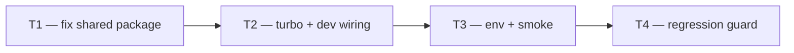

# HOTFIX — Day 19: `pnpm dev` build error (`@propai/shared`)

**Symptom:** Next.js/Turbopack fails on `/login` (and any page importing `@propai/shared`):

```
Module not found: Can't resolve './audit/audit-log.js'
./packages/shared/src/index.ts
```

Also fails for: `./constants.js`, `./properties/property.js`, `./roles/permissions.js`, `./uploads/presign.js`.

**Affected apps:** `@propai/web`, `@propai/marketplace` (both use `transpilePackages: ["@propai/shared"]`).

**Root cause:** `@propai/shared` exports **raw TypeScript source** (`package.json` → `"./src/index.ts"`) with **Node ESM `.js` suffixes** in relative imports. That works for `tsx`/API, but **Turbopack does not map `*.js` → `*.ts`** when bundling workspace packages.

**Not the cause:** Day 19 auth/middleware code is fine — the break appears as soon as the web app imports `@propai/shared` (e.g. `APP_NAME` on login page), which pulls the barrel `index.ts`.

**Branch:** current feature branch (`feat/phase-2-properties` or similar).

---

## Execution order



| Task | Can start after | Parallel with |
| ---- | --------------- | ------------- |
| **T1** | — | — |
| **T2** | T1 merged | — |
| **T3** | T2 merged | T4 (partial) |
| **T4** | T1 merged | T3 |

**Pick one strategy in T1** (do not apply both):

| Strategy | Effort | Best for |
| -------- | ------ | -------- |
| **A — Build `@propai/shared` → `dist/`** | Medium | Long-term monorepo (recommended) |
| **B — Extensionless imports in `shared/src`** | Low | Fast unblock today |

---

## T1 — Fix `@propai/shared` consumption by Next.js

**Owner chat prompt:**

> HOTFIX T1: Corrigir @propai/shared para Next.js/Turbopack. Erro: Can't resolve './audit/audit-log.js' em packages/shared/src/index.ts. Escolher estratégia A (build dist) ou B (imports sem .js). Verificar pnpm --filter @propai/web build passa.

### Strategy A — Build pipeline (recommended)

- [ ] Add `packages/shared/tsconfig.build.json`:

```json
{
  "extends": "./tsconfig.json",
  "compilerOptions": {
    "noEmit": false,
    "outDir": "dist",
    "rootDir": "src",
    "declaration": true,
    "declarationMap": true,
    "module": "NodeNext",
    "moduleResolution": "NodeNext"
  },
  "include": ["src/**/*.ts"],
  "exclude": ["src/**/*.test.ts"]
}
```

- [ ] Update `packages/shared/package.json`:

```json
{
  "scripts": {
    "build": "tsc -p tsconfig.build.json",
    "typecheck": "tsc --noEmit",
    "test": "vitest run"
  },
  "exports": {
    ".": {
      "types": "./dist/index.d.ts",
      "default": "./dist/index.js"
    }
  },
  "files": ["dist"]
}
```

- [ ] Keep `.js` suffixes in source imports (Node ESM) — emitted `dist/` will contain real `.js` files
- [ ] Add `dist/` to `.gitignore` if not already (built in CI/dev)
- [ ] Run:
  ```bash
  pnpm --filter @propai/shared build
  pnpm --filter @propai/web build
  pnpm --filter @propai/marketplace build
  pnpm test:shared
  pnpm test:api
  ```

### Strategy B — Extensionless imports (quick fix)

- [ ] In `packages/shared/src/index.ts` and any internal files, change:
  - `from "./audit/audit-log.js"` → `from "./audit/audit-log"`
  - Same for `constants`, `roles/permissions`, `uploads/presign`, `properties/property`
- [ ] Leave `package.json` exports pointing at `./src/index.ts`
- [ ] Run same verification commands as Strategy A

### Done when

- `pnpm --filter @propai/web build` exits **0**
- `pnpm --filter @propai/marketplace build` exits **0**
- No `Can't resolve './…​.js'` errors

### Files (typical)

- `packages/shared/tsconfig.build.json` (Strategy A)
- `packages/shared/package.json`
- `packages/shared/src/index.ts` (Strategy B)
- `.gitignore` (Strategy A — `packages/shared/dist`)

---

## T2 — Wire build into `pnpm dev` / Turbo

**Owner chat prompt:**

> HOTFIX T2: Garantir que @propai/shared seja consumível ao rodar pnpm dev. Se Strategy A: prebuild shared antes do web dev (turbo dependsOn ou script predev). Documentar no LOCAL-DEV.md.

**Depends on:** T1 merged.

### Do (Strategy A only)

- [ ] Option 1 — Turbo `dev` depends on shared build:
  ```json
  // turbo.json
  "dev": {
    "dependsOn": ["^build"],
    "cache": false,
    "persistent": true
  }
  ```
  And ensure `@propai/shared` has `"build"` script.

- [ ] Option 2 — Root `predev` hook:
  ```json
  "predev": "node scripts/predev-check.mjs && pnpm --filter @propai/shared build"
  ```

- [ ] Add `"build": "tsc -p tsconfig.build.json"` to shared; ensure `apps/web` `"build"` still runs `next build`

- [ ] Strategy B: no turbo change required (document that)

### Done when

Fresh clone flow works:
```bash
pnpm install
pnpm docker:up
pnpm db:migrate
pnpm dev
```
→ Web starts without module resolution errors.

### Files

- `turbo.json` and/or root `package.json`
- `docs/LOCAL-DEV.md`

---

## T3 — Env vars + manual smoke (Day 19 login)

**Owner chat prompt:**

> HOTFIX T3: Após build fix, validar pnpm dev end-to-end. Confirmar NEXT_PUBLIC_API_URL no .env, API rodando, /login e /signup carregam, login redireciona /dashboard.

**Depends on:** T2 merged.

### Do

- [ ] Confirm root `.env` has:
  ```env
  NEXT_PUBLIC_API_URL=http://localhost:3333
  API_URL=http://localhost:3333
  BETTER_AUTH_SECRET=<min 32 chars>
  BETTER_AUTH_URL=http://localhost:3333
  ```
- [ ] Run stack:
  ```bash
  pnpm docker:up
  pnpm db:migrate
  pnpm dev
  ```
- [ ] Browser checks:
  - [ ] http://localhost:3000/login — **no build error**
  - [ ] http://localhost:3000/signup — loads
  - [ ] Sign-up → redirects to `/dashboard` with sidebar
  - [ ] Sign-out → `/login`
  - [ ] Incognito `/dashboard` → redirect `/login`
- [ ] Note: Next 16 may log middleware deprecation warning — **non-blocking** for this hotfix

### Done when

Login works against local API (Day 19 acceptance criteria met).

### Files

- `.env.example` (if `NEXT_PUBLIC_API_URL` comment missing)
- Optional: `docs/web/dashboard-auth.md` troubleshooting section

---

## T4 — Regression guard (prevent recurrence)

**Owner chat prompt:**

> HOTFIX T4: Adicionar verificação CI/local para @propai/web build não quebrar por @propai/shared. Atualizar dev:smoke ou documentar pnpm --filter @propai/web build no checklist.

**Depends on:** T1 merged.

### Do

- [ ] Add to `scripts/dev-stack-smoke.mjs` OR new `scripts/web-build-smoke.mjs`:
  - After typecheck, run `pnpm --filter @propai/shared build` (if Strategy A)
  - Run `pnpm --filter @propai/web build`
- [ ] Or add root script:
  ```json
  "build:web": "pnpm --filter @propai/shared build && pnpm --filter @propai/web build"
  ```
- [ ] Update `docs/BACKEND-FOUNDATION-CHECKLIST.md` or `docs/LOCAL-DEV.md` — web build must pass before Day 19 sign-off
- [ ] Optional: short note in `packages/shared/README.md` — "Next.js apps require Strategy A or B"

### Done when

Next `@propai/shared` change cannot silently break web dev again.

---

## Verification checklist (all tasks)

```bash
pnpm --filter @propai/shared build    # Strategy A only
pnpm --filter @propai/web build
pnpm --filter @propai/marketplace build
pnpm typecheck
pnpm test:shared
pnpm test:api
pnpm dev
# Browser: /login OK
```

---

## Copy-paste prompts for parallel chats

### Chat A — T1 (fix core — start here)

```
Projeto: propai-os. HOTFIX Day 19 — pnpm dev quebrado.

Erro Turbopack: Module not found Can't resolve './audit/audit-log.js' em packages/shared/src/index.ts ao abrir /login.

Leia docs/tasks/HOTFIX-DAY-19-WEB-DEV.md seção T1. Corrija @propai/shared para Next.js (Strategy A build dist RECOMENDADA, ou B imports sem .js). pnpm --filter @propai/web build deve passar. pnpm test:shared && pnpm test:api verdes.
```

### Chat B — T2 (após T1)

```
Projeto: propai-os. HOTFIX T2.

Leia docs/tasks/HOTFIX-DAY-19-WEB-DEV.md seção T2. Se shared usa dist/, wire build no pnpm dev (turbo dependsOn ou predev). Atualize LOCAL-DEV.md. Fresh pnpm dev deve subir web sem erro de módulo.
```

### Chat C — T3 (smoke login — após T2)

```
Projeto: propai-os. HOTFIX T3.

Leia docs/tasks/HOTFIX-DAY-19-WEB-DEV.md seção T3. Validar .env NEXT_PUBLIC_API_URL, pnpm dev, /login /signup /dashboard fluxo completo. Documentar troubleshooting se necessário.
```

### Chat D — T4 (regression — paralelo T3)

```
Projeto: propai-os. HOTFIX T4.

Leia docs/tasks/HOTFIX-DAY-19-WEB-DEV.md seção T4. Adicione web build smoke (dev-stack-smoke ou script build:web) para não regredir @propai/shared + Next.
```

---

## FAQ for implementers

| Question | Answer |
| -------- | ------ |
| Why did Day 19 “finish” but dev fails? | Login/signup import `@propai/shared` barrel; old home page only imported constants — same underlying issue, now hit on first auth route. |
| Is middleware broken? | No — build fails before middleware runs. |
| Should web import `@propai/shared/constants` only? | Workaround only; barrel fix in shared is the real fix. |
| Strategy A vs B? | **A** for production monorepos; **B** if you need a 10-minute unblock. |

---

## Out of scope

- Migrating `@propai/db` for Next (web should not import db)
- Middleware → proxy migration (Next 16 deprecation warning)
- Staging deployment
