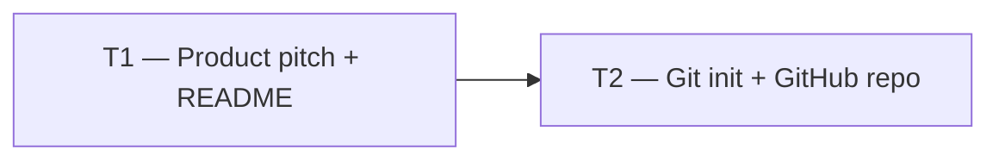

# Phase 0 — Day 1: Scope contract and repository (task pack)

**Objective:** Define exactly what the product delivers and have the Git repository running on GitHub.

**Prerequisite:** None — this is the first day.

**Branch:** `main` (initial commit directly)

**References:**

- [guia-desenvolvimento-propai-os-dia-a-dia.md](../../guia-desenvolvimento-propai-os-dia-a-dia.md) — Day 1
- [REQUIREMENTS.md](../REQUIREMENTS.md) — product scope (created this day)

---

## Execution order



| Task | Can start after | Parallel with |
| ---- | --------------- | ------------- |
| **T1** | — | — |
| **T2** | T1 | — |

---

## Shared conventions (all tasks)

| Topic | Rule |
| ----- | ---- |
| Language | English (en-US) — all copy, docs, commit messages |
| Product name | PropAI OS |
| Target market | US real estate brokerages |
| Repo | Public — `propai-os` on GitHub |

---

## T1 — Product pitch + README

### Do

- [ ] Write 1-paragraph product pitch (English):
  > *"PropAI OS is an AI-powered Real Estate Operating System for US brokerages — multi-tenant CRM, pipeline, marketplace, semantic search, and analytics."*
- [ ] Create `README.md` with:
  - Problem / solution paragraph
  - Stack overview (placeholder — expand on Day 5)
  - Live demo link (placeholder)
  - Architecture diagram (Mermaid draft)

### Files

- `README.md`

---

## T2 — Git init + GitHub repo

### Do

- [ ] Initialize Git:
  ```bash
  mkdir propai-os && cd propai-os
  git init
  git add . && git commit -m "chore: initial commit"
  ```
- [ ] Create **public** GitHub repository `propai-os`:
  ```bash
  gh repo create propai-os --public --source=. --push
  ```

### Done when

- Repo visible on `github.com/<user>/propai-os`
- `README.md` with product pitch in English

---

## Day 1 checklist

- [ ] Product pitch written in English (1 paragraph)
- [ ] `README.md` committed
- [ ] Public GitHub repo created and pushed
- [ ] Architecture Mermaid diagram drafted (even if rough)

**Done criteria (from guide):** Repo on GitHub + README with scope in 1 paragraph (English).
