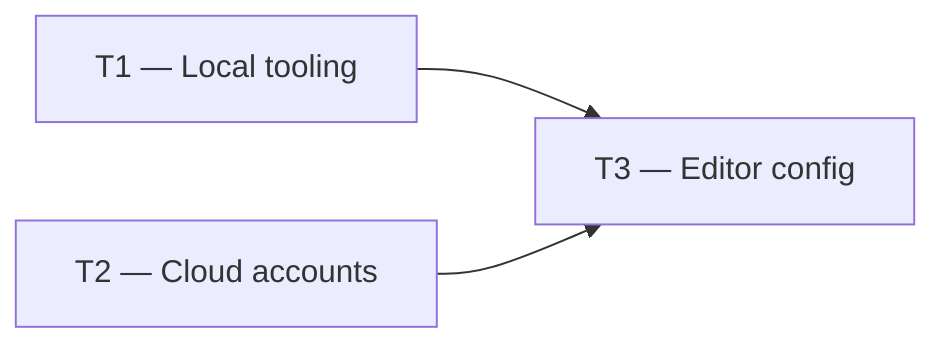

# Phase 0 — Day 2: Development environment (task pack)

**Objective:** Local machine ready for Node.js, Docker, and all required cloud accounts.

**Prerequisite:** Day 1 complete — public GitHub repo exists.

**Branch:** `main`

**References:**

- [guia-desenvolvimento-propai-os-dia-a-dia.md](../../guia-desenvolvimento-propai-os-dia-a-dia.md) — Day 2

---

## Execution order



| Task | Can start after | Parallel with |
| ---- | --------------- | ------------- |
| **T1** | — | T2 |
| **T2** | — | T1 |
| **T3** | T1 + T2 | — |

---

## T1 — Local tooling

### Do

- [ ] Install Node.js 20 LTS:
  ```bash
  node -v   # should print v20.x.x
  ```
- [ ] Install pnpm 9+:
  ```bash
  pnpm -v   # should print 9.x.x
  ```
- [ ] Install Docker Desktop:
  ```bash
  docker -v
  docker run hello-world
  ```

### Done when

- `node -v`, `pnpm -v`, `docker -v` all return correct versions
- `docker run hello-world` completes without error

---

## T2 — Cloud accounts

### Do

- [ ] **GitHub** — repo already created (Day 1)
- [ ] **Vercel** — create account + link GitHub
- [ ] **Neon** — create PostgreSQL project (`propai-dev` database)
- [ ] **Upstash** — create Redis database for BullMQ and rate limiting
- [ ] **Cloudflare R2** or **AWS S3** — create bucket `propai-uploads` (private)
- [ ] **Resend** — create account; verify sending domain or use sandbox
- [ ] **Stripe** — create account; enable test mode; note `sk_test_` key
- [ ] **OpenAI** or **Anthropic** — create API key (AI features)
- [ ] **Sentry** — create project (free tier)
- [ ] *Optional:* **Mapbox** or **Google Maps** API key (property map)

### Done when

- All accounts created; API keys saved to a password manager (never committed)

---

## T3 — Editor configuration

### Do

- [ ] VS Code (or Cursor) with:
  - ESLint extension
  - Prettier extension
  - TypeScript language support
- [ ] `.editorconfig` at repo root (consistent indentation)
- [ ] ESLint + Prettier config (will be finalized in Day 5 monorepo setup)

### Done when

- Editor highlights TypeScript errors and formats on save

---

## Day 2 checklist

- [ ] `docker run hello-world` works
- [ ] Vercel login OK (`vercel whoami`)
- [ ] Neon project accessible via connection string
- [ ] All API keys stored securely (password manager)

**Done criteria (from guide):** `docker run hello-world` works; Vercel and Neon login OK.
