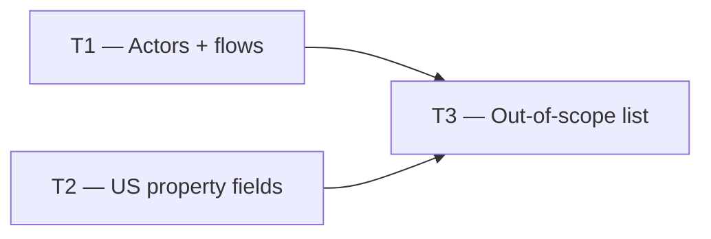

# Phase 0 — Day 3: Requirements documentation (task pack)

**Objective:** Closed list of MVP features vs v2 — written by the developer, in English.

**Prerequisite:** Day 2 complete — all accounts ready.

**Branch:** `docs/requirements` or `main`

**References:**

- [guia-desenvolvimento-propai-os-dia-a-dia.md](../../guia-desenvolvimento-propai-os-dia-a-dia.md) — Day 3
- [REQUIREMENTS.md](../REQUIREMENTS.md) — the file to be created

---

## Execution order

| Task | Can start after | Parallel with |
| ---- | --------------- | ------------- |
| **T1** | — | T2 |
| **T2** | — | T1 |
| **T3** | T1 + T2 | — |

---

## T1 — Actors and flows

### Do

- [ ] File `docs/REQUIREMENTS.md` — section **Actors**:
  - `Brokerage Owner` — full access, billing, team management
  - `Manager` — full operational access, no billing
  - `Agent` — own properties and assigned leads
  - `Viewer` — read-only analytics
  - `Public visitor` — marketplace browse + lead submit
- [ ] Section **Brokerage flow**:
  > Sign up → create workspace → invite agents → add properties → manage leads → schedule visits → close deals → view analytics
- [ ] Section **Public flow**:
  > Browse marketplace → semantic search → view property → submit interest → lead appears in CRM in real time

---

## T2 — US property fields

### Do

- [ ] Section **US property fields (v1)**:
  - `bedrooms` (integer)
  - `bathrooms` (decimal, e.g. 2.5)
  - `sqFt` (integer — square feet, not m²)
  - `priceUsdCents` (integer — never float)
  - `hoaFeeUsd` (integer, nullable)
  - `yearBuilt` (integer, nullable)
  - `type`: Single Family, Condo, Townhouse, Multi-Family
  - `status`: draft, active, under_contract, sold, rented
  - `rentOrSale`: sale or rent
  - Address: `addressLine1`, `city`, `state` (2-letter US), `zipCode`

---

## T3 — Out-of-scope and AI features

### Do

- [ ] Section **Explicit out of scope v1**:
  - MLS integration
  - Mortgage calculator
  - 3D virtual tour (Three.js)
  - Native mobile app
  - Multi-language i18n
- [ ] Section **AI features v1**:
  - Vision (photo → listing fields)
  - Semantic search (pgvector)
  - Lead scoring
  - Price estimate

### Done when

- `docs/REQUIREMENTS.md` written; developer can explain product in 2 min in English

---

## Day 3 checklist

- [ ] `docs/REQUIREMENTS.md` committed
- [ ] All 5 actors defined with roles
- [ ] Both flows (brokerage + public) documented
- [ ] US property fields listed with types
- [ ] v1 out-of-scope list explicit

**Done criteria (from guide):** Requirements file saved; you can explain the product in 2 minutes in English.
