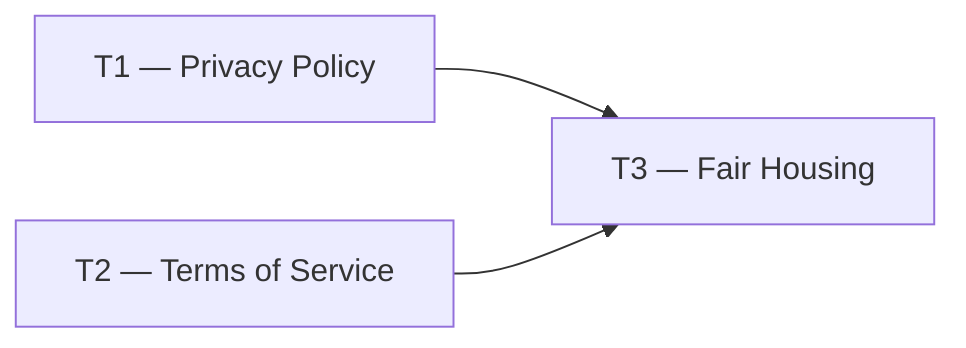

# Phase 0 — Day 4: Legal and compliance draft (task pack)

**Objective:** Legal base before storing lead PII and property data.

**Prerequisite:** Day 3 complete — `docs/REQUIREMENTS.md` exists.

**Branch:** `docs/legal` or `main`

**References:**

- [guia-desenvolvimento-propai-os-dia-a-dia.md](../../guia-desenvolvimento-propai-os-dia-a-dia.md) — Day 4
- [REQUIREMENTS.md](../REQUIREMENTS.md) — actors and data types

---

## Execution order

| Task | Can start after | Parallel with |
| ---- | --------------- | ------------- |
| **T1** | — | T2 |
| **T2** | — | T1 |
| **T3** | T1 + T2 | — |

---

## Shared conventions

| Topic | Rule |
| ----- | ---- |
| Language | English (en-US) — US legal audience |
| Status | Draft is fine for a portfolio project |
| PropAI OS role | A **tool for brokerages** — not a licensed brokerage |

---

## T1 — Privacy Policy

### Do

- [ ] Create `docs/legal/PRIVACY-POLICY.md` (English draft):
  - Data collected: account info, property data, lead PII (name, email, phone), usage analytics
  - Retention: active data kept while account active; deleted within 30 days of account closure
  - User rights: access, correction, deletion request via email
  - Contact: `privacy@propai.io` (placeholder)
  - Note: No selling of personal data; CCPA-aware disclaimer

---

## T2 — Terms of Service

### Do

- [ ] Create `docs/legal/TERMS-OF-SERVICE.md` (English draft):
  - SaaS subscription terms (Free / Pro plans)
  - Acceptable use: no discrimination, no false listings
  - Liability limitation: PropAI OS is a tool, not a real estate broker
  - Termination clause
  - Governing law: State of Delaware (common for US SaaS)

---

## T3 — Fair Housing disclaimer

### Do

- [ ] Create `docs/legal/FAIR-HOUSING.md`:
  - Equal Housing Opportunity disclaimer (required for US real estate products):
    > *Equal Housing Opportunity. PropAI OS does not discriminate based on race, color, religion, sex, handicap, familial status, or national origin.*
  - Note: This text must appear in the marketplace footer (implemented in Phase 5)
  - Note: PropAI OS is a platform for brokerages — compliance is shared responsibility

### Done when

- All 3 legal docs committed to `docs/legal/`

---

## Day 4 checklist

- [ ] `docs/legal/PRIVACY-POLICY.md` committed
- [ ] `docs/legal/TERMS-OF-SERVICE.md` committed
- [ ] `docs/legal/FAIR-HOUSING.md` committed with exact Equal Housing Opportunity text
- [ ] All docs clarify PropAI OS is a tool, not a licensed brokerage

**Done criteria (from guide):** Texts saved in `docs/legal/` (draft is fine for portfolio project).
