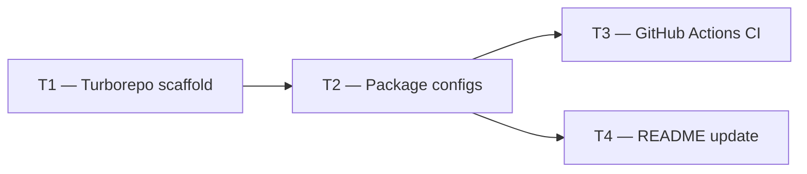

# Phase 0 — Day 5: Monorepo and initial CI (task pack)

**Objective:** Turborepo folder structure and minimal GitHub Actions pipeline.

**Prerequisite:** Day 4 complete — legal docs in place; Node.js + pnpm installed.

**Branch:** `chore/monorepo-setup` (from `main`)

**References:**

- [guia-desenvolvimento-propai-os-dia-a-dia.md](../../guia-desenvolvimento-propai-os-dia-a-dia.md) — Day 5

---

## Execution order



| Task | Can start after | Parallel with |
| ---- | --------------- | ------------- |
| **T1** | — | — |
| **T2** | T1 | — |
| **T3** | T2 | T4 |
| **T4** | T2 | T3 |

---

## Shared conventions

| Topic | Rule |
| ----- | ---- |
| Package manager | pnpm workspaces |
| TypeScript | `strict: true` in all packages |
| Naming | `@propai/api`, `@propai/web`, `@propai/marketplace`, `@propai/shared`, `@propai/db`, `@propai/config` |

---

## T1 — Turborepo scaffold

### Do

- [ ] Bootstrap:
  ```bash
  pnpm dlx create-turbo@latest propai-os
  ```
- [ ] Adjust `turbo.json` pipeline: `build`, `typecheck`, `lint`, `test`
- [ ] Create workspace structure:
  ```
  apps/api/          # Fastify API
  apps/web/          # Next.js dashboard
  apps/marketplace/  # Next.js public marketplace
  packages/shared/   # Zod contracts, enums, constants
  packages/db/       # Drizzle schema + migrations
  packages/config/   # ESLint, TSConfig, Tailwind presets
  packages/ui/       # Shared shadcn components (added later)
  ```
- [ ] Root `pnpm-workspace.yaml`

### Done when

- `pnpm install` from root succeeds

---

## T2 — Package configs

### Do

- [ ] **`packages/config`** — shared ESLint config, shared `tsconfig.base.json` with `strict: true`
- [ ] **`packages/shared`** — `package.json` with `@propai/shared`, TypeScript, exports
- [ ] **`packages/db`** — `package.json` with `@propai/db`, Drizzle ORM, drizzle-kit deps
- [ ] **`apps/api`** — Fastify placeholder entry, TypeScript referencing `tsconfig.base.json`
- [ ] **`apps/web`** — Next.js 15 placeholder (or `npx create-next-app@latest`)
- [ ] Each package: add `typecheck` script → `tsc --noEmit`

### Done when

- `pnpm typecheck` from root runs without error across all packages
- `packages/shared` importable from `apps/api`

---

## T3 — GitHub Actions CI

### Do

- [ ] Create `.github/workflows/ci.yml`:
  ```yaml
  name: CI
  on: [pull_request]
  jobs:
    check:
      runs-on: ubuntu-latest
      steps:
        - uses: actions/checkout@v4
        - uses: pnpm/action-setup@v3
        - uses: actions/setup-node@v4
          with:
            node-version: 20
            cache: pnpm
        - run: pnpm install --frozen-lockfile
        - run: pnpm lint
        - run: pnpm typecheck
  ```
- [ ] Verify CI badge in `README.md`

### Done when

- PR to `main` triggers CI; lint + typecheck pass

---

## T4 — README update

### Do

- [ ] Update root `README.md`:
  - Monorepo structure diagram (matching final structure)
  - Getting started: `pnpm install`, `pnpm dev`
  - CI badge

### Done when

- README reflects actual folder structure

---

## Day 5 checklist

```bash
pnpm install           # clean install from root
pnpm typecheck         # all packages
pnpm lint              # all packages
```

- [ ] All packages resolve without error
- [ ] `@propai/shared` importable from `@propai/api`
- [ ] GitHub Actions CI configured

**Done criteria (from guide):** `pnpm install` at root works; `packages/shared` importable from `apps/api`.
