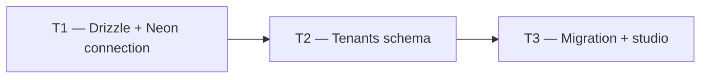

# Phase 1 — Day 6: Database package + Neon project (task pack)

**Objective:** Drizzle ORM connected to Neon PostgreSQL; first schema and migration working.

**Prerequisite:** Day 5 complete — monorepo scaffold with `packages/db` package.

**Branch:** `feat/phase-1-foundation` (from `main`)

**References:**

- [guia-desenvolvimento-propai-os-dia-a-dia.md](../../guia-desenvolvimento-propai-os-dia-a-dia.md) — Day 6

---

## Execution order



---

## Shared conventions

| Topic | Rule |
| ----- | ---- |
| ORM | Drizzle ORM with `postgres.js` driver |
| DB | Neon — dev branch |
| Migrations | `drizzle-kit` — `pnpm db:generate` + `pnpm db:migrate` |
| Env | `DATABASE_URL` (admin), `DATABASE_APP_URL` (RLS app role) |

---

## T1 — Drizzle + Neon connection

### Do

- [ ] Install in `packages/db`:
  - `drizzle-orm`, `drizzle-kit`, `postgres` (postgres.js)
- [ ] `packages/db/src/client.ts` — `getDb()` (admin) + `getAppDb()` (app role)
- [ ] `packages/db/src/env.ts` — read `DATABASE_URL` and `DATABASE_APP_URL`
- [ ] `.env.example` at root — add `DATABASE_URL`, `DATABASE_APP_URL`

---

## T2 — Tenants schema

### Do

- [ ] `packages/db/src/schema/tenants.ts`:
  - `tenants` table: `id uuid PK`, `name text`, `slug text UNIQUE`, `createdAt timestamptz`
  - `tenant_settings`: `tenantId uuid FK`, `timezone text`, `currency text DEFAULT 'USD'`, `logoUrl text`
- [ ] Export from `packages/db/src/schema/index.ts`
- [ ] `packages/db/drizzle.config.ts` pointing to schema dir + migrations dir

---

## T3 — Migration + studio

### Do

- [ ] Add scripts to `packages/db/package.json`:
  ```json
  "db:generate": "drizzle-kit generate",
  "db:migrate": "drizzle-kit migrate",
  "db:studio": "drizzle-kit studio"
  ```
- [ ] Run:
  ```bash
  pnpm db:generate
  pnpm db:migrate
  ```
- [ ] Verify: `pnpm db:studio` opens Drizzle Studio with `tenants` table visible

---

## Day 6 checklist

```bash
pnpm --filter @propai/db db:migrate
pnpm --filter @propai/db db:studio
pnpm typecheck
```

- [ ] `tenants` and `tenant_settings` tables visible in Neon console
- [ ] Migration applies without error on fresh DB
- [ ] Drizzle Studio accessible

**Done criteria (from guide):** Migrations apply to Neon dev branch without error.
