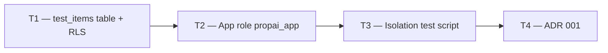

# Phase 1 — Day 7: RLS POC (critical day) (task pack)

**Objective:** Prove at the database level that Tenant A cannot see Tenant B data. This is the critical gate before any feature work.

**Prerequisite:** Day 6 complete — Drizzle connected to Neon; `tenants` table migrated.

**Branch:** `feat/phase-1-foundation`

**References:**

- [guia-desenvolvimento-propai-os-dia-a-dia.md](../../guia-desenvolvimento-propai-os-dia-a-dia.md) — Day 7
- [ADR 001 — RLS multi-tenancy](../adr/001-rls-multi-tenancy.md) — created this day

---

## Execution order



---

## Shared conventions

| Topic | Rule |
| ----- | ---- |
| RLS config var | `app.current_tenant` (PostgreSQL `SET LOCAL`) |
| Policy type | `PERMISSIVE FOR ALL` with null-safe cast |
| App role | `propai_app` — non-superuser, RLS enforced |
| Proof | Two tenants, two rows each → zero cross-leak |

---

## T1 — test_items table + RLS

### Do

- [ ] Drizzle schema: `test_items` (`id uuid PK`, `tenantId uuid NOT NULL`, `label text`, `createdAt`)
- [ ] Migration with:
  ```sql
  ALTER TABLE test_items ENABLE ROW LEVEL SECURITY;
  ALTER TABLE test_items FORCE ROW LEVEL SECURITY;
  CREATE POLICY test_items_tenant_isolation ON test_items
    AS PERMISSIVE FOR ALL TO PUBLIC
    USING (tenant_id = nullif(current_setting('app.current_tenant', true), '')::uuid)
    WITH CHECK (tenant_id = nullif(current_setting('app.current_tenant', true), '')::uuid);
  GRANT SELECT, INSERT, UPDATE, DELETE ON test_items TO propai_app;
  ```
- [ ] Run `pnpm db:migrate`

---

## T2 — App role propai_app

### Do

- [ ] Migration to create `propai_app` PostgreSQL role:
  ```sql
  DO $$ BEGIN
    IF NOT EXISTS (SELECT 1 FROM pg_roles WHERE rolname = 'propai_app') THEN
      CREATE ROLE propai_app WITH LOGIN PASSWORD 'propai_app';
    END IF;
  END $$;
  GRANT CONNECT ON DATABASE propai TO propai_app;
  GRANT USAGE ON SCHEMA public TO propai_app;
  ```
- [ ] `DATABASE_APP_URL` pointing to `propai_app` credentials in `.env`
- [ ] `getAppDb()` uses `DATABASE_APP_URL`

---

## T3 — Isolation test script

### Do

- [ ] `packages/db/scripts/rls-poc-test.ts`:
  - Insert 2 tenants (A, B) using admin `getDb()`
  - Insert 2 `test_items` per tenant
  - Via `getAppDb()` + `withTenantContext(tenantA)` → assert only A rows visible
  - Via `getAppDb()` + `withTenantContext(tenantB)` → assert only B rows visible
  - No context → assert 0 rows
  - Tenant A cannot read tenant B row by explicit `WHERE id = B_row_id`
- [ ] Script exits 0 on success, non-zero on failure

```bash
pnpm db:rls-test   # add to package.json scripts
```

---

## T4 — ADR 001

### Do

- [ ] Create `docs/adr/001-rls-multi-tenancy.md`:
  - Status: Accepted
  - Context: SaaS multi-tenancy at DB level vs schema-per-tenant
  - Decision: Single schema, `tenant_id` on all business tables, PostgreSQL RLS
  - Policy pattern: `nullif(current_setting(...), '')::uuid` (null-safe for missing context)
  - Test results: copy from T3 output

---

## Day 7 checklist

```bash
pnpm db:migrate
pnpm db:rls-test
```

- [ ] `test_items` has RLS enabled + forced
- [ ] `propai_app` cannot see cross-tenant data
- [ ] `pnpm db:rls-test` exits 0
- [ ] ADR 001 written

**Done criteria (from guide):** Document test results in `docs/adr/001-rls-multi-tenancy.md`.

> ⚠️ **Tech lead rule:** If RLS leaks — stop. Fix before moving to Day 8.
