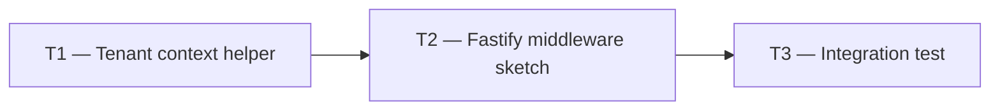

# Phase 1 — Day 8: RLS integration with Drizzle (task pack)

**Objective:** Every API request sets PostgreSQL tenant context before running queries — no cross-tenant data leak possible.

**Prerequisite:** Day 7 complete — RLS POC proven on `test_items`; ADR 001 written.

**Branch:** `feat/phase-1-foundation`

**References:**

- [guia-desenvolvimento-propai-os-dia-a-dia.md](../../guia-desenvolvimento-propai-os-dia-a-dia.md) — Day 8
- [ADR 001](../adr/001-rls-multi-tenancy.md) — RLS policy pattern
- DB client: `packages/db/src/client.ts`

---

## Execution order



---

## Shared conventions

| Topic | Rule |
| ----- | ---- |
| Context setter | `SELECT set_config('app.current_tenant', $1, true)` inside transaction |
| Always transactional | `SET LOCAL` only affects current transaction — must wrap every query |
| Middleware design | Extract tenantId from session → call `setTenantContext` before query |

---

## T1 — Tenant context helper

### Do

- [ ] `packages/db/src/tenant-context.ts`:
  - `setTenantContext(executor, tenantId)` — runs `set_config` SQL
  - `withTenantContext(tenantId, fn)` — wraps `fn` in a transaction with context set
  - `runInTenantContext(tenantId, fn)` — alias for API routes

- [ ] Export from `packages/db/src/index.ts`

---

## T2 — Fastify middleware sketch

### Do

- [ ] `apps/api/src/plugins/tenant-context.ts` (sketch — full Better Auth in Day 10):
  - Extract `activeOrganizationId` from session (placeholder)
  - Decorate `request.tenantId`
  - Protected routes under `/v1/` return 401 if no session
- [ ] Document: any query running outside `runInTenantContext` will return 0 rows (RLS blocks)

---

## T3 — Integration test / script

### Do

- [ ] Extend `rls-poc-test.ts` or new test: API route without tenant context → 0 rows (not error)
- [ ] Test: set tenant A context → only A rows; switch to B → only B rows
- [ ] Update ADR 001 with Drizzle integration pattern

---

## Day 8 checklist

```bash
pnpm db:rls-test
pnpm typecheck
```

- [ ] `runInTenantContext` exported from `@propai/db`
- [ ] Query without context → 0 rows, never cross-tenant leak
- [ ] ADR 001 updated with Drizzle integration pattern

**Done criteria (from guide):** Automated test or script proves isolation; ADR updated.
