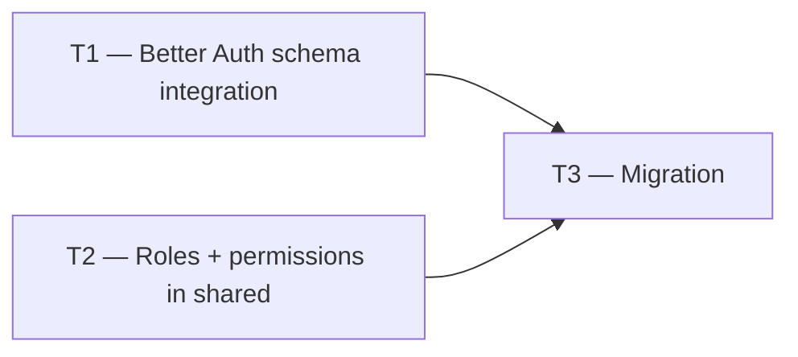

# Phase 1 — Day 9: Core schema — users, members, roles (task pack)

**Objective:** Identity model aligned with Better Auth Organizations — users, orgs (tenants), members, invitations, and role enums.

**Prerequisite:** Day 8 complete — `runInTenantContext` working; RLS integration proven.

**Branch:** `feat/phase-1-foundation`

**References:**

- [guia-desenvolvimento-propai-os-dia-a-dia.md](../../guia-desenvolvimento-propai-os-dia-a-dia.md) — Day 9
- [Better Auth Organizations docs](https://better-auth.com/docs/plugins/organization)
- Roles/permissions: `packages/shared/src/roles/permissions.ts`

---

## Execution order



---

## Shared conventions

| Topic | Rule |
| ----- | ---- |
| Tables | Better Auth manages `users`, `sessions`, `organizations`, `members`, `invitations` |
| Roles | `owner`, `manager`, `agent`, `viewer` — defined in `@propai/shared` |
| Org = Tenant | `organization.id` = `tenant_id` on all business tables |

---

## T1 — Better Auth schema integration

### Do

- [ ] Add Better Auth managed tables to Drizzle schema (or reference separately):
  - `users`, `sessions`, `accounts`, `verifications`
  - `organizations` (= tenants)
  - `members` (userId, organizationId, role)
  - `invitations` (email, organizationId, role, expiresAt)
- [ ] Export from `packages/db/src/schema/index.ts`

---

## T2 — Roles + permissions in shared

### Do

- [ ] `packages/shared/src/roles/permissions.ts`:
  ```typescript
  export const BROKERAGE_ROLES = ["owner", "manager", "agent", "viewer"] as const;
  export const PERMISSIONS = [
    "leads:write", "properties:write", "analytics:read", "audit:read", "billing:manage"
  ] as const;
  export const ROLE_PERMISSIONS: Record<BrokerageRole, readonly Permission[]> = { ... };
  ```
- [ ] `hasPermission(role, permission)` helper
- [ ] Export from `packages/shared/src/index.ts`

---

## T3 — Migration

### Do

- [ ] Generate + apply migration for Better Auth tables
- [ ] Verify `organizations` table is the source of truth for tenants (replace or alias `tenants` table from Day 6 if needed)
- [ ] Run `pnpm db:rls-test` — existing tests still pass

---

## Day 9 checklist

```bash
pnpm db:migrate
pnpm db:rls-test
pnpm typecheck
```

- [ ] `BROKERAGE_ROLES` exported from `@propai/shared`
- [ ] `ROLE_PERMISSIONS` maps each role to permissions
- [ ] Better Auth tables migrated
- [ ] Existing RLS tests still pass

**Done criteria (from guide):** Schema migrated; roles defined in shared package.
