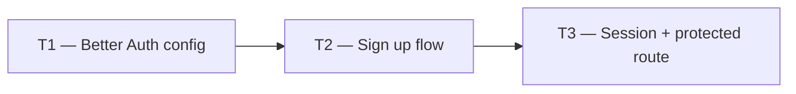

# Phase 1 — Day 10: Better Auth setup (API) (task pack)

**Objective:** Sign up creates an organization (tenant) + owner user; session includes `activeOrganizationId`.

**Prerequisite:** Day 9 complete — Better Auth tables migrated; roles defined.

**Branch:** `feat/phase-1-foundation`

**References:**

- [guia-desenvolvimento-propai-os-dia-a-dia.md](../../guia-desenvolvimento-propai-os-dia-a-dia.md) — Day 10
- [Better Auth Organizations](https://better-auth.com/docs/plugins/organization)

---

## Execution order

---

## Shared conventions

| Topic | Rule |
| ----- | ---- |
| Auth library | Better Auth with Organizations plugin |
| Session | Cookie-based (same origin); `activeOrganizationId` in session |
| Signup | User + organization name → creates tenant + owner member |
| CORS | Trusted origins from `NEXT_PUBLIC_APP_URL` |

---

## T1 — Better Auth config

### Do

- [ ] Install `better-auth` in `apps/api`
- [ ] `apps/api/src/modules/auth/index.ts` — configure Better Auth:
  - `database` — Drizzle adapter pointing to `getDb()`
  - `plugins: [organizations()]`
  - `emailAndPassword: { enabled: true }`
  - `trustedOrigins: [NEXT_PUBLIC_APP_URL]`
- [ ] `BETTER_AUTH_SECRET`, `BETTER_AUTH_URL` in `.env.example`

---

## T2 — Sign up flow

### Do

- [ ] Verify sign up creates:
  1. `users` row
  2. `organizations` row with provided org name
  3. `members` row with `role: "owner"`
- [ ] On sign in: `session.activeOrganizationId` populated
- [ ] Invite flow: `POST /auth/organization/invite-member`

---

## T3 — Session + protected route

### Do

- [ ] `apps/api/src/modules/auth/session.ts` — `getSessionFromRequest(request)` → `PropAiSession | null`
- [ ] `apps/api/src/modules/auth/resolve-tenant-id.ts` — extract tenantId from session
- [ ] `apps/api/src/plugins/tenant-context.ts` — wire session → tenantId → `request.tenantId`
- [ ] Test: `GET /v1/test-items` without auth → 401; with auth → 200

---

## Day 10 checklist

Using Postman or Insomnia:

- [ ] `POST /auth/sign-up/email` → creates user + org + owner member
- [ ] `POST /auth/sign-in/email` → session cookie returned
- [ ] `GET /v1/test-items` with cookie → 200
- [ ] `GET /v1/test-items` without cookie → 401

**Done criteria (from guide):** Postman/Insomnia: sign up → login → session cookie → protected route 200.
