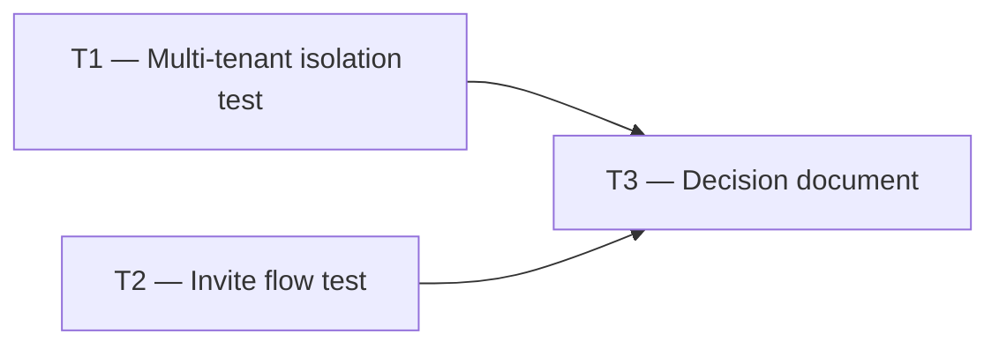

# Phase 1 — Day 11: Auth validation day (task pack)

**Objective:** Go/no-go decision on auth + tenant creation before building the full API.

**Prerequisite:** Day 10 complete — Better Auth configured; sign up creates tenant.

**Branch:** `feat/phase-1-foundation`

**References:**

- [guia-desenvolvimento-propai-os-dia-a-dia.md](../../guia-desenvolvimento-propai-os-dia-a-dia.md) — Day 11

---

## Execution order

---

## T1 — Multi-tenant isolation test

### Do

- [ ] Sign up as User A with Org A
- [ ] Sign up as User B with Org B
- [ ] Both users create `test_items`
- [ ] Verify: User A cannot see User B's `test_items` (RLS enforced)
- [ ] Verify: Session `activeOrganizationId` differs between A and B

---

## T2 — Invite flow test

### Do

- [ ] Owner A invites `user-b@example.com` to Org A
- [ ] User B accepts invitation
- [ ] User B's session now has `activeOrganizationId = Org A`
- [ ] User B can see Org A's data (member of org), not Org B's

---

## T3 — Decision document

### Do

- [ ] Create `docs/AUTH-POC-FEEDBACK.md`:
  - Test results (isolation working / issues found)
  - Go decision: continue to full API
  - Any known issues or workarounds documented
  - Session structure (what fields are available)

### Done when

- Decision documented: **GO** for Day 12+ or **BLOCK** with fix plan

---

## Day 11 checklist

- [ ] 2 users, 2 orgs — data isolated ✅
- [ ] Invite flow — invitee joins org and sees correct data ✅
- [ ] `docs/AUTH-POC-FEEDBACK.md` written with GO decision
- [ ] No RLS leak found

**Done criteria (from guide):** Decision recorded: GO for full API.
