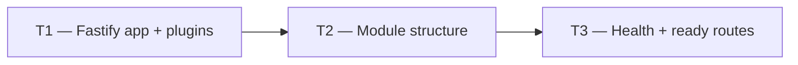

# Phase 1 — Day 12: API Fastify scaffold (task pack)

**Objective:** HTTP server with plugins, feature structure, and health check endpoint.

**Prerequisite:** Day 11 complete — auth POC approved (GO decision).

**Branch:** `feat/phase-1-foundation`

**References:**

- [guia-desenvolvimento-propai-os-dia-a-dia.md](../../guia-desenvolvimento-propai-os-dia-a-dia.md) — Day 12

---

## Execution order



---

## Shared conventions

| Topic | Rule |
| ----- | ---- |
| Framework | Fastify v5 |
| Validation | `fastify-type-provider-zod` — all routes typed with Zod |
| Logging | `pino` — structured JSON logs with request ID |
| Security | `@fastify/helmet` + CORS |

---

## T1 — Fastify app + plugins

### Do

- [ ] `apps/api/src/app.ts` — `buildApp()` with:
  - `zodValidatorPlugin` — Zod type provider
  - `errorHandlerPlugin` — standardized `{ error, message }` responses
  - `@fastify/cors` — trusted origins from env
  - `securityPlugin` — Helmet headers
  - `authPlugin` — Better Auth routes
  - `tenantContextPlugin` — session → tenantId
  - `memberRolePlugin` — permission hooks
- [ ] `apps/api/src/server.ts` — `buildApp()` + listen on `PORT`/`HOST`

---

## T2 — Module structure

### Do

- [ ] Directory structure:
  ```
  src/
  ├── modules/
  │   ├── auth/
  │   ├── health/
  │   ├── tenants/
  │   ├── test-items/
  │   └── audit/
  ├── plugins/
  │   ├── auth.ts
  │   ├── tenant-context.ts
  │   ├── require-member-role.ts
  │   ├── error-handler.ts
  │   ├── security.ts
  │   └── zod-validator.ts
  ├── lib/
  │   ├── api-error.ts
  │   └── logger.ts
  ├── app.ts
  └── server.ts
  ```
- [ ] Modules registered under `/v1` prefix (except `health`)
- [ ] Add dev script: `pnpm --filter @propai/api dev`

---

## T3 — Health + ready routes

### Do

- [ ] `GET /health` → `{ status: "ok", timestamp }` — no auth required
- [ ] `GET /ready` → checks DB connection; returns 503 if DB down
- [ ] Verify:
  ```bash
  curl http://localhost:3333/health
  # → {"status":"ok"}
  ```

---

## Day 12 checklist

```bash
pnpm --filter @propai/api dev
curl http://localhost:3333/health
curl http://localhost:3333/ready
pnpm typecheck
```

- [ ] `GET /health` returns 200 `{ status: "ok" }`
- [ ] `GET /ready` returns 200 when DB up, 503 when DB down
- [ ] All plugins registered
- [ ] Module directory structure matches spec

**Done criteria (from guide):** `curl localhost:3333/health` returns ok.
