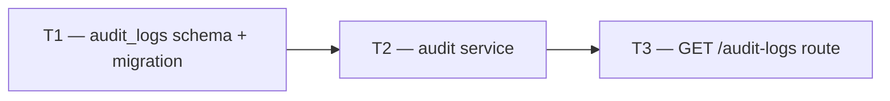

# Phase 1 — Day 13: Audit log module (task pack)

**Objective:** Track who did what — senior-level detail for a production SaaS.

**Prerequisite:** Day 12 complete — Fastify scaffold; health check passing.

**Branch:** `feat/phase-1-foundation`

**References:**

- [guia-desenvolvimento-propai-os-dia-a-dia.md](../../guia-desenvolvimento-propai-os-dia-a-dia.md) — Day 13

---

## Execution order



---

## Shared conventions

| Topic | Rule |
| ----- | ---- |
| Table | `audit_logs` — tenant-scoped via RLS |
| Actor | `actorId` = user ID from session |
| Actions | Enum in `@propai/shared` |
| RBAC | `GET /audit-logs` owner + manager only (`audit:read` permission) |
| Pagination | Cursor-based (same pattern as other list routes) |

---

## T1 — audit_logs schema + migration

### Do

- [ ] `packages/db/src/schema/audit-logs.ts`:
  ```typescript
  audit_logs(
    id uuid PK,
    tenant_id uuid NOT NULL FK organizations,
    actor_id text FK users (set null on delete),
    action text NOT NULL,
    entity_type text NOT NULL,
    entity_id text,
    metadata jsonb,
    ip text,
    created_at timestamptz default now
  )
  ```
- [ ] RLS: same pattern as `test_items` (tenant_id policy)
- [ ] Index: `(tenant_id, created_at DESC)`
- [ ] Run `pnpm db:migrate`

---

## T2 — Audit service

### Do

- [ ] `packages/db/src/audit/audit-log.ts`:
  - `logAuditEvent(input)` — inserts audit row in tenant context
  - `AUDIT_ACTIONS` enum in `@propai/shared`: `property_created`, `property_updated`, `tenant_created`, etc.
- [ ] Export from `packages/db/src/index.ts` and `packages/shared/src/index.ts`
- [ ] `writeAuditEventSafe(input)` wrapper — catches errors, logs but never throws (audit must not break mutations)

---

## T3 — GET /audit-logs route

### Do

- [ ] `apps/api/src/modules/audit/routes.ts`:
  - `GET /v1/audit-logs` — `audit:read` permission required
  - Query params: `limit`, `cursor`, `actorId`, `action`, `entityType`
  - Returns paginated list of audit entries
- [ ] Zod schemas in `@propai/shared`

---

## Day 13 checklist

```bash
pnpm db:migrate
pnpm --filter @propai/api dev
pnpm typecheck
```

- [ ] Creating a tenant → audit entry created
- [ ] `GET /v1/audit-logs` returns entries for authenticated owner/manager
- [ ] Agent (no `audit:read`) → 403
- [ ] Audit service failure does NOT break the parent mutation

**Done criteria (from guide):** Creating a tenant logs an audit entry.
