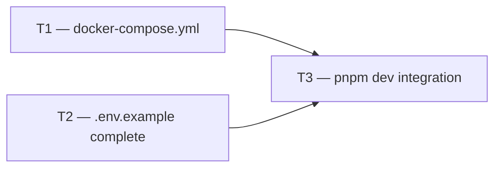

# Phase 1 — Day 14: Docker Compose local dev (task pack)

**Objective:** Anyone can clone the repo and run the full stack locally with two commands.

**Prerequisite:** Day 13 complete — Fastify API working with audit logs.

**Branch:** `feat/phase-1-foundation`

**References:**

- [guia-desenvolvimento-propai-os-dia-a-dia.md](../../guia-desenvolvimento-propai-os-dia-a-dia.md) — Day 14

---

## Execution order



---

## Shared conventions

| Topic | Rule |
| ----- | ---- |
| PostgreSQL image | `pgvector/pgvector:pg16` — includes pgvector extension |
| Redis image | `redis:7-alpine` |
| Ports | Postgres: 5432, Redis: 6379, API: 3333, Web: 3000 |
| Env defaults | All local values pre-filled in `.env.example` |

---

## T1 — docker-compose.yml

### Do

- [ ] Root `docker-compose.yml`:
  ```yaml
  services:
    postgres:
      image: pgvector/pgvector:pg16
      environment:
        POSTGRES_USER: propai
        POSTGRES_PASSWORD: propai
        POSTGRES_DB: propai
      ports: ["5432:5432"]
      volumes: [postgres_data:/var/lib/postgresql/data]

    redis:
      image: redis:7-alpine
      ports: ["6379:6379"]
  ```
- [ ] Named volume `postgres_data` for persistence
- [ ] Optional profile `storage` for MinIO (local S3 alternative)
- [ ] `pnpm docker:up` alias in root `package.json`:
  ```json
  "docker:up": "docker compose up -d"
  ```

---

## T2 — .env.example complete

### Do

- [ ] Ensure ALL environment variables documented with:
  - Purpose comment
  - Local default value (works after `docker compose up -d`)
  - Production placeholder (e.g., Neon URL format)
- [ ] Variables grouped: App, API, Database, Redis, Auth, Storage, Email, Billing, AI, Observability, Maps, Feature flags

---

## T3 — pnpm dev integration

### Do

- [ ] Root `turbo.json` pipeline: `dev` task fans out to `api` + `web`
- [ ] Add `pnpm dev` to root `package.json`
- [ ] Quick-start sequence verified:
  ```bash
  git clone ...
  cp .env.example .env
  docker compose up -d
  pnpm install
  pnpm db:migrate
  pnpm dev
  ```
- [ ] Update `README.md` Getting Started section with this sequence

---

## Day 14 checklist

```bash
docker compose up -d
pnpm install
pnpm db:migrate
pnpm --filter @propai/api dev
# → GET http://localhost:3333/health → {"status":"ok"}
```

- [ ] Fresh clone → `docker compose up -d` → `pnpm dev` → health OK
- [ ] `.env.example` has working local defaults for all required vars
- [ ] pgvector image used (needed for Day 29)

**Done criteria (from guide):** Fresh clone → `docker compose up -d` → `pnpm dev` → health ok.
