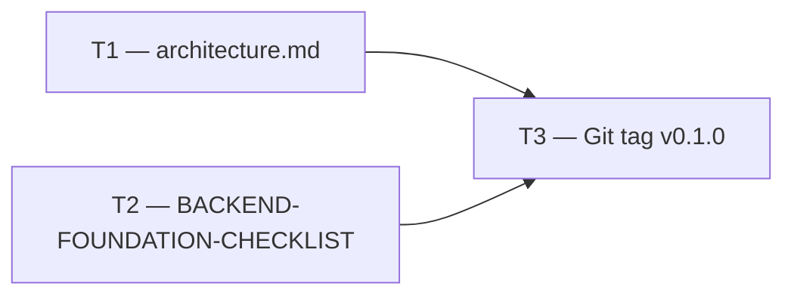

# Phase 1 — Day 15: Tag POC and plan Phase 2 (task pack)

**Objective:** Freeze multi-tenancy foundation v0.1 — documentation, architecture diagram, and checklist 100%.

**Prerequisite:** Days 6–14 complete — auth, RLS, API scaffold, audit, Docker all working.

**Branch:** `feat/phase-1-foundation` → merge to `main` → tag

**References:**

- [guia-desenvolvimento-propai-os-dia-a-dia.md](../../guia-desenvolvimento-propai-os-dia-a-dia.md) — Day 15
- [ADR 001](../adr/001-rls-multi-tenancy.md) — RLS (should be finalized)
- [AUTH-POC-FEEDBACK.md](../AUTH-POC-FEEDBACK.md) — GO decision

---

## Execution order



---

## T1 — Architecture documentation

### Do

- [ ] `docs/architecture.md` — complete system diagram:
  ```mermaid
  graph TD
    Web["Next.js Dashboard"] -->|REST + Cookie| API["Fastify API"]
    API -->|SET LOCAL + RLS| DB["PostgreSQL (Neon)"]
    API -->|session| BetterAuth["Better Auth"]
    BetterAuth --> DB
  ```
- [ ] Section: Multi-Tenancy with RLS — explain `app.current_tenant`, `propai_app` role, isolation guarantees
- [ ] Section: Auth flow — sign up → org created → session cookie

---

## T2 — Backend Foundation Checklist

### Do

- [ ] Create `docs/BACKEND-FOUNDATION-CHECKLIST.md`:
  - [x] Turborepo + pnpm workspaces
  - [x] TypeScript strict across all packages
  - [x] Better Auth with Organizations plugin
  - [x] PostgreSQL RLS — tenant isolation proven
  - [x] `propai_app` role (non-superuser, RLS enforced)
  - [x] `runInTenantContext` Drizzle wrapper
  - [x] Audit log module
  - [x] Docker Compose local dev
  - [x] GitHub Actions CI (lint + typecheck)
  - [x] `pnpm db:rls-test` green

---

## T3 — Git tag

### Do

- [ ] Merge `feat/phase-1-foundation` → `main`
- [ ] Tag:
  ```bash
  git tag foundation-v0.1.0
  git push origin foundation-v0.1.0
  ```
- [ ] GitHub Release: `foundation-v0.1.0` with brief notes

---

## Day 15 checklist

```bash
pnpm db:rls-test    # passes
pnpm typecheck      # passes
pnpm test           # passes (if tests configured)
```

- [ ] `foundation-v0.1.0` tag on GitHub
- [ ] `docs/architecture.md` with RLS Mermaid diagram
- [ ] `docs/BACKEND-FOUNDATION-CHECKLIST.md` all items checked
- [ ] Ready to start Phase 2 (Properties module)

**Done criteria (from guide):** Tag on GitHub; architecture doc written.
