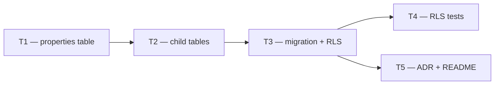

# Phase 2 — Day 16: Properties schema (task pack)

**Objective:** Core domain tables for US real estate with tenant isolation (RLS).

**Prerequisite:** Phase 1 complete — tag `foundation-v0.1.0`, `pnpm docker:up && pnpm db:migrate && pnpm db:rls-test` green.

**Branch suggestion:** `feat/phase-2-properties` (from `main`).

**References:**
- [PHASE-2-PLAN.md](../PHASE-2-PLAN.md)
- [REQUIREMENTS.md — US property fields](../REQUIREMENTS.md#us-property-fields-v1)
- [ADR 001 — RLS](../adr/001-rls-multi-tenancy.md)
- Schema patterns: `packages/db/src/schema/audit-logs.ts`, migration `packages/db/drizzle/0006_audit_logs.sql`

**Out of scope (Day 16):** `property_pricing_history` (v1.1), API routes, Zod DTOs (Day 17), web UI.

---

## Execution order



| Task | Can start after | Parallel with |
| ---- | --------------- | ------------- |
| **T1** | — | — |
| **T2** | T1 merged | — |
| **T3** | T1 + T2 merged | — |
| **T4** | T3 merged | T5 |
| **T5** | T3 merged | T4 |

---

## Shared conventions (all tasks)

| Topic | Rule |
| ----- | ---- |
| ORM | Drizzle in `packages/db/src/schema/` |
| Tenant FK | `tenant_id` → `organization.id` (`onDelete: cascade`) |
| Money | List price in **cents** (`integer`); HOA in **whole USD/month** (`integer`, nullable) — see REQUIREMENTS |
| Bathrooms | `numeric(3,1)` or Drizzle `numeric` — supports `2.5` |
| Soft delete | `soft_deleted_at` timestamptz nullable; no hard delete in v1 |
| `created_by` | `text` FK → `user.id`, `onDelete: set null` |
| RLS | `ENABLE` + `FORCE ROW LEVEL SECURITY` + null-safe policy (ADR 001) |
| Runtime role | `GRANT SELECT, INSERT, UPDATE, DELETE ON … TO propai_app` |
| Naming | DB snake_case; Drizzle camelCase in TS |
| TypeScript | Strict, no `any`; export new tables from `schema/index.ts` |

### Enums (v1)

| Enum | Values |
| ---- | ------ |
| `property_type` | `single_family`, `condo`, `townhouse`, `multi_family` |
| `property_status` | `draft`, `active`, `under_contract`, `sold`, `rented` |
| `rent_or_sale` | `sale`, `rent` |

Display labels (en-US) belong in Day 17 (`@propai/shared`); DB stores snake_case enum values.

---

## T1 — Drizzle schema: `properties` table

**Owner chat prompt:**

> Implement Day 16 / T1: Drizzle schema for the `properties` table in `@propai/db`. Follow `audit-logs.ts` and REQUIREMENTS US property fields. Do not add migration SQL yet — schema only.

### Do

- [ ] Create `packages/db/src/schema/properties.ts`
- [ ] Define `pgEnum` for `property_type`, `property_status`, `rent_or_sale`
- [ ] Define `properties` table:

| Column (DB) | Type | Notes |
| ----------- | ---- | ----- |
| `id` | uuid PK | `defaultRandom()` |
| `tenant_id` | uuid NOT NULL | FK → `organization.id` |
| `title` | text NOT NULL | |
| `description` | text | nullable |
| `type` | property_type enum NOT NULL | |
| `status` | property_status enum NOT NULL | default `draft` |
| `price_usd_cents` | integer NOT NULL | list price in cents |
| `rent_or_sale` | rent_or_sale enum NOT NULL | |
| `bedrooms` | integer NOT NULL | ≥ 0 |
| `bathrooms` | numeric(3,1) NOT NULL | |
| `sq_ft` | integer NOT NULL | |
| `year_built` | integer | nullable |
| `hoa_fee_usd` | integer | nullable, whole USD/month |
| `address_line1` | text NOT NULL | |
| `address_line2` | text | nullable |
| `city` | text NOT NULL | |
| `state` | text NOT NULL | 2-letter US code |
| `zip_code` | text NOT NULL | |
| `latitude` | numeric(10,7) | nullable, WGS84 |
| `longitude` | numeric(10,7) | nullable, WGS84 |
| `created_by` | text | FK → `user.id`, set null on delete |
| `created_at` | timestamptz | default now |
| `updated_at` | timestamptz | default now |
| `soft_deleted_at` | timestamptz | nullable |

- [ ] Indexes (Drizzle `index()` in table callback):
  - `properties_tenant_status_idx` on `(tenant_id, status)`
  - `properties_tenant_city_state_idx` on `(tenant_id, city, state)`
  - `properties_geo_idx` on `(latitude, longitude)` — btree composite for v1
- [ ] Export enums + `properties` from `packages/db/src/schema/index.ts`
- [ ] Run `pnpm typecheck` (filter `@propai/db`)

### Done when

- Schema compiles; no migration file required yet
- Field names align with REQUIREMENTS (cents for price, not float)

### Files

- `packages/db/src/schema/properties.ts` (new)
- `packages/db/src/schema/index.ts` (edit)

---

## T2 — Drizzle schema: `property_features` + `property_images`

**Owner chat prompt:**

> Implement Day 16 / T2: Drizzle child tables `property_features` and `property_images` in `@propai/db`. FK to `properties.id` with cascade delete. Schema only — no migration SQL.

**Depends on:** T1 merged (`properties` table exists in schema).

### Do

- [ ] Add to `packages/db/src/schema/properties.ts` (or split `property-features.ts` / `property-images.ts` if cleaner)

**`property_features`**

| Column | Type | Notes |
| ------ | ---- | ----- |
| `id` | uuid PK | |
| `property_id` | uuid NOT NULL | FK → `properties.id`, cascade |
| `feature_key` | text NOT NULL | e.g. `pool`, `garage` |
| `feature_value` | text NOT NULL | e.g. `true`, `2-car` |
| `created_at` | timestamptz | default now |

- Index: `property_features_property_id_idx` on `(property_id)`
- Unique (optional v1): `(property_id, feature_key)` — decide and document in PR

**`property_images`**

| Column | Type | Notes |
| ------ | ---- | ----- |
| `id` | uuid PK | |
| `property_id` | uuid NOT NULL | FK → `properties.id`, cascade |
| `storage_key` | text NOT NULL | R2/S3 object key (Day 19+) |
| `sort_order` | integer NOT NULL | default 0 |
| `is_primary` | boolean NOT NULL | default false |
| `created_at` | timestamptz | default now |

- Index: `property_images_property_id_sort_idx` on `(property_id, sort_order)`

- [ ] Export new tables from `schema/index.ts`
- [ ] Run `pnpm typecheck`

### RLS note for T3

Child tables **do not** need `tenant_id` if T3 uses parent-scoped policies (`EXISTS` subquery on `properties.tenant_id`). Do not add redundant `tenant_id` unless the team chooses denormalization — pick one approach in T3 and stick to it.

### Done when

- Both tables defined with FKs and indexes
- Typecheck passes

---

## T3 — Migration SQL: tables + indexes + RLS + GRANT

**Owner chat prompt:**

> Implement Day 16 / T3: Generate and finalize Drizzle migration for properties domain. Add RLS policies and `GRANT` to `propai_app` following `0006_audit_logs.sql`. Verify with `pnpm db:migrate`.

**Depends on:** T1 + T2 merged.

### Do

- [ ] From repo root (Docker up, `.env` with `DATABASE_URL`):
  ```bash
  pnpm db:generate
  ```
- [ ] Review generated SQL in `packages/db/drizzle/0007_*.sql` (number may vary)
- [ ] **Hand-edit migration** (drizzle-kit does not emit RLS) — append after table creation:

**`properties` RLS** — direct `tenant_id` (same as `audit_logs`):

```sql
ALTER TABLE properties ENABLE ROW LEVEL SECURITY;
ALTER TABLE properties FORCE ROW LEVEL SECURITY;
CREATE POLICY properties_tenant_isolation ON properties
  AS PERMISSIVE FOR ALL TO PUBLIC
  USING (tenant_id = nullif(current_setting('app.current_tenant', true), '')::uuid)
  WITH CHECK (tenant_id = nullif(current_setting('app.current_tenant', true), '')::uuid);
GRANT SELECT, INSERT, UPDATE, DELETE ON properties TO propai_app;
```

**Child tables RLS** — via parent property (no `tenant_id` on child):

```sql
-- Repeat pattern for property_features and property_images
CREATE POLICY property_features_tenant_isolation ON property_features
  AS PERMISSIVE FOR ALL TO PUBLIC
  USING (
    EXISTS (
      SELECT 1 FROM properties p
      WHERE p.id = property_features.property_id
        AND p.tenant_id = nullif(current_setting('app.current_tenant', true), '')::uuid
    )
  )
  WITH CHECK (
    EXISTS (
      SELECT 1 FROM properties p
      WHERE p.id = property_features.property_id
        AND p.tenant_id = nullif(current_setting('app.current_tenant', true), '')::uuid
    )
  );
GRANT SELECT, INSERT, UPDATE, DELETE ON property_features TO propai_app;
-- Same for property_images
```

- [ ] Confirm indexes present:
  - `(tenant_id, status)`
  - `(tenant_id, city, state)`
  - `(latitude, longitude)`
- [ ] Apply migration:
  ```bash
  pnpm db:migrate
  ```
- [ ] Smoke: connect as `propai_app` (`DATABASE_APP_URL`) and `SELECT` from `properties` with no context → 0 rows

### Done when

- `pnpm db:migrate` succeeds on clean + existing dev DB
- All three tables have RLS enabled + forced
- `propai_app` has table grants

### Files

- `packages/db/drizzle/0007_*.sql` (new)
- `packages/db/drizzle/meta/*` (generated)

---

## T4 — Extend `pnpm db:rls-test` for properties domain

**Owner chat prompt:**

> Implement Day 16 / T4: Extend `packages/db/scripts/rls-poc-test.ts` to validate tenant isolation for `properties`, `property_features`, and `property_images`. Follow existing test_items + audit_logs patterns.

**Depends on:** T3 merged (migration applied).

### Do

- [ ] Update TRUNCATE list to include new tables (order respects FKs)
- [ ] Seed per tenant (via `withTenantContext` + `getAppDb()`):
  - 1–2 `properties` rows per tenant A/B
  - 1 `property_features` row per property
  - 1 `property_images` row per property
- [ ] Assert for **each** table:
  - Tenant A sees only A rows
  - Tenant B sees only B rows
  - No `app.current_tenant` → 0 rows
  - Tenant A cannot read B rows even with explicit `WHERE tenant_id = B` (properties) or cross-property FK (child tables)
- [ ] Assert child isolation: Tenant A cannot insert feature/image for Tenant B's `property_id`
- [ ] Update console banner: `properties + property_features + property_images`
- [ ] Run:
  ```bash
  pnpm docker:up
  pnpm db:migrate
  pnpm db:rls-test
  ```

### Done when

- `pnpm db:rls-test` exits 0 with new cases
- No use of `getDb()` (admin) for assertions — use `getAppDb()` + `withTenantContext`

### Files

- `packages/db/scripts/rls-poc-test.ts`

---

## T5 — Documentation: ADR 004 + README update

**Owner chat prompt:**

> Implement Day 16 / T5: Document the properties schema — ADR 004 and update `packages/db/README.md` table list. No code changes unless README-only.

**Depends on:** T3 merged (final column names confirmed).

### Do

- [ ] Create `docs/adr/004-properties-schema.md`:
  - Status Accepted, date, context (Day 16)
  - Table summaries + enum values
  - RLS strategy (direct on `properties`, parent-scoped on children)
  - Index rationale (tenant filters, geo v1 btree)
  - Explicit deferral: `property_pricing_history`, pgvector embeddings (later)
  - Money/storage notes (cents vs HOA whole dollars)
- [ ] Add row to `docs/adr/README.md` index
- [ ] Update `packages/db/README.md` schema table list
- [ ] Optional: mark Day 16 row in `docs/PHASE-2-PLAN.md` as in progress / done (checkbox only)

### Done when

- ADR readable standalone; links to ADR 001
- README lists new tables

---

## Day 16 integration checklist (after T1–T5)

Run on one machine before marking Day 16 complete:

```bash
pnpm docker:up
pnpm db:migrate
pnpm db:rls-test
pnpm typecheck
```

- [ ] All tasks merged to `feat/phase-2-properties`
- [ ] No `any` in new TS files
- [ ] `property_pricing_history` **not** included (v1.1)
- [ ] Ready for **Day 17** — Zod schemas in `@propai/shared`

---

## Copy-paste prompts for parallel chats

### Chat A — T1

```
Projeto: propai-os (monorepo). Fase 2, Day 16, Tarefa T1.

Leia docs/tasks/PHASE-2-DAY-16.md seção T1 e implemente apenas o schema Drizzle da tabela `properties` (+ enums) em packages/db. Siga audit-logs.ts e REQUIREMENTS US fields. Sem migration ainda. Verifique pnpm typecheck no @propai/db.
```

### Chat B — T2 (após T1)

```
Projeto: propai-os. Fase 2, Day 16, Tarefa T2.

Leia docs/tasks/PHASE-2-DAY-16.md seção T2. Implemente property_features e property_images em Drizzle (FK → properties). Depende de T1 merged. Sem migration. pnpm typecheck.
```

### Chat C — T3 (após T1+T2)

```
Projeto: propai-os. Fase 2, Day 16, Tarefa T3.

Leia docs/tasks/PHASE-2-DAY-16.md seção T3. pnpm db:generate, edite migration com RLS + GRANT (padrão 0006_audit_logs.sql). Parent-scoped RLS nos child tables. pnpm db:migrate deve passar.
```

### Chat D — T4 (após T3)

```
Projeto: propai-os. Fase 2, Day 16, Tarefa T4.

Leia docs/tasks/PHASE-2-DAY-16.md seção T4. Estenda packages/db/scripts/rls-poc-test.ts para properties, property_features, property_images. pnpm db:rls-test verde.
```

### Chat E — T5 (após T3, paralelo a T4)

```
Projeto: propai-os. Fase 2, Day 16, Tarefa T5.

Leia docs/tasks/PHASE-2-DAY-16.md seção T5. Crie docs/adr/004-properties-schema.md, atualize docs/adr/README.md e packages/db/README.md.
```

---

## Deferred (not Day 16)

| Item | Target |
| ---- | ------ |
| `property_pricing_history` | v1.1 / optional |
| `@propai/shared` Zod DTOs | Day 17 |
| CRUD API `/v1/properties` | Day 18 |
| `property_photos` naming in API | Day 20–21 (table is `property_images` in DB) |
| pgvector / embeddings column | Phase 3+ |
| Dev seed sample properties | Optional follow-up; not blocking Day 16 |
