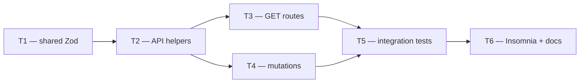

# Phase 2 — Day 17: Properties CRUD API (task pack)

**Objective:** Full REST for listings with Zod contracts in `@propai/shared`, tenant-scoped queries, cursor pagination, filters, RBAC, and manual Insomnia verification.

**Prerequisite:** Day 16 complete — `properties` table + RLS green (`pnpm db:migrate && pnpm db:rls-test`).

**Branch:** `feat/phase-2-properties`.

**References:**
- [PHASE-2-PLAN.md](../PHASE-2-PLAN.md)
- [REQUIREMENTS.md — US property fields](../REQUIREMENTS.md#us-property-fields-v1)
- [api-scaffold.md](../api/api-scaffold.md)
- [ADR 001 — RLS](../adr/001-rls-multi-tenancy.md)
- [ADR 003 — Audit logs](../adr/003-audit-logs.md)
- Patterns: `apps/api/src/modules/audit/routes.ts`, `packages/shared/src/audit/audit-log.ts`, `apps/api/src/audit.integration.test.ts`

**Routes prefix:** `/v1/properties` (not `/properties` alone).

**Out of scope (Day 17):** `property_features` / `property_images` CRUD, presigned uploads (Day 19–21), web UI, `assigned_to` column / reassignment workflow.

---

## Execution order



| Task | Can start after | Parallel with |
| ---- | --------------- | ------------- |
| **T1** | Day 16 merged | — |
| **T2** | T1 merged | — |
| **T3** | T2 merged | T4 (if coordinated on module shell) |
| **T4** | T2 merged | T3 |
| **T5** | T3 + T4 merged | — |
| **T6** | T5 merged (or T3+T4 for docs-only pass) | — |

**Coordination note:** T3 and T4 both touch `apps/api/src/modules/properties/`. Either merge sequentially or split files upfront (`routes/list.ts`, `routes/mutations.ts`, `index.ts` registers both).

---

## Shared conventions (all tasks)

| Topic | Rule |
| ----- | ---- |
| Auth | Session cookie on all `/v1/properties/*` (tenant-context plugin) |
| Tenant | `tenantId` from `request.tenantId` only — **never** from body/query |
| DB access | `runInTenantContext(tenantId, …)` + explicit `select` columns |
| Permission gate | `createRequirePermissionHook("properties:write")` on all routes |
| Agent scope (v1) | **Assigned = `created_by === session.user.id`** (no `assigned_to` column yet) |
| Manager / owner | Full tenant scope (all non-deleted properties) |
| Viewer | 403 — no `properties:write` permission |
| Soft delete | `DELETE` sets `soft_deleted_at`; default lists exclude `soft_deleted_at IS NOT NULL` |
| Money in API | `priceUsdCents` integer; optional `hoaFeeUsd` whole dollars |
| Bathrooms in API | string matching `/^\d+(\.\d)?$/` (e.g. `"2.5"`) — map to/from DB `numeric` |
| Dates in response | ISO 8601 strings (`z.iso.datetime()`) |
| Audit | `writeAuditEventSafe` on create/update/delete — extend `AUDIT_ACTIONS` |
| Errors | `apiError()` JSON `{ error, message }` — existing error-handler |
| TypeScript | Strict, no `any` |

### Endpoints summary

| Method | Path | RBAC | Notes |
| ------ | ---- | ---- | ----- |
| `POST` | `/v1/properties` | `properties:write` | Sets `createdBy` from session |
| `GET` | `/v1/properties` | `properties:write` | Cursor + filters; agent scope |
| `GET` | `/v1/properties/:id` | `properties:write` | 404 if other tenant / agent not owner |
| `PATCH` | `/v1/properties/:id` | `properties:write` | Partial update; agent scope |
| `DELETE` | `/v1/properties/:id` | `properties:write` | Soft delete; agent scope |

### List query params

| Param | Type | Notes |
| ----- | ---- | ----- |
| `limit` | int 1–100 | default `20` |
| `cursor` | string | `ISO8601\|uuid` (same pattern as audit logs) |
| `status` | enum | optional filter |
| `type` | enum | optional filter |
| `city` | string | optional, exact match (case-insensitive OK) |
| `state` | string | optional, 2-letter US code |
| `minPriceUsdCents` | int | optional, inclusive |
| `maxPriceUsdCents` | int | optional, inclusive |

---

## T1 — `@propai/shared` Zod contracts + unit tests

**Owner chat prompt:**

> Implement Day 17 / T1: Property Zod schemas in `@propai/shared` — CreatePropertySchema, UpdatePropertySchema, PropertyResponse, list query/response. Add unit tests. No API routes yet.

### Do

- [ ] Create `packages/shared/src/properties/property.ts`
- [ ] Reuse enum values aligned with DB (`packages/db/src/schema/properties.ts`):
  - `propertyTypeSchema`: `single_family`, `condo`, `townhouse`, `multi_family`
  - `propertyStatusSchema`: `draft`, `active`, `under_contract`, `sold`, `rented`
  - `rentOrSaleSchema`: `sale`, `rent`
- [ ] **`CreatePropertySchema`** — required fields for new listing:

```typescript
// Shape (implement fully with Zod refinements)
{
  title: string (min 1, max 200)
  description?: string
  type: propertyTypeSchema
  status?: propertyStatusSchema  // default draft at API layer if omitted
  priceUsdCents: int positive
  rentOrSale: rentOrSaleSchema
  bedrooms: int min 0
  bathrooms: string regex /^\d+(\.5)?$/  // v1: whole or .5
  sqFt: int positive
  yearBuilt?: int (1800 .. currentYear+1)
  hoaFeeUsd?: int min 0
  addressLine1, city, state (2-letter), zipCode (5 or ZIP+4)
  addressLine2?: string
  latitude?: number (-90..90)
  longitude?: number (-180..180)
}
```

- [ ] **`UpdatePropertySchema`** = `CreatePropertySchema.partial()` (all fields optional)
- [ ] **`PropertyResponseSchema`** — full row for API responses:

```typescript
{
  id: uuid
  tenantId: uuid
  title, description, type, status, priceUsdCents, rentOrSale
  bedrooms, bathrooms (string), sqFt, yearBuilt, hoaFeeUsd
  addressLine1, addressLine2, city, state, zipCode
  latitude, longitude (nullable numbers or null)
  createdBy: string | null
  createdAt, updatedAt: iso datetime
  softDeletedAt: iso datetime | null
}
```

- [ ] **`PropertyListQuerySchema`** — cursor pagination + filters (table above)
- [ ] **`PropertyListResponseSchema`**: `{ items: PropertyResponse[], nextCursor: string | null }`
- [ ] **`PropertyCreateResponseSchema`**: `{ property: PropertyResponse }` (or `{ item }` — pick one, document in T6)
- [ ] Export all from `packages/shared/src/index.ts`
- [ ] Extend **`AUDIT_ACTIONS`** in `packages/shared/src/audit/audit-log.ts`:
  - `property.created`, `property.updated`, `property.deleted`
- [ ] Create `packages/shared/src/properties/property.test.ts`:
  - Valid minimal create passes
  - Invalid state, zip, bathrooms, negative price fail
  - Update empty object passes
  - List query defaults (`limit` 20)
- [ ] Run: `pnpm test:shared && pnpm typecheck`

### Done when

- Schemas exported; tests green
- API/web can import types without `@propai/db` enum duplication in consumers

### Files

- `packages/shared/src/properties/property.ts` (new)
- `packages/shared/src/properties/property.test.ts` (new)
- `packages/shared/src/index.ts` (edit)
- `packages/shared/src/audit/audit-log.ts` (edit — audit actions)

---

## T2 — API helpers: mapper, cursor, agent scope

**Owner chat prompt:**

> Implement Day 17 / T2: Property API helpers in apps/api — map DB row to PropertyResponse, cursor encode/decode (audit pattern), resolvePropertyAccess for agent vs manager scope. No routes yet.

**Depends on:** T1 merged.

### Do

- [ ] `apps/api/src/lib/property-cursor.ts` — copy pattern from `audit-cursor.ts` (`createdAt|id`)
- [ ] `apps/api/src/lib/map-property-row.ts` — map Drizzle row → `PropertyResponse`:
  - `bathrooms` → string (`row.bathrooms.toString()`)
  - `latitude` / `longitude` → `number | null` from numeric
  - dates → `.toISOString()`
- [ ] `apps/api/src/lib/property-access.ts`:

```typescript
type PropertyAccessResult =
  | { allowed: true; scope: "all" | "assigned" }
  | { allowed: false; reason: "not_found" | "forbidden" };

// resolveListScope(role): agents → filter createdBy = userId; manager/owner → no extra filter
// assertPropertyAccess(role, userId, property): agent must match createdBy
```

- [ ] `apps/api/src/lib/property-access.test.ts` — unit tests for agent/manager/owner matrix
- [ ] Run: `pnpm --filter @propai/api test` (unit tests pass)

### Done when

- Helpers tested; no route registration yet

### Files

- `apps/api/src/lib/property-cursor.ts` (new)
- `apps/api/src/lib/map-property-row.ts` (new)
- `apps/api/src/lib/property-access.ts` (new)
- `apps/api/src/lib/property-access.test.ts` (new)

---

## T3 — GET routes: list + by id

**Owner chat prompt:**

> Implement Day 17 / T3: GET /v1/properties (cursor, filters, agent scope) and GET /v1/properties/:id. Register properties module in app.ts. Use @propai/shared schemas and T2 helpers.

**Depends on:** T2 merged.

### Do

- [ ] Create module shell:
  - `apps/api/src/modules/properties/index.ts` — register routes + `memberRolePlugin` if needed
  - `apps/api/src/modules/properties/routes.ts` — start with GET handlers
- [ ] Register in `apps/api/src/app.ts` inside `/v1` block: `await registerPropertiesModule(v1)`
- [ ] **`GET /v1/properties`**
  - `preHandler`: `createRequirePermissionHook("properties:write")`
  - Parse query with `PropertyListQuerySchema`
  - Build Drizzle `where` with `and(...)`:
    - always `isNull(properties.softDeletedAt)`
    - optional filters (status, type, city, state, price range)
    - agent scope: `eq(properties.createdBy, session.user.id)` when role is `agent`
  - Cursor: `orderBy(desc(createdAt), desc(id))`, same OR pattern as audit routes
  - Explicit `select` — do not `select()` whole table blindly if extra columns added later
  - Response: `PropertyListResponse`
- [ ] **`GET /v1/properties/:id`**
  - Params schema: `z.object({ id: z.uuid() })`
  - Load row in tenant context; 404 if missing or soft-deleted
  - Agent: 404 (not 403) if `createdBy !== session.user.id` — avoid leaking existence
  - Response: `{ property: PropertyResponse }`
- [ ] Run: `pnpm typecheck`

### Done when

- Module registered; GET routes compile
- Manual smoke optional (Insomnia in T6)

### Files

- `apps/api/src/modules/properties/index.ts` (new)
- `apps/api/src/modules/properties/routes.ts` (new)
- `apps/api/src/app.ts` (edit)

---

## T4 — Mutation routes: POST, PATCH, DELETE (soft)

**Owner chat prompt:**

> Implement Day 17 / T4: POST/PATCH/DELETE /v1/properties with audit events, createdBy from session, agent scope on mutations, soft delete.

**Depends on:** T2 merged; T3 module shell exists (merge T3 first or coordinate file ownership).

### Do

- [ ] **`POST /v1/properties`**
  - Body: `CreatePropertySchema`
  - Insert with `tenantId`, `createdBy: session.user.id`
  - `writeAuditEventSafe`: `property.created`, `entityType: "property"`
  - 201 + `{ property: PropertyResponse }`
- [ ] **`PATCH /v1/properties/:id`**
  - Body: `UpdatePropertySchema`
  - Load existing; agent scope check
  - Update `updatedAt: new Date()`
  - Do not allow client to set `tenantId`, `createdBy`, `softDeletedAt`
  - Audit: `property.updated` with changed field keys in metadata
  - 200 + `{ property: PropertyResponse }`
- [ ] **`DELETE /v1/properties/:id`**
  - Soft delete: set `softDeletedAt = now()`, touch `updatedAt`
  - Agent scope check
  - Audit: `property.deleted`
  - 200 + `{ property: PropertyResponse }` or 204 — pick one, document in T6
- [ ] Run: `pnpm typecheck`

### Done when

- Full CRUD handlers present
- Audit actions use extended `AUDIT_ACTIONS` from T1

### Files

- `apps/api/src/modules/properties/routes.ts` (edit)

---

## T5 — Integration tests

**Owner chat prompt:**

> Implement Day 17 / T5: Integration tests for /v1/properties — tenant isolation, agent vs manager RBAC, filters, cursor, soft delete. Follow audit.integration.test.ts patterns.

**Depends on:** T3 + T4 merged.

### Do

- [ ] Create `apps/api/src/properties.integration.test.ts`
- [ ] Test cases (minimum):

| # | Scenario | Expect |
| - | -------- | ------ |
| 1 | Owner creates property via POST | 201, `createdBy` set |
| 2 | Owner lists properties | 200, includes created row |
| 3 | Agent A creates property; Agent B GET by id | 404 |
| 4 | Manager lists properties | 200, sees Agent A's property |
| 5 | Agent PATCH own property | 200 |
| 6 | Agent PATCH another agent's property | 404 |
| 7 | Filter by `status` + `minPriceUsdCents` | correct subset |
| 8 | Cursor pagination returns `nextCursor`, second page non-overlapping | |
| 9 | DELETE soft-deletes; GET list excludes | |
| 10 | Viewer role GET /v1/properties | 403 |
| 11 | Unauthenticated request | 401 |
| 12 | Tenant B session cannot GET Tenant A property id | 404 |

- [ ] Use brokerage sign-up + invite flow (same as `audit.integration.test.ts`)
- [ ] Run: `pnpm test:api`

### Done when

- `pnpm test:api` green including new file

### Files

- `apps/api/src/properties.integration.test.ts` (new)

---

## T6 — Insomnia collection + API docs

**Owner chat prompt:**

> Implement Day 17 / T6: Insomnia collection for Properties CRUD, update api-scaffold.md and Postman collection folder. Document RBAC manual steps.

**Depends on:** T3 + T4 (T5 green preferred for accurate examples).

### Do

- [ ] Create `docs/api/propai-api.insomnia.json` (Insomnia v4 export):
  - Environment: `baseUrl` = `http://localhost:3333`
  - Folder **Day 17 — Properties**
  - Requests: sign-up (or reuse auth), POST, GET list, GET by id, PATCH, DELETE
  - Query examples: `?status=active&state=TX&minPriceUsdCents=10000000`
  - Cookie auth inherited from sign-in request
- [ ] Update `docs/api/propai-api.postman_collection.json` — mirror same folder (project already uses Postman)
- [ ] Update `docs/api/api-scaffold.md` — properties module layout + endpoint table
- [ ] Optional: add Insomnia import note to `docs/api/auth-flow.md`
- [ ] Manual verification checklist in this file's integration section

### Done when

- Insomnia collection imports and runs against local API
- Docs list all query params and RBAC rules

### Files

- `docs/api/propai-api.insomnia.json` (new)
- `docs/api/propai-api.postman_collection.json` (edit)
- `docs/api/api-scaffold.md` (edit)

---

## Day 17 integration checklist (after T1–T6)

```bash
pnpm docker:up
pnpm db:migrate
pnpm db:rls-test
pnpm test:shared
pnpm test:api
pnpm typecheck
```

Manual (Insomnia):

1. Brokerage sign-up → save session cookie  
2. POST `/v1/properties` with sample Austin TX listing  
3. GET `/v1/properties` — row appears  
4. Invite agent → agent creates listing → manager sees both, agents see only own  
5. DELETE → list no longer includes row  

- [ ] All tasks merged to `feat/phase-2-properties`
- [ ] Zod shared between API and future web (`@propai/shared`)
- [ ] Ready for **Day 18+** (object storage / photos) or web module per PHASE-2-PLAN

---

## Copy-paste prompts for parallel chats

### Chat A — T1 (start now)

```
Projeto: propai-os (monorepo). Fase 2, Day 17, Tarefa T1.

Leia docs/tasks/PHASE-2-DAY-17.md seção T1. Implemente schemas Zod de properties em packages/shared (CreatePropertySchema, UpdatePropertySchema, PropertyResponse, list query/response). Estenda AUDIT_ACTIONS com property.created/updated/deleted. Unit tests em property.test.ts. pnpm test:shared && pnpm typecheck.
```

### Chat B — T2 (após T1)

```
Projeto: propai-os. Fase 2, Day 17, Tarefa T2.

Leia docs/tasks/PHASE-2-DAY-17.md seção T2. Crie helpers em apps/api/src/lib: property-cursor, map-property-row, property-access (agent = created_by, manager/owner = all). Unit tests. Sem routes ainda.
```

### Chat C — T3 (após T2)

```
Projeto: propai-os. Fase 2, Day 17, Tarefa T3.

Leia docs/tasks/PHASE-2-DAY-17.md seção T3. Implemente GET /v1/properties (cursor + filtros + scope agent) e GET /v1/properties/:id. Registre módulo properties em app.ts. RBAC properties:write. runInTenantContext + select explícito.
```

### Chat D — T4 (após T2; coordenar com T3)

```
Projeto: propai-os. Fase 2, Day 17, Tarefa T4.

Leia docs/tasks/PHASE-2-DAY-17.md seção T4. Implemente POST/PATCH/DELETE /v1/properties (soft delete), audit events, createdBy da session. Agent scope em PATCH/DELETE. Depende do shell do módulo (T3).
```

### Chat E — T5 (após T3+T4)

```
Projeto: propai-os. Fase 2, Day 17, Tarefa T5.

Leia docs/tasks/PHASE-2-DAY-17.md seção T5. Crie apps/api/src/properties.integration.test.ts — isolamento tenant, RBAC agent/manager/viewer, filtros, cursor, soft delete. pnpm test:api verde.
```

### Chat F — T6 (após T3+T4)

```
Projeto: propai-os. Fase 2, Day 17, Tarefa T6.

Leia docs/tasks/PHASE-2-DAY-17.md seção T6. Crie docs/api/propai-api.insomnia.json (folder Day 17 Properties). Atualize postman collection e api-scaffold.md.
```

---

## RBAC matrix (v1 — document in PR)

| Role | List / read | Create | Update | Delete |
| ---- | ----------- | ------ | ------ | ------ |
| owner | All in tenant | Yes | All | All |
| manager | All in tenant | Yes | All | All |
| agent | `created_by = self` only | Yes (sets self as creator) | Own only | Own only |
| viewer | 403 | 403 | 403 | 403 |

**Future:** explicit `assigned_to` column + reassignment API (not Day 17).

---

## Deferred

| Item | Target |
| ---- | ------ |
| `properties:read` separate permission | Not needed v1 — reuse `properties:write` |
| Nested features/images in API | Day 21+ |
| `includeDeleted` query for managers | Optional follow-up |
| OpenAPI / Swagger | Phase 2+ |
