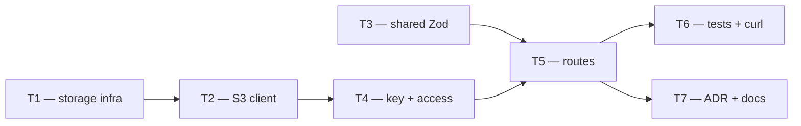

# Phase 2 — Day 18: Image upload (R2/S3 presigned) (task pack)

**Objective:** Secure property photo upload/download via presigned URLs — binary never flows through the API.

**Prerequisite:** Day 17 complete — `/v1/properties` CRUD green (`pnpm test:api`).

**Branch:** `feat/phase-2-properties`.

**References:**
- [PHASE-2-PLAN.md](../PHASE-2-PLAN.md)
- [ADR 004 — Properties schema](../adr/004-properties-schema.md)
- [.env.example](../../.env.example) — `S3_*` vars
- Patterns: `apps/api/src/modules/properties/routes.ts`, `apps/api/src/lib/property-access.ts`

**Route prefix:** User spec says `/uploads/…` — in this codebase that means **`/v1/uploads/…`** (session + tenant middleware only applies under `/v1/`).

**Out of scope (Day 18):** Persisting `property_images` rows, photo reorder/delete API, AI vision, web upload UI, public bucket URLs.

---

## Execution order



| Task | Can start after | Parallel with |
| ---- | --------------- | ------------- |
| **T1** | Day 17 merged | T3 |
| **T2** | T1 (env known) | T3 |
| **T3** | — | T1, T2 |
| **T4** | T2 merged | T3 |
| **T5** | T3 + T4 merged | — |
| **T6** | T5 merged | T7 |
| **T7** | T5 merged | T6 |

---

## Shared conventions (all tasks)

| Topic | Rule |
| ----- | ---- |
| Bucket | **Private** — no public ACL; access only via presigned URLs |
| SDK | `@aws-sdk/client-s3` + `@aws-sdk/s3-request-presigner` (S3-compatible → R2) |
| Env | `S3_ENDPOINT`, `S3_REGION`, `S3_BUCKET`, `S3_ACCESS_KEY_ID`, `S3_SECRET_ACCESS_KEY` |
| Max size | **10 MB** (`10 * 1024 * 1024` bytes) — validate before issuing PUT presign |
| Content-Type | **`image/*` only** — reject `application/pdf`, etc. |
| Object key | `tenant/{tenantId}/property/{propertyId}/{uuid}.{ext}` |
| Extension | Derive from `contentType` (`image/jpeg` → `.jpg`, `image/png` → `.png`, `image/webp` → `.webp`) |
| Tenant in key | Must match `request.tenantId` — never trust client-supplied tenant segment |
| Download | `GET /v1/uploads/presign-download?key=` — key must belong to current tenant |
| Auth | Session cookie + active org (tenant-context) |
| RBAC | `createRequirePermissionHook("properties:write")` on both endpoints |
| Property gate | Property must exist, not soft-deleted; reuse `assertPropertyAccess` (agent scope) |
| Presign TTL | Default **900s** (15 min); optional env `S3_PRESIGN_EXPIRES_SECONDS` |
| Errors | 400 invalid input; 404 property/key not found; 503 if storage not configured |
| Secrets | Never commit `.env`; document placeholders only |

### Endpoints

| Method | Path | Body / query | Response |
| ------ | ---- | ------------ | -------- |
| `POST` | `/v1/uploads/presign` | `{ propertyId, contentType, contentLength }` | `{ uploadUrl, key, expiresAt, headers }` |
| `GET` | `/v1/uploads/presign-download` | `?key=` | `{ downloadUrl, expiresAt }` |

### Key format (strict)

```
tenant/{tenantId}/property/{propertyId}/{uuid}.{ext}
```

Regex for validation (example):

```
^tenant/[0-9a-f-]{36}/property/[0-9a-f-]{36}/[0-9a-f-]{36}\.(jpg|jpeg|png|webp)$
```

---

## T1 — Storage infra: private bucket + CORS runbook (+ optional MinIO local)

**Owner chat prompt:**

> Implement Day 18 / T1: Object storage infra docs — private R2 bucket, CORS config, optional MinIO Docker profile for local curl tests. No API routes yet.

### Do

- [ ] Create `docs/infra/object-storage.md`:
  - **Cloudflare R2:** create bucket (private), API token, `S3_ENDPOINT` format
  - **CORS** (browser PUT from dashboard origin):

```json
[
  {
    "AllowedOrigins": ["http://localhost:3000", "https://your-dashboard.vercel.app"],
    "AllowedMethods": ["PUT", "GET", "HEAD"],
    "AllowedHeaders": ["Content-Type", "Content-Length"],
    "ExposeHeaders": ["ETag"],
    "MaxAgeSeconds": 3600
  }
]
```

  - Note: bucket stays private; CORS allows browser **direct upload** to presigned URL
- [ ] Optional but recommended — **MinIO** for local dev (`docker compose --profile storage up -d`):
  - Service on port `9000` (API) / `9001` (console)
  - Init script creates bucket `propai-uploads`, private
  - Document `.env` values:

```env
S3_ENDPOINT=http://localhost:9000
S3_REGION=us-east-1
S3_BUCKET=propai-uploads
S3_ACCESS_KEY_ID=minioadmin
S3_SECRET_ACCESS_KEY=minioadmin
```

- [ ] Update `.env.example` comments if new vars added (`S3_PRESIGN_EXPIRES_SECONDS`)
- [ ] Update `docs/LOCAL-DEV.md` — link to object-storage.md

### Done when

- Team can stand up bucket (R2 or MinIO) without reading source code
- CORS documented for dashboard origin

### Files

- `docs/infra/object-storage.md` (new)
- `docker-compose.yml` (edit — optional MinIO profile)
- `docker/minio/init/` (optional bucket bootstrap)
- `docs/LOCAL-DEV.md` (edit)

---

## T2 — S3 client + presign helpers

**Owner chat prompt:**

> Implement Day 18 / T2: Add AWS SDK to @propai/api — S3 client from env, createPresignedPutUrl and createPresignedGetUrl helpers. Unit tests with mocked client. Fail gracefully when S3_* unset.

**Depends on:** T1 env contract agreed (or use `.env.example` as source of truth).

### Do

- [ ] Add dependencies to `apps/api/package.json`:
  - `@aws-sdk/client-s3`
  - `@aws-sdk/s3-request-presigner`
- [ ] `apps/api/src/lib/storage-config.ts`:
  - `getStorageConfig()` — parse env; return `null` if incomplete (for 503 in routes)
  - `UPLOAD_MAX_BYTES = 10 * 1024 * 1024`
  - `ALLOWED_CONTENT_TYPE_PREFIX = "image/"`
  - `isAllowedImageContentType(contentType: string): boolean`
- [ ] `apps/api/src/lib/s3-client.ts`:
  - Lazy singleton `S3Client` with `forcePathStyle: true` (R2/MinIO friendly)
  - `createPresignedPutUrl({ key, contentType, contentLength, expiresIn })`
  - `createPresignedGetUrl({ key, expiresIn })`
  - PUT command includes `ContentType` so signature binds to it
- [ ] `apps/api/src/lib/s3-client.test.ts` — mock client or test pure validation helpers
- [ ] Run: `pnpm --filter @propai/api typecheck && pnpm --filter @propai/api test`

### Done when

- Helpers compile; tests pass without real bucket (mocked or config-only tests)

### Files

- `apps/api/package.json`
- `apps/api/src/lib/storage-config.ts` (new)
- `apps/api/src/lib/s3-client.ts` (new)
- `apps/api/src/lib/s3-client.test.ts` (new)

---

## T3 — `@propai/shared` upload Zod schemas

**Owner chat prompt:**

> Implement Day 18 / T3: Zod schemas for presigned upload/download in @propai/shared — request/response types exported for API and future web. Unit tests for contentType and size limits.

**Can run in parallel with T1/T2.**

### Do

- [ ] Create `packages/shared/src/uploads/presign.ts`
- [ ] **`presignUploadRequestSchema`**:

```typescript
{
  propertyId: z.uuid()
  contentType: z.string().refine(isImageContentType)
  contentLength: z.number().int().min(1).max(10_485_760) // 10MB
}
```

- [ ] **`presignUploadResponseSchema`**: `{ uploadUrl, key, expiresAt: z.iso.datetime(), headers: z.record(z.string(), z.string()) }`
- [ ] **`presignDownloadQuerySchema`**: `{ key: z.string().min(1).max(512) }`
- [ ] **`presignDownloadResponseSchema`**: `{ downloadUrl: z.url(), expiresAt: z.iso.datetime() }`
- [ ] Export types + schemas from `packages/shared/src/index.ts`
- [ ] `packages/shared/src/uploads/presign.test.ts` — reject oversize, non-image, invalid uuid
- [ ] Run: `pnpm test:shared && pnpm typecheck`

### Done when

- Shared contracts ready for API + web Day 25

### Files

- `packages/shared/src/uploads/presign.ts` (new)
- `packages/shared/src/uploads/presign.test.ts` (new)
- `packages/shared/src/index.ts` (edit)

---

## T4 — Object key builder + tenant/property validation

**Owner chat prompt:**

> Implement Day 18 / T4: Storage key utilities — buildObjectKey, parseObjectKey, assertKeyBelongsToTenant. Integrate property lookup + assertPropertyAccess before presign. No HTTP routes yet.

**Depends on:** T2 merged.

### Do

- [ ] `apps/api/src/lib/object-key.ts`:
  - `buildObjectKey({ tenantId, propertyId, contentType })` → uses `randomUUID()` + extension map
  - `parseObjectKey(key)` → `{ tenantId, propertyId, fileId, ext } | null`
  - `assertKeyBelongsToTenant(key, tenantId): boolean`
  - Reject `..`, leading `/`, wrong segment count
- [ ] `apps/api/src/lib/resolve-property-for-upload.ts`:
  - Load property by id in `runInTenantContext`
  - Call `assertPropertyAccess(role, userId, property)`
  - Return property or null (404 at route layer)
- [ ] `apps/api/src/lib/object-key.test.ts` — valid/invalid keys, tenant mismatch
- [ ] Run: `pnpm --filter @propai/api test`

### Done when

- Key format matches spec exactly: `tenant/{tenantId}/property/{propertyId}/{uuid}.jpg`

### Files

- `apps/api/src/lib/object-key.ts` (new)
- `apps/api/src/lib/resolve-property-for-upload.ts` (new)
- `apps/api/src/lib/object-key.test.ts` (new)

---

## T5 — Upload routes module

**Owner chat prompt:**

> Implement Day 18 / T5: POST /v1/uploads/presign and GET /v1/uploads/presign-download. Register uploads module in app.ts. RBAC properties:write, property access, storage helpers from T2/T4.

**Depends on:** T3 + T4 merged.

### Do

- [ ] Create `apps/api/src/modules/uploads/index.ts` + `routes.ts`
- [ ] Register in `apps/api/src/app.ts` inside `/v1` block
- [ ] **`POST /v1/uploads/presign`**
  - `preHandler`: `createRequirePermissionHook("properties:write")`
  - Body: `presignUploadRequestSchema`
  - If storage config missing → 503 `"Object storage is not configured."`
  - Resolve property + agent scope (404 if denied)
  - Build key via `buildObjectKey` (server-side only)
  - Return presigned PUT URL + `headers: { "Content-Type": contentType }`
- [ ] **`GET /v1/uploads/presign-download`**
  - Query: `presignDownloadQuerySchema`
  - Validate key belongs to `request.tenantId`
  - Optional: verify property still exists (recommended)
  - Return presigned GET URL
- [ ] Do **not** insert `property_images` row yet (Day 19+ confirm flow)
- [ ] Run: `pnpm typecheck`

### Done when

- Routes registered; manual curl ready (T6)

### Files

- `apps/api/src/modules/uploads/index.ts` (new)
- `apps/api/src/modules/uploads/routes.ts` (new)
- `apps/api/src/app.ts` (edit)

---

## T6 — Integration tests + curl verification guide

**Owner chat prompt:**

> Implement Day 18 / T6: Integration tests for /v1/uploads presign endpoints (mock S3 or skip when storage unset). Add docs/api/upload-curl.md with full curl flow: sign-up → create property → presign → PUT image → presign-download → GET image.

**Depends on:** T5 merged.

### Do

- [ ] `apps/api/src/uploads.integration.test.ts`:
  - 401 unauthenticated
  - 403 viewer role
  - Agent cannot presign for another agent's property (404)
  - Manager can presign for any tenant property
  - 400 for `contentType: application/pdf`
  - 400 for `contentLength > 10MB`
  - 400/403 for download key belonging to another tenant
  - Mock `createPresignedPutUrl` / `createPresignedGetUrl` via vi.mock OR test only validation paths when `getStorageConfig()` returns null → 503
- [ ] Create `docs/api/upload-curl.md`:

```bash
# 1) Sign up / session cookie
# 2) POST /v1/properties
# 3) POST /v1/uploads/presign -d '{"propertyId":"...","contentType":"image/jpeg","contentLength":12345}'
# 4) curl -X PUT -H "Content-Type: image/jpeg" --data-binary @photo.jpg "$uploadUrl"
# 5) GET "/v1/uploads/presign-download?key=tenant/..."
# 6) curl -o out.jpg "$downloadUrl"
```

- [ ] Run: `pnpm test:api`

### Done when

- Integration tests green
- curl doc verified once against MinIO or R2

### Files

- `apps/api/src/uploads.integration.test.ts` (new)
- `docs/api/upload-curl.md` (new)

---

## T7 — ADR 005 + API docs + Insomnia/Postman

**Owner chat prompt:**

> Implement Day 18 / T7: Write ADR 005 object storage, update api-scaffold.md, extend Insomnia/Postman with Day 18 upload folder.

**Depends on:** T5 merged (T6 green preferred).

### Do

- [ ] Create `docs/adr/005-object-storage-r2.md` (Accept) — key format, private bucket, presign flow, CORS, limits
- [ ] Update `docs/adr/README.md` — ADR 005 Accepted
- [ ] Update `docs/api/api-scaffold.md` — uploads module + endpoints table
- [ ] Extend `docs/api/propai-api.postman_collection.json` — folder **Day 18 — Uploads**
- [ ] Extend or create Insomnia requests (if `propai-api.insomnia.json` exists from Day 17)

### Done when

- ADR 005 linked from README index
- Manual collection runs presign → PUT → download flow

### Files

- `docs/adr/005-object-storage-r2.md` (new)
- `docs/adr/README.md` (edit)
- `docs/api/api-scaffold.md` (edit)
- `docs/api/propai-api.postman_collection.json` (edit)

---

## Day 18 integration checklist

```bash
pnpm docker:up
# optional: docker compose --profile storage up -d   # if MinIO added in T1
pnpm db:migrate
pnpm test:shared
pnpm test:api
pnpm typecheck
```

Manual (see `docs/api/upload-curl.md`):

- [ ] POST presign returns `uploadUrl` + `key`
- [ ] PUT binary to `uploadUrl` returns 200/204
- [ ] GET presign-download returns URL that serves the image
- [ ] Cross-tenant key rejected on download

---

## Copy-paste prompts for parallel chats

### Chat A — T1 (infra — start now)

```
Projeto: propai-os. Fase 2, Day 18, Tarefa T1.

Leia docs/tasks/PHASE-2-DAY-18.md seção T1. Documente R2 bucket privado + CORS em docs/infra/object-storage.md. Opcional: profile MinIO no docker-compose para dev local. Atualize LOCAL-DEV.md. Sem routes API ainda.
```

### Chat B — T2 (S3 client — após T1 ou em paralelo com .env.example)

```
Projeto: propai-os. Fase 2, Day 18, Tarefa T2.

Leia docs/tasks/PHASE-2-DAY-18.md seção T2. Adicione @aws-sdk/client-s3 e s3-request-presigner ao @propai/api. Implemente storage-config.ts e s3-client.ts (presigned PUT/GET). Max 10MB, image/* only. Unit tests. pnpm --filter @propai/api test.
```

### Chat C — T3 (shared Zod — paralelo)

```
Projeto: propai-os. Fase 2, Day 18, Tarefa T3.

Leia docs/tasks/PHASE-2-DAY-18.md seção T3. Schemas Zod de upload em packages/shared (presignUploadRequest/Response, presignDownload query/response). Unit tests. pnpm test:shared.
```

### Chat D — T4 (keys + access — após T2)

```
Projeto: propai-os. Fase 2, Day 18, Tarefa T4.

Leia docs/tasks/PHASE-2-DAY-18.md seção T4. object-key.ts (tenant/{tenantId}/property/{propertyId}/{uuid}.ext), parse/validate tenant, resolve-property-for-upload com assertPropertyAccess. Unit tests.
```

### Chat E — T5 (routes — após T3+T4)

```
Projeto: propai-os. Fase 2, Day 18, Tarefa T5.

Leia docs/tasks/PHASE-2-DAY-18.md seção T5. POST /v1/uploads/presign e GET /v1/uploads/presign-download. Módulo uploads em app.ts. RBAC properties:write. Não persistir property_images ainda.
```

### Chat F — T6 (tests + curl — após T5)

```
Projeto: propai-os. Fase 2, Day 18, Tarefa T6.

Leia docs/tasks/PHASE-2-DAY-18.md seção T6. uploads.integration.test.ts + docs/api/upload-curl.md (fluxo completo curl). pnpm test:api verde.
```

### Chat G — T7 (docs — após T5, paralelo T6)

```
Projeto: propai-os. Fase 2, Day 18, Tarefa T7.

Leia docs/tasks/PHASE-2-DAY-18.md seção T7. ADR 005 object storage, api-scaffold.md, Postman/Insomnia folder Day 18 Uploads.
```

---

## Security checklist (review in PR)

| Check | Implementation |
| ----- | -------------- |
| Tenant isolation | Key prefix must match session `tenantId` |
| No path traversal | Reject `..`, slashes in wrong places |
| Property ownership | Agent scope via existing `assertPropertyAccess` |
| Content binding | Presigned PUT signed with fixed `Content-Type` |
| Size limit | Reject `contentLength > 10MB` before presign |
| Private bucket | No public read; download only via presigned GET |
| Short TTL | 15 min default; no long-lived URLs |

---

## Deferred (not Day 18)

| Item | Target |
| ---- | ------ |
| `POST /v1/properties/:id/photos/confirm` + DB row | Day 19+ |
| Audit `photo.uploaded` | Day 19+ |
| Image resize / virus scan | v2 |
| CDN public URLs for marketplace | Later phase |
