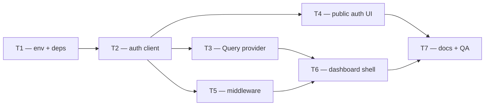

# Phase 2 — Day 19: Web app scaffold (dashboard) (task pack)

**Objective:** Connect `apps/web` to the Fastify API — authenticated dashboard shell with login/signup, TanStack Query, and route protection.

**Prerequisite:** API auth working locally (`pnpm test:api` — brokerage sign-up + sign-in + `/v1/*`).

**Branch:** `feat/phase-2-properties` (or `feat/web-dashboard`).

**References:**
- [PHASE-2-PLAN.md](../PHASE-2-PLAN.md)
- [auth-flow.md](../api/auth-flow.md)
- [LOCAL-DEV.md](../LOCAL-DEV.md)
- Existing scaffold: `apps/web/` (Next.js App Router, Tailwind v4, shadcn partial, dark mode forced)

**Important:** `apps/web` **already exists** — do not recreate the app. Extend the scaffold; verify `pnpm --filter @propai/web dev` on port 3000.

**Stack note:** Repo runs **Next.js 16** App Router (not 15) — same patterns apply.

**Out of scope (Day 19):** Properties list/detail UI, photo upload UI, marketplace app, Server Actions for CRUD, Better Auth React SDK if raw fetch + cookies is sufficient.

---

## Execution order



| Task | Can start after | Parallel with |
| ---- | --------------- | ------------- |
| **T1** | — | — |
| **T2** | T1 | — |
| **T3** | T2 | T4, T5 |
| **T4** | T2 | T3, T5 |
| **T5** | T2 | T3, T4 |
| **T6** | T3 + T5 | T4 (if routes agreed) |
| **T7** | T4 + T6 | — |

---

## Shared conventions (all tasks)

| Topic | Rule |
| ----- | ---- |
| API base | `NEXT_PUBLIC_API_URL` (client) / `API_URL` (server) — default `http://localhost:3333` |
| Auth cookies | Better Auth on API — `credentials: "include"` on all auth + `/v1/*` fetches |
| Sign-in | `POST {API}/api/auth/sign-in/email` `{ email, password, rememberMe }` |
| Sign-up (brokerage) | `POST {API}/api/auth/brokerage-sign-up` — creates org + owner |
| Session check | `GET {API}/api/auth/get-session` |
| CORS | API already trusts `http://localhost:3000` (`TRUSTED_ORIGINS`) |
| UI language | en-US copy (product convention in docs) |
| Theme | Dark mode only — `forcedTheme="dark"` (already in `providers.tsx`) |
| Colors | Tokens from `src/app/globals.css` — no hardcoded hex |
| Components | shadcn/ui from `@/components/ui` |
| Forms | React Hook Form + `zodResolver` + shadcn `Form` (project rules) |
| Feedback | Sonner toast — no `alert()` |
| Paths | `@/` alias; business UI later in `src/modules/` |

### Route map (target)

| Path | Layout | Auth |
| ---- | ------ | ---- |
| `/login` | Public (centered card) | Guest only → redirect `/dashboard` if session |
| `/signup` | Public | Guest only |
| `/dashboard` | Authenticated sidebar | Required |
| `/` | — | Redirect → `/dashboard` or `/login` |

---

## T1 — Env, dependencies, shadcn gaps

**Owner chat prompt:**

> Implement Day 19 / T1: Wire web env vars, add TanStack Query + React Hook Form + hookform resolvers to @propai/web. Install missing shadcn components (form, sidebar). Verify existing Next/Tailwind/shadcn scaffold. No pages yet.

### Do

- [ ] Add to `apps/web/package.json`:
  - `@tanstack/react-query`
  - `react-hook-form`
  - `@hookform/resolvers`
- [ ] Env (root `.env.example` + document in LOCAL-DEV):
  - `NEXT_PUBLIC_API_URL=http://localhost:3333` (browser fetch target)
  - Confirm `API_URL` for server/middleware (may mirror same value)
- [ ] `apps/web/src/lib/env.ts` — typed accessors; throw in dev if `NEXT_PUBLIC_API_URL` missing
- [ ] Install shadcn components if missing:
  ```bash
  cd apps/web && pnpm dlx shadcn@latest add form sidebar
  ```
- [ ] Confirm `components.json`, `globals.css` tokens, `Providers` + Sonner intact
- [ ] Run: `pnpm install && pnpm --filter @propai/web typecheck`

### Done when

- Dependencies installed; form + sidebar components present
- `pnpm --filter @propai/web dev` still starts

### Files

- `apps/web/package.json`
- `apps/web/src/lib/env.ts` (new)
- `.env.example` (edit)
- `apps/web/src/components/ui/form.tsx` (if added)
- `apps/web/src/components/ui/sidebar.tsx` (if added)

---

## T2 — Auth client + session types

**Owner chat prompt:**

> Implement Day 19 / T2: Auth client for apps/web — signIn, signUpBrokerage, getSession, signOut calling Fastify Better Auth endpoints with credentials include. Types for session/user. No UI yet.

**Depends on:** T1 merged.

### Do

- [ ] `apps/web/src/lib/auth-client.ts`:
  - `signInWithEmail({ email, password, rememberMe? })`
  - `signUpBrokerage({ email, password, name, organizationName })`
  - `getSession()` → `{ session, user } | null`
  - `signOut()`
  - All use `fetch(getApiUrl() + path, { credentials: "include", ... })`
  - Parse errors from API `{ error, message }`
- [ ] `apps/web/src/types/auth.ts` — `AuthSession`, `AuthUser` (no `any`)
- [ ] Optional: `apps/web/src/lib/api-client.ts` — base fetch for future `/v1/*` calls
- [ ] Unit test `apps/web/src/lib/auth-client.test.ts` — mock `fetch` for 200/401 paths (optional but recommended)

### API endpoints (reference)

| Action | Method | Path |
| ------ | ------ | ---- |
| Sign in | POST | `/api/auth/sign-in/email` |
| Brokerage sign-up | POST | `/api/auth/brokerage-sign-up` |
| Session | GET | `/api/auth/get-session` |
| Sign out | POST | `/api/auth/sign-out` |

### Done when

- Client functions compile; can be imported by forms and middleware

### Files

- `apps/web/src/lib/auth-client.ts` (new)
- `apps/web/src/lib/api-client.ts` (new, optional)
- `apps/web/src/types/auth.ts` (new)

---

## T3 — TanStack Query provider

**Owner chat prompt:**

> Implement Day 19 / T3: Add TanStack Query to apps/web — QueryClientProvider in Providers, default staleTime, devtools optional off. Export useSessionQuery hook wrapping getSession.

**Depends on:** T2 merged.

### Do

- [ ] `apps/web/src/lib/query-client.ts` — factory for QueryClient
- [ ] Update `apps/web/src/components/providers.tsx`:
  - Wrap children with `QueryClientProvider`
  - Keep ThemeProvider + Toaster
- [ ] `apps/web/src/hooks/use-session.ts`:
  - `useSessionQuery()` — `queryKey: ["session"]`, calls `getSession()`
  - `useRequireSession()` — for client components (optional)
- [ ] Run: `pnpm --filter @propai/web typecheck`

### Done when

- Provider tree: Query → Theme → children → Toaster

### Files

- `apps/web/src/lib/query-client.ts` (new)
- `apps/web/src/components/providers.tsx` (edit)
- `apps/web/src/hooks/use-session.ts` (new)

---

## T4 — Public layout + login + signup pages

**Owner chat prompt:**

> Implement Day 19 / T4: Public auth layout, /login and /signup pages with React Hook Form + Zod + shadcn Form. Login calls signInWithEmail → redirect /dashboard. Signup calls signUpBrokerage → redirect /dashboard. Toast on error.

**Depends on:** T2 merged (T3 optional for pages).

### Do

- [ ] Route group `apps/web/src/app/(public)/layout.tsx` — centered layout, no sidebar
- [ ] Zod schemas in `apps/web/src/modules/auth/schemas/`:
  - `loginSchema` — email, password
  - `brokerageSignUpSchema` — match API fields (mirror `brokerageSignUpSchema` from API)
- [ ] `LoginForm.tsx` (client) — `useForm` + `useTransition`; success → `router.push("/dashboard")` + `router.refresh()`
- [ ] `SignUpForm.tsx` (client) — same pattern for brokerage sign-up
- [ ] Pages:
  - `apps/web/src/app/(public)/login/page.tsx`
  - `apps/web/src/app/(public)/signup/page.tsx`
- [ ] Links between login ↔ signup
- [ ] If session exists on public pages, redirect to `/dashboard` (client check or small server wrapper)

### Done when

- Forms submit to API; successful login lands on `/dashboard` (shell may be empty until T6)

### Files

- `apps/web/src/app/(public)/layout.tsx` (new)
- `apps/web/src/app/(public)/login/page.tsx` (new)
- `apps/web/src/app/(public)/signup/page.tsx` (new)
- `apps/web/src/modules/auth/schemas/login.ts` (new)
- `apps/web/src/modules/auth/schemas/sign-up.ts` (new)
- `apps/web/src/modules/auth/components/login-form.tsx` (new)
- `apps/web/src/modules/auth/components/sign-up-form.tsx` (new)

---

## T5 — Auth middleware (route protection)

**Owner chat prompt:**

> Implement Day 19 / T5: Next.js middleware — protect /dashboard/*, redirect unauthenticated to /login; redirect authenticated away from /login and /signup. Forward cookies to API get-session.

**Depends on:** T2 merged.

### Do

- [ ] `apps/web/src/middleware.ts`:
  - Matcher: `/dashboard/:path*`, `/login`, `/signup`, `/`
  - Forward `cookie` header to `GET ${API_URL}/api/auth/get-session`
  - No session + protected path → redirect `/login?next=...`
  - Has session + auth page → redirect `/dashboard`
  - `/` → `/dashboard` or `/login`
- [ ] Use `API_URL` server-side (not only NEXT_PUBLIC)
- [ ] Avoid infinite redirect loops; skip static assets / `_next`
- [ ] Document: middleware runs on Edge — keep fetch minimal, no Node-only APIs

### Done when

- Unauthenticated user cannot open `/dashboard`
- Authenticated user hitting `/login` goes to `/dashboard`

### Files

- `apps/web/src/middleware.ts` (new)

---

## T6 — Authenticated dashboard layout (sidebar)

**Owner chat prompt:**

> Implement Day 19 / T6: Dashboard route group with sidebar layout — org name from GET /v1/organization/me, nav placeholders (Dashboard, Properties disabled), sign out, empty dashboard home page.

**Depends on:** T3 + T5 merged.

### Do

- [ ] Route group `apps/web/src/app/(dashboard)/layout.tsx`:
  - shadcn `Sidebar` + header
  - Dark tokens only; `rounded-2xl` cards pattern from project rules
- [ ] `apps/web/src/components/app-sidebar.tsx` — nav items (Properties link → `#` or `/dashboard` until Day 22)
- [ ] `apps/web/src/components/user-nav.tsx` — sign out button → `signOut()` + redirect `/login`
- [ ] Fetch org profile:
  - Server Component in layout **or** client `useQuery` → `GET /v1/organization/me` with credentials
  - Prefer small client wrapper if cookies only work via browser fetch
- [ ] `apps/web/src/app/(dashboard)/dashboard/page.tsx` — welcome / empty state
- [ ] Remove or redirect old `apps/web/src/app/page.tsx` — root `/` handled by middleware

### Module header pattern (project rules)

```tsx
<section className="rounded-2xl border border-border bg-card p-6">
  <p className="text-sm font-medium uppercase tracking-[0.18em] text-primary">Module</p>
  <h1 className="text-3xl font-bold tracking-tight text-foreground">Dashboard</h1>
  <p className="text-sm leading-7 text-muted-foreground">…</p>
</section>
```

### Done when

- Logged-in user sees sidebar + dashboard home
- Sign out returns to login

### Files

- `apps/web/src/app/(dashboard)/layout.tsx` (new)
- `apps/web/src/app/(dashboard)/dashboard/page.tsx` (new)
- `apps/web/src/components/app-sidebar.tsx` (new)
- `apps/web/src/components/user-nav.tsx` (new)
- `apps/web/src/app/page.tsx` (edit or remove)

---

## T7 — Docs + manual QA checklist

**Owner chat prompt:**

> Implement Day 19 / T7: Document dashboard auth flow in docs/web/dashboard-auth.md, update LOCAL-DEV.md and PHASE-2-PLAN. Manual QA steps for local + staging API_URL.

**Depends on:** T4 + T6 merged.

### Do

- [ ] Create `docs/web/dashboard-auth.md`:
  - Architecture diagram (browser → API cookies)
  - Env vars table
  - Flow: sign-up → dashboard → refresh → still authed → sign-out
  - Staging: set `NEXT_PUBLIC_API_URL` to staging API
  - Troubleshooting: CORS, missing BETTER_AUTH_SECRET, cookies blocked
- [ ] Update `docs/LOCAL-DEV.md` — Day 19 verification bullets
- [ ] Update `docs/AUTH-POC-FEEDBACK.md` — mark dashboard login as in progress/done
- [ ] Optional: add `NEXT_PUBLIC_API_URL` to `pnpm dev:smoke` checks

### Manual QA (must pass)

```bash
pnpm docker:up && pnpm db:migrate
pnpm dev
# Browser http://localhost:3000/signup → create brokerage
# → lands on /dashboard with sidebar
# Open incognito → /dashboard redirects to /login
# Login with same credentials → /dashboard
```

### Done when

- Another dev can login without reading source code

### Files

- `docs/web/dashboard-auth.md` (new)
- `docs/LOCAL-DEV.md` (edit)

---

## Day 19 integration checklist

```bash
pnpm install
pnpm docker:up
pnpm db:migrate
pnpm typecheck
pnpm dev
```

Browser:

- [ ] Sign-up creates org + lands on dashboard
- [ ] Login works for existing user
- [ ] `/dashboard` blocked without session
- [ ] Sign out clears session
- [ ] Works with `NEXT_PUBLIC_API_URL` pointing to staging (if deployed)

---

## Copy-paste prompts for parallel chats

### Chat A — T1 (start now)

```
Projeto: propai-os. Fase 2, Day 19, Tarefa T1.

Leia docs/tasks/PHASE-2-DAY-19.md seção T1. apps/web já existe — adicione TanStack Query, react-hook-form, @hookform/resolvers. NEXT_PUBLIC_API_URL no .env.example. shadcn form + sidebar. pnpm --filter @propai/web typecheck.
```

### Chat B — T2 (após T1)

```
Projeto: propai-os. Fase 2, Day 19, Tarefa T2.

Leia docs/tasks/PHASE-2-DAY-19.md seção T2. auth-client.ts (signIn, signUpBrokerage, getSession, signOut) com credentials include para API :3333. Types em src/types/auth.ts. Sem UI ainda.
```

### Chat C — T3 (após T2)

```
Projeto: propai-os. Fase 2, Day 19, Tarefa T3.

Leia docs/tasks/PHASE-2-DAY-19.md seção T3. QueryClientProvider em providers.tsx, use-session.ts hook com getSession. pnpm --filter @propai/web typecheck.
```

### Chat D — T4 (após T2, paralelo T3/T5)

```
Projeto: propai-os. Fase 2, Day 19, Tarefa T4.

Leia docs/tasks/PHASE-2-DAY-19.md seção T4. Layout (public), páginas /login e /signup com React Hook Form + Zod + shadcn Form. Redirect /dashboard após sucesso. Sonner toast em erro.
```

### Chat E — T5 (após T2, paralelo T3/T4)

```
Projeto: propai-os. Fase 2, Day 19, Tarefa T5.

Leia docs/tasks/PHASE-2-DAY-19.md seção T5. middleware.ts — proteger /dashboard, redirect login/signup, forward cookies para GET /api/auth/get-session.
```

### Chat F — T6 (após T3+T5)

```
Projeto: propai-os. Fase 2, Day 19, Tarefa T6.

Leia docs/tasks/PHASE-2-DAY-19.md seção T6. Layout (dashboard) com sidebar shadcn, /dashboard home, org name via /v1/organization/me, sign out. Dark mode tokens only.
```

### Chat G — T7 (após T4+T6)

```
Projeto: propai-os. Fase 2, Day 19, Tarefa T7.

Leia docs/tasks/PHASE-2-DAY-19.md seção T7. docs/web/dashboard-auth.md + LOCAL-DEV.md. Checklist QA login local e staging API_URL.
```

---

## Cookie / CORS troubleshooting (for implementers)

| Symptom | Likely cause | Fix |
| ------- | ------------ | --- |
| 401 after login | Cookies not sent | `credentials: "include"` on fetch |
| CORS error | Origin not trusted | Add staging web URL to `TRUSTED_ORIGINS` in API |
| Session null in middleware | Edge fetch missing Cookie | Forward `request.headers.get("cookie")` |
| Login OK but /v1 403 | No active org | Brokerage sign-up sets `activeOrganizationId` |

---

## Deferred (not Day 19)

| Item | Target |
| ---- | ------ |
| Properties module pages | Day 22+ |
| Invite accept UI | Later |
| `better-auth/react` client | Optional refactor |
| Next.js rewrite proxy for `/api/auth` | Only if cookie issues persist |
| E2E Playwright login | Optional |
