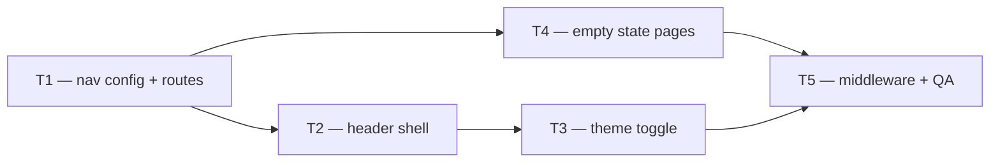

# Phase 2 — Day 20: Dashboard layout and navigation (task pack)

**Objective:** Professional SaaS shell — full sidebar navigation, header with org context, theme toggle, and empty states per section.

**Prerequisite:** Day 19 complete — auth shell, middleware, TanStack Query, login/signup.

**Branch:** `feat/phase-2-day-20-25`

**References:**
- [PHASE-2-PLAN.md](../PHASE-2-PLAN.md)
- [dashboard-auth.md](../web/dashboard-auth.md)
- Day 19 task pack: [PHASE-2-DAY-19.md](./PHASE-2-DAY-19.md)

**Out of scope (Day 20):** Real data in sections, properties CRUD UI, notifications backend, settings forms.

---

## Execution order



| Task | Can start after | Parallel with |
| ---- | --------------- | ------------- |
| **T1** | — | — |
| **T2** | T1 | T4 |
| **T3** | T2 | T4 |
| **T4** | T1 | T2, T3 |
| **T5** | T3 + T4 | — |

---

## Shared conventions

| Topic | Rule |
| ----- | ---- |
| Routes | `/dashboard`, `/properties`, `/leads`, `/visits`, `/analytics`, `/settings` |
| Layout | `(dashboard)` route group — shared sidebar + header |
| Nav config | `src/modules/dashboard/data/nav-items.ts` |
| Protected routes | `src/modules/dashboard/data/protected-routes.ts` (Edge-safe, no lucide) |
| UI language | en-US copy (product convention) |
| Theme | Dark default + light toggle via `next-themes` |
| Colors | Tokens from `globals.css` only |
| Navigation | Next.js `<Link>` — client-side transitions, no full reload |

---

## T1 — Sidebar navigation

**Owner chat prompt:**

> Implement Day 20 / T1: Expand sidebar with Dashboard, Properties, Leads, Visits, Analytics, Settings. Centralize nav items in `modules/dashboard/data/`. Active state per route. All links enabled (no disabled placeholders).

### Do

- [ ] `nav-items.ts` — 6 nav items with Lucide icons
- [ ] `protected-routes.ts` — prefixes for middleware (no icon imports)
- [ ] Update `app-sidebar.tsx` — map nav items, `isDashboardNavActive()`
- [ ] Sidebar header keeps org name from `useOrganizationQuery()`

### Done when

- All 6 items visible; active highlight follows current path

### Files

- `apps/web/src/modules/dashboard/data/nav-items.ts`
- `apps/web/src/modules/dashboard/data/protected-routes.ts`
- `apps/web/src/components/app-sidebar.tsx`

---

## T2 — Dashboard header

**Owner chat prompt:**

> Implement Day 20 / T2: Header with organization name, notification bell placeholder (disabled), user dropdown menu (name, email, sign out). Extract `dashboard-header.tsx`.

### Do

- [ ] `dashboard-header.tsx` — SidebarTrigger + org name + actions
- [ ] Bell icon button — disabled, `title` / `aria-label` "coming soon"
- [ ] `user-nav.tsx` — shadcn DropdownMenu with initials avatar + sign out
- [ ] Update `(dashboard)/layout.tsx` to use `DashboardHeader`

### Done when

- Header shows org name; user menu opens; sign out still works

### Files

- `apps/web/src/components/dashboard-header.tsx`
- `apps/web/src/components/user-nav.tsx`
- `apps/web/src/app/(dashboard)/layout.tsx`

---

## T3 — Dark / light theme toggle

**Owner chat prompt:**

> Implement Day 20 / T3: Theme toggle in header. Remove `forcedTheme="dark"` from providers. `theme-toggle.tsx` with Sun/Moon icons. Default dark, user can switch to light.

### Do

- [ ] `theme-toggle.tsx` — `useTheme()`, hydration guard
- [ ] `providers.tsx` — remove `forcedTheme`, keep `defaultTheme="dark"`
- [ ] `app/layout.tsx` — remove hardcoded `dark` class on `<html>`
- [ ] Place toggle in `dashboard-header.tsx`

### Done when

- Toggle switches theme without flash or broken styles

### Files

- `apps/web/src/components/theme-toggle.tsx`
- `apps/web/src/components/providers.tsx`
- `apps/web/src/app/layout.tsx`
- `apps/web/src/components/dashboard-header.tsx`

---

## T4 — Empty state pages

**Owner chat prompt:**

> Implement Day 20 / T4: Reusable `ModuleHeader` + `EmptyState` components. Create page per nav section with module header pattern and dashed empty state card.

### Do

- [ ] `module-header.tsx` — label + h1 + description (project pattern)
- [ ] `empty-state.tsx` — icon, title, description
- [ ] Pages:
  - `(dashboard)/dashboard/page.tsx`
  - `(dashboard)/properties/page.tsx`
  - `(dashboard)/leads/page.tsx`
  - `(dashboard)/visits/page.tsx`
  - `(dashboard)/analytics/page.tsx`
  - `(dashboard)/settings/page.tsx`

### Done when

- Each route renders header + empty state; no 404

### Files

- `apps/web/src/components/module-header.tsx`
- `apps/web/src/components/empty-state.tsx`
- `apps/web/src/app/(dashboard)/*/page.tsx` (6 pages)

---

## T5 — Middleware + navigation QA

**Owner chat prompt:**

> Implement Day 20 / T5: Extend middleware to protect all dashboard routes. Verify client-side navigation between sections without full page reload.

### Do

- [ ] `middleware.ts` — matcher for all 6 route prefixes
- [ ] Use `isProtectedDashboardPath()` from `protected-routes.ts`
- [ ] Unauthenticated `/properties` etc. → `/login?next=...`
- [ ] Manual QA: click every sidebar item while logged in

### Done when

- Navigation between routes without broken reload
- Protected routes blocked without session

### Files

- `apps/web/src/middleware.ts`

---

## Day 20 integration checklist

```bash
pnpm install
pnpm docker:up
pnpm db:migrate
pnpm --filter @propai/web typecheck
pnpm dev
```

Browser (logged in):

- [ ] Sidebar shows 6 items; active state correct
- [ ] Header shows organization name
- [ ] User menu → sign out works
- [ ] Bell visible (disabled placeholder)
- [ ] Theme toggle dark ↔ light
- [ ] Each section shows empty state
- [ ] Sidebar links navigate without full reload
- [ ] Incognito `/properties` → redirect login

---

## Copy-paste prompts for parallel chats

### Chat A — T1

```
Projeto: propai-os. Fase 2, Day 20, Tarefa T1.
Branch: feat/phase-2-day-20-25. Leia docs/tasks/PHASE-2-DAY-20.md seção T1.
Sidebar com 6 itens de navegação, nav-items.ts + protected-routes.ts.
```

### Chat B — T2 (após T1)

```
Projeto: propai-os. Fase 2, Day 20, Tarefa T2.
Leia docs/tasks/PHASE-2-DAY-20.md seção T2.
Header com org name, bell placeholder, user dropdown menu.
```

### Chat C — T3 (após T2)

```
Projeto: propai-os. Fase 2, Day 20, Tarefa T3.
Leia docs/tasks/PHASE-2-DAY-20.md seção T3.
Theme toggle dark/light, remover forcedTheme.
```

### Chat D — T4 (após T1, paralelo T2/T3)

```
Projeto: propai-os. Fase 2, Day 20, Tarefa T4.
Leia docs/tasks/PHASE-2-DAY-20.md seção T4.
ModuleHeader + EmptyState + 6 páginas vazias.
```

### Chat E — T5 (após T3+T4)

```
Projeto: propai-os. Fase 2, Day 20, Tarefa T5.
Leia docs/tasks/PHASE-2-DAY-20.md seção T5.
Middleware para todas as rotas do dashboard + QA navegação.
```

---

## Deferred (not Day 20)

| Item | Target |
| ---- | ------ |
| Properties list/detail | Day 22–24 |
| Photo confirm API | Day 21 |
| Notifications backend | Later |
| Settings forms | Later |
