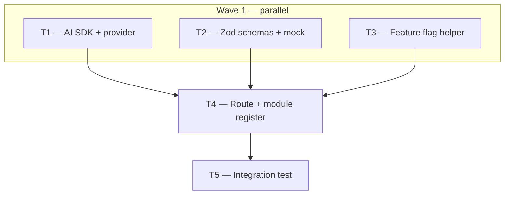

# Phase 3 — Day 26: AI module backend scaffold (task pack)

**Objective:** `apps/api/src/modules/ai/` with Vercel AI SDK, feature flag, and structured output schema. When vision is disabled, the analyze endpoint returns validated mock JSON (no LLM call).

**Prerequisite:** Phase 2 complete — properties CRUD, presigned upload + image confirm (`feat/phase-2-day-20-25` merged or equivalent on `main`).

**Branch:** `feat/phase-3-ai-module` (from `main`).

**References:**

- [REQUIREMENTS.md — AI vision](../REQUIREMENTS.md#vision-photo--listing-fields)
- [architecture.md — AI and async work](../architecture.md#ai-and-async-work-cross-cutting)
- [ADR index — 006 AI workers (planned)](../adr/README.md)
- API patterns: `apps/api/src/modules/properties/`, `apps/api/src/lib/storage-config.ts`
- Shared contracts: `packages/shared/src/properties/`

**Out of scope (Day 26):** BullMQ workers, real LLM vision calls, rate limiting, web UI, embeddings / semantic search.

---

## Execution order



| Task | Can start after | Parallel with |
| ---- | --------------- | ------------- |
| **T1** | — | T2, T3 |
| **T2** | — | T1, T3 |
| **T3** | — | T1, T2 |
| **T4** | T1 + T2 + T3 merged on branch | — |
| **T5** | T4 merged | — |

**Minimum chats:** 3 parallel (T1, T2, T3) → 1 sequential (T4) → 1 optional (T5, or fold into T4).

---

## Shared conventions (all tasks)

| Topic | Rule |
| ----- | ---- |
| API prefix | Routes under `/v1/ai/*` (registered in `buildApp` `/v1` scope) |
| Auth | Session + tenant context on `/v1/*` (same as properties) |
| Schemas | Zod in `@propai/shared` — API and web import the same contracts |
| TypeScript | Strict, no `any`; `z.infer<typeof schema>` for types |
| Feature flag | `ENABLE_AI_VISION` — `true` only when env is exactly `"true"` (case-insensitive) |
| Day 26 behavior | Flag `false` → **mock JSON** validated with shared schema; **no** provider call |
| Provider | Vercel AI SDK (`ai` + `@ai-sdk/openai`); Anthropic optional comment in `.env.example` only |
| LLM keys | Never required when flag is off; provider module returns `null` if key missing |

### Structured output shape (v1 vision)

| Field | Type | Notes |
| ----- | ---- | ----- |
| `bedrooms` | `number` (int ≥ 0) | Whole bedrooms |
| `bathrooms` | `number` | Supports half-baths (e.g. `2.5`) |
| `sqFt` | `number` (int > 0) | US living area |
| `features` | `string[]` | Tags e.g. `["pool", "garage"]` |
| `description` | `string` | Marketing copy suggestion |
| `seoTitle` | `string` | Page title suggestion |
| `suggestedPriceUSD` | `number` (int ≥ 0) \| `null` | Whole USD, not cents; nullable when uncertain |

---

## T1 — Vercel AI SDK + provider bootstrap

**Owner chat prompt:**

> Implement Phase 3 / Day 26 / **T1**: Install Vercel AI SDK in `@propai/api` and add provider bootstrap. Read `docs/tasks/PHASE-3-DAY-26.md`. Branch `feat/phase-3-ai-module`. Add `ai` and `@ai-sdk/openai`. Create `apps/api/src/lib/ai-provider.ts` that exports `getOpenAiProvider()` returning a configured OpenAI provider instance or `null` when `OPENAI_API_KEY` is missing. Do not add routes yet. Run `pnpm --filter @propai/api typecheck`.

### Do

- [ ] `pnpm --filter @propai/api add ai @ai-sdk/openai`
- [ ] `apps/api/src/lib/ai-provider.ts` — read `OPENAI_API_KEY` from env; trim; return `null` if empty
- [ ] Export type-safe helper (no throw on missing key)
- [ ] Confirm `.env.example` already documents `OPENAI_API_KEY` (add comment if needed)

### Done when

- Dependencies in `apps/api/package.json`
- Provider helper compiles; unit test optional

### Files

- `apps/api/package.json`
- `apps/api/src/lib/ai-provider.ts`

---

## T2 — Shared Zod schemas + mock fixture

**Owner chat prompt:**

> Implement Phase 3 / Day 26 / **T2**: Add AI vision Zod schemas to `@propai/shared`. Read `docs/tasks/PHASE-3-DAY-26.md`. Branch `feat/phase-3-ai-module`. Create `propertyImageAnalysisSchema` (bedrooms, bathrooms, sqFt, features[], description, seoTitle, suggestedPriceUSD nullable). Add request schema `analyzePropertyImagesRequestSchema` with `imageUrls: z.array(z.url()).min(1).max(10)` and matching response schema. Export mock fixture `MOCK_PROPERTY_IMAGE_ANALYSIS` that satisfies the schema. Re-export from `packages/shared/src/index.ts`. Add vitest test parsing mock. Run `pnpm --filter @propai/shared test`.

### Do

- [ ] `packages/shared/src/ai/property-image-analysis.ts`
- [ ] `propertyImageAnalysisSchema`, `analyzePropertyImagesRequestSchema`, `analyzePropertyImagesResponseSchema`
- [ ] `MOCK_PROPERTY_IMAGE_ANALYSIS` constant (`satisfies` or parse in test)
- [ ] `packages/shared/src/ai/property-image-analysis.test.ts`
- [ ] Export from `packages/shared/src/index.ts`

### Done when

- Mock validates with `propertyImageAnalysisSchema.parse()`
- `pnpm --filter @propai/shared test` green

### Files

- `packages/shared/src/ai/property-image-analysis.ts`
- `packages/shared/src/ai/property-image-analysis.test.ts`
- `packages/shared/src/index.ts`

---

## T3 — Feature flag `ENABLE_AI_VISION`

**Owner chat prompt:**

> Implement Phase 3 / Day 26 / **T3**: Feature flag helper for AI vision. Read `docs/tasks/PHASE-3-DAY-26.md`. Branch `feat/phase-3-ai-module`. Create `apps/api/src/lib/ai-feature-flags.ts` with `isAiVisionEnabled(): boolean` — true only when `process.env.ENABLE_AI_VISION` is `"true"` (case-insensitive). Add `apps/api/src/lib/ai-feature-flags.test.ts`. Do not add routes. Run `pnpm --filter @propai/api test`.

### Do

- [ ] `isAiVisionEnabled()` in `apps/api/src/lib/ai-feature-flags.ts`
- [ ] Vitest covering `true`, `false`, unset, `TRUE`, empty string
- [ ] `.env.example` already has `ENABLE_AI_VISION=false` — no change unless missing

### Done when

- Tests pass; no route changes

### Files

- `apps/api/src/lib/ai-feature-flags.ts`
- `apps/api/src/lib/ai-feature-flags.test.ts`

---

## T4 — `POST /v1/ai/analyze-property-images` (mock when flag off)

**Owner chat prompt:**

> Implement Phase 3 / Day 26 / **T4**: AI module route scaffold. Read `docs/tasks/PHASE-3-DAY-26.md`. Branch `feat/phase-3-ai-module` (merge/rebase T1–T3 first). Create `apps/api/src/modules/ai/` with `index.ts` + `routes.ts`. Register `registerAiModule` in `apps/api/src/app.ts` under `/v1`. Add `POST /v1/ai/analyze-property-images` — auth + tenant context, validate body with `analyzePropertyImagesRequestSchema` from `@propai/shared`. When `isAiVisionEnabled()` is **false**, return `200` with `MOCK_PROPERTY_IMAGE_ANALYSIS` (response validated by `analyzePropertyImagesResponseSchema`). When flag is **true**, return `503` with clear message "AI vision is not implemented yet" (Day 27+). Permission: `properties:write` or equivalent existing property mutation permission. Run `pnpm --filter @propai/api typecheck`.

### Do

- [ ] `apps/api/src/modules/ai/routes.ts` — POST handler
- [ ] `apps/api/src/modules/ai/index.ts` — `registerAiModule`
- [ ] Wire in `apps/api/src/app.ts`
- [ ] Zod provider on route (fastify-type-provider-zod pattern from properties)
- [ ] Flag off → mock; flag on → 503 placeholder (no LLM call on Day 26)

### Done when

```bash
# ENABLE_AI_VISION=false (default)
curl -X POST http://localhost:3333/v1/ai/analyze-property-images \
  -H "Content-Type: application/json" \
  -H "Cookie: <session>" \
  -H "x-tenant-id: <org-id>" \
  -d '{"imageUrls":["https://example.com/photo.jpg"]}'
# → 200 + mock JSON matching schema
```

### Files

- `apps/api/src/modules/ai/routes.ts`
- `apps/api/src/modules/ai/index.ts`
- `apps/api/src/app.ts`

---

## T5 — Integration test

**Owner chat prompt:**

> Implement Phase 3 / Day 26 / **T5**: Integration test for AI analyze endpoint. Read `docs/tasks/PHASE-3-DAY-26.md`. Branch `feat/phase-3-ai-module` (after T4). Add `apps/api/src/ai-analyze.integration.test.ts` following patterns from `properties.integration.test.ts`. With `ENABLE_AI_VISION=false`, POST returns 200 and body matches `propertyImageAnalysisSchema`. With flag `true`, returns 503. Run `pnpm --filter @propai/api test`.

### Do

- [ ] Integration test with test tenant/session helpers
- [ ] Assert mock fields (bedrooms, features array, etc.)
- [ ] `pnpm typecheck` at repo root green

### Done when

- `pnpm --filter @propai/api test` passes

### Files

- `apps/api/src/ai-analyze.integration.test.ts`

---

## Day 26 checklist

```bash
git checkout feat/phase-3-ai-module
pnpm install
pnpm --filter @propai/api typecheck
pnpm --filter @propai/shared test
pnpm --filter @propai/api test
pnpm dev
```

- [ ] `ai` + `@ai-sdk/openai` installed in `@propai/api`
- [ ] `ENABLE_AI_VISION=false` → mock JSON from `POST /v1/ai/analyze-property-images`
- [ ] Response validates against `propertyImageAnalysisSchema`
- [ ] `ENABLE_AI_VISION=true` → 503 placeholder (no silent LLM spend on Day 26)
- [ ] No TypeScript errors; no `any`

---

## Copy-paste prompts (quick)

### T1

```
Projeto: propai-os. Phase 3, Day 26, T1.
Branch: feat/phase-3-ai-module. Leia docs/tasks/PHASE-3-DAY-26.md.
Instalar Vercel AI SDK (ai, @ai-sdk/openai) e criar apps/api/src/lib/ai-provider.ts.
Sem rotas ainda.
```

### T2

```
Projeto: propai-os. Phase 3, Day 26, T2.
Branch: feat/phase-3-ai-module. Leia docs/tasks/PHASE-3-DAY-26.md.
Schemas Zod + mock em packages/shared/src/ai/property-image-analysis.ts.
Exportar em @propai/shared com testes vitest.
```

### T3

```
Projeto: propai-os. Phase 3, Day 26, T3.
Branch: feat/phase-3-ai-module. Leia docs/tasks/PHASE-3-DAY-26.md.
Helper isAiVisionEnabled() em apps/api/src/lib/ai-feature-flags.ts + testes.
```

### T4

```
Projeto: propai-os. Phase 3, Day 26, T4.
Branch: feat/phase-3-ai-module (T1–T3 já na branch). Leia docs/tasks/PHASE-3-DAY-26.md.
Módulo apps/api/src/modules/ai/ — POST /v1/ai/analyze-property-images.
Flag off → mock JSON; flag on → 503 placeholder.
```

### T5

```
Projeto: propai-os. Phase 3, Day 26, T5.
Branch: feat/phase-3-ai-module (T4 já na branch). Leia docs/tasks/PHASE-3-DAY-26.md.
Integration test apps/api/src/ai-analyze.integration.test.ts.
```

### Full day (single chat)

```
Projeto: propai-os. Phase 3, Day 26 completo.
Branch: feat/phase-3-ai-module. Leia docs/tasks/PHASE-3-DAY-26.md.
Implementar T1–T5: AI SDK, schemas shared, feature flag, rota mock, integration test.
```
