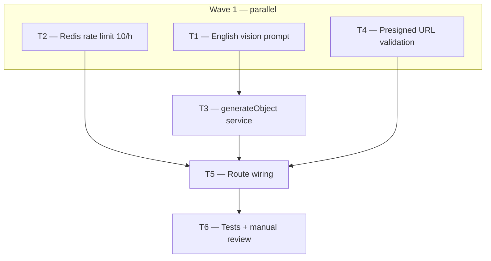

# Phase 3 — Day 27: Vision prompt and image analysis (task pack)

**Objective:** Real vision analysis — upload photos (presigned download URLs) → AI returns structured property fields validated with Zod.

**Prerequisite:** Day 26 complete on `feat/phase-3-ai-module` — `POST /v1/ai/analyze-property-images`, `@propai/shared` schemas, `isAiVisionEnabled()`, `getGeminiProvider()`, mock path when flag off.

**Branch:** `feat/phase-3-ai-module` (same branch as Phase 3).

**References:**

- [PHASE-3-DAY-26.md](./PHASE-3-DAY-26.md)
- [REQUIREMENTS.md — Vision](../REQUIREMENTS.md#vision-photo--listing-fields)
- Presigned download: `GET /v1/uploads/presign-download`, `packages/shared/src/uploads/presign.ts`
- Provider: `apps/api/src/lib/ai-provider.ts` (Gemini via `@ai-sdk/google`)
- Route stub: `apps/api/src/modules/ai/routes.ts` (503 when flag on — replace in Day 27)

**Out of scope (Day 27):** BullMQ async workers (sync LLM call in route is OK for this day; workers in a later day), web UI “Analyze photos” button, embeddings, audit log for AI usage.

**Architecture note:** REQUIREMENTS mention async jobs for vision long-term. Day 27 intentionally uses a **synchronous** `generateObject` call so you can manually validate output with 5 photos. Do not block Day 27 on queue infrastructure.

---

## Execution order



| Task | Can start after | Parallel with |
| ---- | --------------- | ------------- |
| **T1** | Day 26 merged | T2, T4 |
| **T2** | Day 26 merged | T1, T4 |
| **T4** | Day 26 merged | T1, T2 |
| **T3** | T1 merged | T2, T4 (not T5) |
| **T5** | T2 + T3 + T4 merged | — |
| **T6** | T5 merged | — |

**Minimum chats:** 3 parallel (T1, T2, T4) → 1 (T3) → 1 (T5) → 1 optional (T6, or fold into T5).

---

## Shared conventions (all tasks)

| Topic | Rule |
| ----- | ---- |
| Provider | `getGeminiProvider()` + `getGeminiVisionModelId()` — Gemini multimodal |
| SDK | Vercel AI SDK `generateObject` with `propertyImageAnalysisSchema` (Zod) |
| Request | `imageUrls`: 1–10 URLs (already in `analyzePropertyImagesRequestSchema`) |
| Image URLs | Presigned **GET** URLs from `GET /v1/uploads/presign-download` (private R2/MinIO) |
| Flag off | Keep Day 26 behavior: return `MOCK_PROPERTY_IMAGE_ANALYSIS`, no LLM, no rate limit |
| Flag on | Rate limit → validate URLs → LLM → Zod parse → `200` |
| Rate limit | **10 requests / hour / tenant** (`request.tenantId`); `429` + `Retry-After` header |
| Redis | `REDIS_URL` from `.env` (local: `redis://localhost:6379`); fail closed with `503` if Redis unavailable when flag on |
| Errors | Missing `GEMINI_API_KEY` → `503`; invalid LLM JSON → `502`; rate limited → `429` |
| Language | Prompt text in **English** (US real estate); API error messages en-US |
| TypeScript | Strict, no `any` |

### Expected JSON fields (unchanged from Day 26)

`bedrooms`, `bathrooms`, `sqFt`, `features[]`, `description`, `seoTitle`, `suggestedPriceUSD` (nullable)

---

## T1 — English vision prompt

**Owner chat prompt:**

> Implement Phase 3 / Day 27 / **T1**: English prompt for US property photo analysis. Read `docs/tasks/PHASE-3-DAY-27.md`. Branch `feat/phase-3-ai-module`. Create `apps/api/src/modules/ai/prompts/property-vision-prompt.ts` exporting `PROPERTY_VISION_SYSTEM_PROMPT` and `buildPropertyVisionUserPrompt(imageCount: number)`. System prompt: expert US real estate analyst; infer bedrooms, bathrooms, sq ft, features, marketing description, SEO title, optional suggested list price in whole USD; only use visible evidence; use `null` for `suggestedPriceUSD` when uncertain. User prompt: analyze N photos; return JSON matching the schema fields. Add vitest in `property-vision-prompt.test.ts`. No route changes.

### Do

- [ ] `PROPERTY_VISION_SYSTEM_PROMPT` — clear JSON field instructions aligned with `propertyImageAnalysisSchema`
- [ ] `buildPropertyVisionUserPrompt(imageCount)` — mentions US listing context
- [ ] Unit test: exports non-empty strings; `imageCount` reflected in user prompt

### Done when

- Prompt module compiles; tests pass

### Files

- `apps/api/src/modules/ai/prompts/property-vision-prompt.ts`
- `apps/api/src/modules/ai/prompts/property-vision-prompt.test.ts`

---

## T2 — Rate limit (10 requests/hour per tenant)

**Owner chat prompt:**

> Implement Phase 3 / Day 27 / **T2**: Redis rate limiter for AI vision. Read `docs/tasks/PHASE-3-DAY-27.md`. Branch `feat/phase-3-ai-module`. Add `ioredis` (or `redis` v4) to `@propai/api`. Create `apps/api/src/lib/ai-vision-rate-limit.ts` with `checkAiVisionRateLimit(tenantId: string): Promise<{ allowed: true } | { allowed: false; retryAfterSeconds: number }>` — fixed window or sliding window, **max 10 per hour per tenant**, key prefix `ai:vision:`. Create `getRedisClient()` in `apps/api/src/lib/redis.ts` reading `REDIS_URL`. Export `closeRedisClient()` for tests. Vitest with mocked Redis or integration against docker Redis. Do not wire route yet.

### Do

- [ ] Redis client singleton from `REDIS_URL`
- [ ] 10 req/hour/tenant enforcement
- [ ] Return `retryAfterSeconds` when blocked (for `Retry-After` header)
- [ ] Tests: under limit allowed; 11th blocked

### Done when

- `pnpm --filter @propai/api test` green for rate-limit tests

### Files

- `apps/api/package.json`
- `apps/api/src/lib/redis.ts`
- `apps/api/src/lib/ai-vision-rate-limit.ts`
- `apps/api/src/lib/ai-vision-rate-limit.test.ts`

---

## T4 — Presigned image URL validation

**Owner chat prompt:**

> Implement Phase 3 / Day 27 / **T4**: Validate analyze request image URLs are tenant-scoped presigned downloads. Read `docs/tasks/PHASE-3-DAY-27.md`. Branch `feat/phase-3-ai-module`. Create `apps/api/src/lib/validate-tenant-image-url.ts` with `assertTenantImageUrls(tenantId: string, imageUrls: string[]): { ok: true } | { ok: false; message: string }`. Parse each URL; host must match configured `S3_ENDPOINT` host; object key path must include tenant id (`tenant/{tenantId}/property/...` per ADR 005). Vitest with sample MinIO/R2-style URLs. No route changes.

### Do

- [ ] Reuse `parseObjectKey` / `assertKeyBelongsToTenant` from `apps/api/src/lib/object-key.ts` where possible
- [ ] Reject external URLs (e.g. `https://example.com/photo.jpg`) when flag on
- [ ] Tests: valid tenant key passes; wrong tenant / wrong host fails

### Done when

- Validation helper tested; compiles

### Files

- `apps/api/src/lib/validate-tenant-image-url.ts`
- `apps/api/src/lib/validate-tenant-image-url.test.ts`

---

## T3 — Vision analysis service (`generateObject`)

**Owner chat prompt:**

> Implement Phase 3 / Day 27 / **T3**: Gemini vision service with structured output. Read `docs/tasks/PHASE-3-DAY-27.md`. Branch `feat/phase-3-ai-module` (T1 merged). Create `apps/api/src/modules/ai/analyze-property-images-service.ts` exporting `analyzePropertyImages(imageUrls: string[]): Promise<PropertyImageAnalysis>`. Use `generateObject` from `ai` package with `getGeminiProvider()`, `getGeminiVisionModelId()`, prompts from T1, and `propertyImageAnalysisSchema` as the schema. Pass each URL as an image content part (`image` URL). On missing provider return throw typed error `AiProviderNotConfiguredError`. On Zod/parse failure throw `AiAnalysisParseError`. Add unit test with mocked `generateObject` (vitest mock). No route changes.

### Do

- [ ] `generateObject` + multimodal image URLs
- [ ] Final `propertyImageAnalysisSchema.parse()` on result
- [ ] Error types for route to map to 503/502

### Done when

- Service tests pass with mocked LLM

### Files

- `apps/api/src/modules/ai/analyze-property-images-service.ts`
- `apps/api/src/modules/ai/analyze-property-images-service.test.ts`
- `apps/api/src/modules/ai/ai-errors.ts` (optional small error types)

---

## T5 — Route wiring (flag on → real analysis)

**Owner chat prompt:**

> Implement Phase 3 / Day 27 / **T5**: Wire real vision into `POST /v1/ai/analyze-property-images`. Read `docs/tasks/PHASE-3-DAY-27.md`. Branch `feat/phase-3-ai-module` (T2–T4 merged). Update `apps/api/src/modules/ai/routes.ts`: when `isAiVisionEnabled()` is **false**, keep mock (Day 26). When **true**: (1) `checkAiVisionRateLimit(tenantId)` → 429 + `Retry-After` if blocked; (2) `assertTenantImageUrls` → 400 if invalid; (3) `analyzePropertyImages(imageUrls)` → 200 with validated JSON; (4) provider missing → 503; parse errors → 502. Increment rate limit only after successful validation, before LLM call. Run `pnpm --filter @propai/api typecheck`.

### Do

- [ ] Replace Day 26 `503` placeholder when flag on
- [ ] Preserve mock path when flag off
- [ ] HTTP status mapping documented in route comments

### Done when

```bash
# .env: ENABLE_AI_VISION=true, GEMINI_API_KEY=..., REDIS_URL=redis://localhost:6379, S3_* configured
# Upload photos → presign-download URLs → POST analyze
curl -X POST http://localhost:3333/v1/ai/analyze-property-images \
  -H "Content-Type: application/json" \
  -H "Cookie: <session>" \
  -d '{"imageUrls":["<presigned-get-url-1>","<presigned-get-url-2>"]}'
# → 200 + structured JSON
```

### Files

- `apps/api/src/modules/ai/routes.ts`

---

## T6 — Tests + manual review (5 photos)

**Owner chat prompt:**

> Implement Phase 3 / Day 27 / **T6**: Tests and manual review checklist. Read `docs/tasks/PHASE-3-DAY-27.md`. Branch `feat/phase-3-ai-module` (T5 merged). Update `apps/api/src/ai-analyze.integration.test.ts`: flag on + mocked `analyzePropertyImages` returns parsed JSON; rate limit returns 429 on 11th request; invalid external URL returns 400. Add `docs/tasks/PHASE-3-DAY-27-MANUAL.md` with steps: docker up, upload 5 property photos, collect presigned URLs, POST analyze, review bedrooms/baths/sqFt/features/description. Run full `pnpm --filter @propai/api test` and `pnpm typecheck`.

### Do

- [ ] Integration tests for new branches (mock service layer)
- [ ] Manual doc for “5 test photos → reasonable JSON” acceptance
- [ ] Root typecheck green

### Done when

- Automated tests pass
- Manual doc ready for human review with real Gemini key

### Files

- `apps/api/src/ai-analyze.integration.test.ts`
- `docs/tasks/PHASE-3-DAY-27-MANUAL.md`

---

## Day 27 checklist

```bash
git checkout feat/phase-3-ai-module
pnpm docker:up          # Postgres + Redis
pnpm install
pnpm --filter @propai/api test
pnpm typecheck
```

**Env for real vision:**

```env
ENABLE_AI_VISION=true
GEMINI_API_KEY=<your-key>
REDIS_URL=redis://localhost:6379
# S3_* for upload + presign-download
```

- [ ] English prompt drives US-focused field extraction
- [ ] 1–10 presigned image URLs accepted; external URLs rejected when flag on
- [ ] Response validated with `propertyImageAnalysisSchema`
- [ ] 11th request within an hour → `429` per tenant
- [ ] 5 real photos → reasonable JSON (manual review per `PHASE-3-DAY-27-MANUAL.md`)
- [ ] Flag off still returns mock (Day 26 regression)

---

## Copy-paste prompts (quick)

### T1

```
Projeto: propai-os. Phase 3, Day 27, T1.
Branch: feat/phase-3-ai-module. Leia docs/tasks/PHASE-3-DAY-27.md.
Prompt em inglês para análise de fotos US (system + user builder) em apps/api/src/modules/ai/prompts/.
Sem alterar rotas.
```

### T2

```
Projeto: propai-os. Phase 3, Day 27, T2.
Branch: feat/phase-3-ai-module. Leia docs/tasks/PHASE-3-DAY-27.md.
Rate limit Redis: 10 req/hora/tenant para AI vision. apps/api/src/lib/redis.ts + ai-vision-rate-limit.ts.
```

### T4

```
Projeto: propai-os. Phase 3, Day 27, T4.
Branch: feat/phase-3-ai-module. Leia docs/tasks/PHASE-3-DAY-27.md.
Validar imageUrls são presigned downloads do tenant (S3_ENDPOINT + key tenant/{id}/...).
```

### T3

```
Projeto: propai-os. Phase 3, Day 27, T3.
Branch: feat/phase-3-ai-module (T1 na branch). Leia docs/tasks/PHASE-3-DAY-27.md.
Serviço analyzePropertyImages com generateObject (Gemini) + propertyImageAnalysisSchema.
Testes com mock. Sem rotas ainda.
```

### T5

```
Projeto: propai-os. Phase 3, Day 27, T5.
Branch: feat/phase-3-ai-module (T2–T4 na branch). Leia docs/tasks/PHASE-3-DAY-27.md.
Conectar rota POST /v1/ai/analyze-property-images: flag on → rate limit + validação + LLM; flag off → mock.
```

### T6

```
Projeto: propai-os. Phase 3, Day 27, T6.
Branch: feat/phase-3-ai-module (T5 na branch). Leia docs/tasks/PHASE-3-DAY-27.md.
Atualizar integration tests + docs/tasks/PHASE-3-DAY-27-MANUAL.md (5 fotos, revisão manual).
```

### Full day (single chat)

```
Projeto: propai-os. Phase 3, Day 27 completo.
Branch: feat/phase-3-ai-module. Leia docs/tasks/PHASE-3-DAY-27.md.
Implementar T1–T6: prompt, rate limit, validação URLs, serviço Gemini, rota, testes + manual.
```
