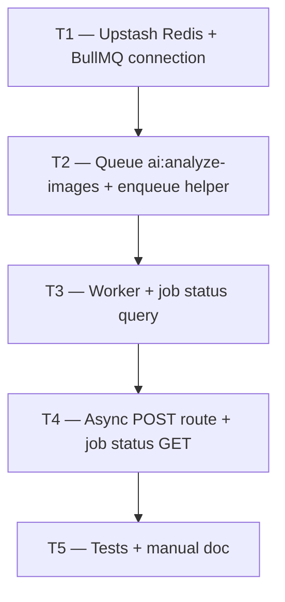

# Phase 3 — Day 28: BullMQ + Redis async job infrastructure (task pack)

**Objective:** Async job infrastructure for AI workflows — queue `ai:analyze-images`, worker process, Redis via Upstash, retry logic, and job status tracking.

**Prerequisite:** Day 27 complete — `POST /ai/analyze-property-images` returns synchronous result; Gemini vision service working.

**Branch:** `feat/phase-3-ai-module`

**References:**

- [guia-desenvolvimento-propai-os-dia-a-dia.md](../../guia-desenvolvimento-propai-os-dia-a-dia.md) — Day 28
- [PHASE-3-DAY-27.md](./PHASE-3-DAY-27.md) — synchronous vision endpoint
- [PHASE-3-DAY-28-MANUAL.md](./PHASE-3-DAY-28-MANUAL.md) — smoke test guide
- Queue: `apps/api/src/modules/ai/queues/analyze-images-queue.ts`
- Worker: `apps/api/src/modules/ai/workers/analyze-property-images-worker.ts`
- Worker entry: `apps/api/src/worker.ts`

**Out of scope (Day 28):** Embedding queue (Day 29), semantic search (Day 31), lead scoring (Day 32), web UI (Day 30).

---

## Execution order



| Task | Can start after | Parallel with |
| ---- | --------------- | ------------- |
| **T1** | Day 27 merged | — |
| **T2** | T1 | — |
| **T3** | T2 | — |
| **T4** | T3 | — |
| **T5** | T4 | — |

---

## Shared conventions (all tasks)

| Topic | Rule |
| ----- | ---- |
| Queue name | `ai:analyze-images` (`AI_ANALYZE_IMAGES_QUEUE_NAME`) |
| Redis env | `REDIS_BULLMQ_URL` (ioredis, TLS for Upstash) |
| Retry | 3 attempts, exponential backoff |
| Job statuses | `queued \| processing \| completed \| failed` |
| Worker entry | `apps/api/src/worker.ts` — separate from HTTP server |
| Worker script | `pnpm --filter @propai/api worker:dev` |
| Concurrency | 1 (vision is rate-limited per tenant) |
| Graceful shutdown | `SIGTERM` → close worker + Redis connections |
| TypeScript | Strict, no `any` |

---

## T1 — Upstash Redis + BullMQ dedicated connection

### Do

- [ ] `apps/api/src/lib/redis-bullmq.ts` — `ioredis` connection from `REDIS_BULLMQ_URL`; TLS support for Upstash (`rediss://`); `getBullMqConnection()` singleton; `BullMqRedisUnavailableError`
- [ ] Separate from main Redis (`redis.ts`) to avoid shared-connection conflicts with BullMQ
- [ ] `.env.example` updated: `REDIS_BULLMQ_URL`

### Files

- `apps/api/src/lib/redis-bullmq.ts`
- `.env.example`

---

## T2 — Queue `ai:analyze-images` + enqueue helper

### Do

- [ ] `packages/shared/src/ai/analyze-images-job.ts` — `AI_ANALYZE_IMAGES_QUEUE_NAME`, `analyzeImagesJobDataSchema` (`{ tenantId, imageUrls }`), `AiJobStatus` enum, job status response schemas
- [ ] `apps/api/src/modules/ai/queues/analyze-images-queue.ts` — `enqueueAnalyzeImagesJob()`, 3 attempts, exponential backoff
- [ ] Export from `packages/shared/src/index.ts`

### Files

- `packages/shared/src/ai/analyze-images-job.ts`
- `packages/shared/src/index.ts`
- `apps/api/src/modules/ai/queues/analyze-images-queue.ts`

---

## T3 — Worker + job status query

### Do

- [ ] `apps/api/src/modules/ai/workers/analyze-property-images-worker.ts` — `processAnalyzePropertyImagesJob()`, `createAnalyzePropertyImagesWorker()` singleton, `closeAnalyzePropertyImagesWorker()`
- [ ] `apps/api/src/modules/ai/queries/get-job-status.ts` — read BullMQ job state, map to `AiJobStatus`, include `result` when completed
- [ ] `apps/api/src/worker.ts` — entry point: connect Redis, create worker, graceful shutdown

### Files

- `apps/api/src/modules/ai/workers/analyze-property-images-worker.ts`
- `apps/api/src/modules/ai/queries/get-job-status.ts`
- `apps/api/src/worker.ts`

---

## T4 — Async POST route + GET job status

### Do

- [ ] `POST /v1/ai/analyze-property-images` — flag on: validate URLs → rate limit → enqueue → **202 + jobId**; flag off: **200 mock JSON**
- [ ] `GET /v1/ai/jobs/:jobId` — return job status + result; 404 when not found
- [ ] Rate limit: 10 requests/hour per tenant (`checkAiVisionRateLimit`, `consumeAiVisionRateLimit`)
- [ ] URL validation: images must be presign URLs for the same tenant

### Files

- `apps/api/src/modules/ai/routes.ts`
- `apps/api/src/lib/ai-vision-rate-limit.ts`
- `apps/api/src/lib/validate-tenant-image-url.ts`

---

## T5 — Tests + manual doc

### Do

- [ ] Unit tests: queue enqueue, worker processor, job status mapping
- [ ] `docs/tasks/PHASE-3-DAY-28-MANUAL.md`: two-terminal setup (API + worker), smoke test with Insomnia
- [ ] `pnpm typecheck` green

### Files

- `apps/api/src/modules/ai/queues/analyze-images-queue.test.ts`
- `apps/api/src/modules/ai/workers/analyze-property-images-worker.test.ts`
- `docs/tasks/PHASE-3-DAY-28-MANUAL.md`

---

## Day 28 checklist

```bash
# Terminal 1 — API
pnpm --filter @propai/api dev

# Terminal 2 — worker
pnpm --filter @propai/api worker:dev
```

**Env:**

```env
ENABLE_AI_VISION=true
GEMINI_API_KEY=<key>
REDIS_BULLMQ_URL=rediss://:<password>@<host>:6380
```

- [ ] `ENABLE_AI_VISION=false` → POST returns 200 mock (no Redis required)
- [ ] `ENABLE_AI_VISION=true` → POST returns 202 + jobId
- [ ] Worker picks up job → `GET /v1/ai/jobs/:jobId` → `completed` + result
- [ ] Rate limit: 11th request returns 429 with `Retry-After`
- [ ] Worker crash → job retried up to 3x
- [ ] Graceful shutdown: `Ctrl+C` on worker closes without hang

**Done criteria (from guide):** Enqueue job → worker processes → status updated in Redis/DB.
