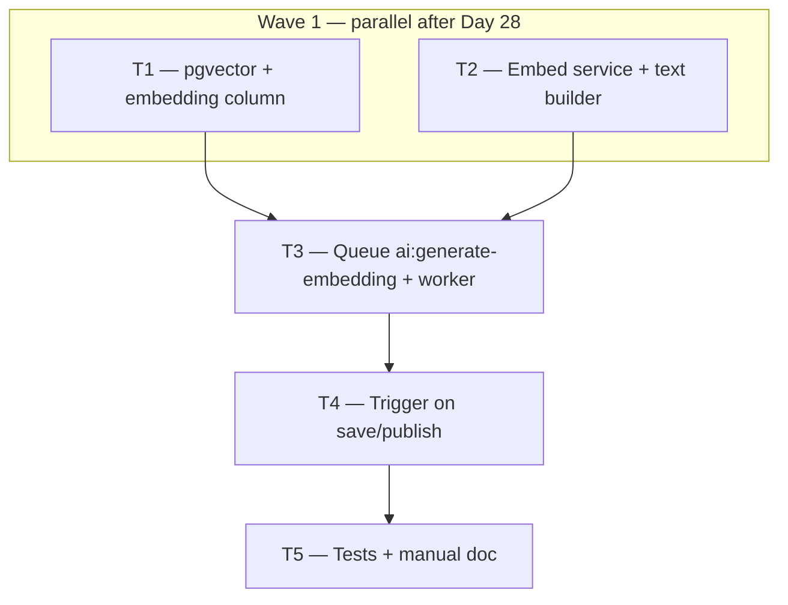

# Phase 3 — Day 29: Embedding generation + pgvector (task pack)

**Objective:** Semantic search foundation — published properties (`status: active`) store a `vector(1536)` embedding in Postgres.

**Prerequisite:** Day 28 complete on `feat/phase-3-ai-module` — BullMQ infra (`redis-bullmq.ts`, queue `ai:analyze-images`, worker entry `worker.ts`, `pnpm --filter @propai/api worker:dev`).

**Branch:** `feat/phase-3-ai-module` (same branch as Phase 3).

**References:**

- [guia-desenvolvimento-propai-os-dia-a-dia.md](../../guia-desenvolvimento-propai-os-dia-a-dia.md) — Day 29
- [REQUIREMENTS.md — Semantic search (pgvector)](../REQUIREMENTS.md#semantic-search-pgvector)
- [PHASE-3-DAY-28-MANUAL.md](./PHASE-3-DAY-28-MANUAL.md) — BullMQ worker patterns
- Properties schema: `packages/db/src/schema/properties.ts`, `docs/adr/004-properties-schema.md`
- Day 28 queue/worker patterns: `apps/api/src/modules/ai/queues/analyze-images-queue.ts`, `apps/api/src/modules/ai/workers/analyze-property-images-worker.ts`

**Out of scope (Day 29):** `GET /search/semantic` API (Day 31), marketplace semantic search UI (Day 50), HNSW index tuning (optional stub only), web “Analyze photos” button (Day 30).

**Architecture note:** REQUIREMENTS specify `vector(1536)` — use OpenAI `text-embedding-3-small` via Vercel AI SDK `embed()`. Gemini vision (Day 27) uses a different provider; do not mix vision and embedding providers without documenting dimensions.

---

## Execution order



| Task | Can start after | Parallel with |
| ---- | --------------- | ------------- |
| **T1** | Day 28 merged | T2 |
| **T2** | Day 28 merged | T1 |
| **T3** | T1 + T2 merged | — |
| **T4** | T3 merged | — |
| **T5** | T4 merged | — |

**Minimum chats:** 2 parallel (T1, T2) → 1 (T3) → 1 (T4) → 1 (T5).

| Can run together? | Must wait for |
| ----------------- | ------------- |
| **T1 + T2** | ✅ Yes | Day 28 |
| **T3** | ❌ | T1 and T2 on branch |
| **T4** | ❌ | T3 (queue + worker) |
| **T5** | ❌ | T4 |

---

## Shared conventions (all tasks)

| Topic | Rule |
| ----- | ---- |
| Queue name | `ai:generate-embedding` |
| DB column | `properties.embedding vector(1536)` nullable |
| Timestamp | `embedding_updated_at timestamptz` nullable (recommended) |
| Embedding input | `title` + `description` + `property_features` (`featureKey: featureValue` per line) |
| Trigger | Property **`active`** (published): enqueue on POST/PATCH when publishing or when indexable fields change |
| Feature flag | `ENABLE_SEMANTIC_SEARCH=true` — when off, no enqueue, no OpenAI calls |
| Provider | `@ai-sdk/openai` + `embed()` from `ai` package; model `text-embedding-3-small` (1536 dims) |
| Env | `OPENAI_API_KEY`, `ENABLE_SEMANTIC_SEARCH=false` in `.env.example` |
| Worker | Same entry `apps/api/src/worker.ts` — register second worker alongside analyze-images |
| Retry | 3 attempts, exponential backoff (match Day 28 defaults) |
| HTTP | Enqueue must **not block** PATCH/POST response |
| TypeScript | Strict, no `any` |

### Trigger rules (T4)

Enqueue when **all** of:

1. `isSemanticSearchEnabled()` is true
2. Property `status === 'active'` and not soft-deleted
3. One of:
   - **Publish:** status transitions to `active` (e.g. `draft` → `active`)
   - **Re-index:** property already `active` and `title` or `description` changed on PATCH

Load features from `property_features` inside the **worker** (not required on every PATCH field today).

---

## T1 — pgvector + `embedding` column

**Owner chat prompt:**

> Implement Phase 3 / Day 29 / **T1**: pgvector on properties. Read `docs/tasks/PHASE-3-DAY-29.md`. Branch `feat/phase-3-ai-module`. In `packages/db`: migration with `CREATE EXTENSION IF NOT EXISTS vector;`, add nullable `embedding vector(1536)` and `embedding_updated_at timestamptz` on `properties`. Update Drizzle schema in `packages/db/src/schema/properties.ts` (custom type or drizzle pgvector helper for `vector(1536)`). Run `pnpm db:generate` + `pnpm db:migrate`. Document Neon: enable pgvector in console before migrate. Update `packages/db/README.md` and `docs/adr/004-properties-schema.md` (remove deferral for embedding column). No API/worker yet. Verify typecheck.

### Do

- [ ] Extension `vector` enabled
- [ ] Column `embedding vector(1536)` nullable on `properties`
- [ ] `embedding_updated_at` column
- [ ] Drizzle schema + migration
- [ ] Neon pgvector note in docs

### Done when

- `pnpm db:migrate` succeeds locally
- Column visible in Postgres

### Files

- `packages/db/drizzle/0008_*.sql` (or next journal entry)
- `packages/db/src/schema/properties.ts`
- `packages/db/README.md`
- `docs/adr/004-properties-schema.md`

---

## T2 — Text builder + embedding service

**Owner chat prompt:**

> Implement Phase 3 / Day 29 / **T2**: property embedding service. Read `docs/tasks/PHASE-3-DAY-29.md`. Branch `feat/phase-3-ai-module`. Extend `apps/api/src/lib/ai-feature-flags.ts` with `isSemanticSearchEnabled(): boolean` when `ENABLE_SEMANTIC_SEARCH=true` (case-insensitive). Add `@ai-sdk/openai` to `@propai/api`. Create `apps/api/src/lib/embedding-provider.ts` (read `OPENAI_API_KEY`, model `text-embedding-3-small`, dimension 1536). Create `apps/api/src/modules/ai/build-property-embedding-text.ts` exporting `buildPropertyEmbeddingText({ title, description, features: { featureKey, featureValue }[] })` — concatenate with newlines. Create `apps/api/src/modules/ai/generate-property-embedding.ts` using `embed()` from `ai`, validate vector length === 1536. Vitest for builder + mocked embed. Update `.env.example`. No queue/routes yet.

### Do

- [ ] `isSemanticSearchEnabled()` flag helper + tests
- [ ] `buildPropertyEmbeddingText()` — title, description, features
- [ ] `generatePropertyEmbedding()` — OpenAI 1536-dim output
- [ ] Unit tests pass

### Done when

- `pnpm --filter @propai/api test` green for new tests

### Files

- `apps/api/package.json`
- `apps/api/src/lib/ai-feature-flags.ts`
- `apps/api/src/lib/ai-feature-flags.test.ts`
- `apps/api/src/lib/embedding-provider.ts`
- `apps/api/src/modules/ai/build-property-embedding-text.ts`
- `apps/api/src/modules/ai/build-property-embedding-text.test.ts`
- `apps/api/src/modules/ai/generate-property-embedding.ts`
- `apps/api/src/modules/ai/generate-property-embedding.test.ts`
- `.env.example`

---

## T3 — Queue `ai:generate-embedding` + worker

**Owner chat prompt:**

> Implement Phase 3 / Day 29 / **T3**: BullMQ embedding worker. Read `docs/tasks/PHASE-3-DAY-29.md`. Branch `feat/phase-3-ai-module` (T1 + T2 merged). Follow Day 28 patterns. In `@propai/shared`: `AI_GENERATE_EMBEDDING_QUEUE_NAME = "ai:generate-embedding"`, `generateEmbeddingJobDataSchema` with `tenantId`, `propertyId` (uuid). In `apps/api/src/modules/ai/queues/generate-embedding-queue.ts`: enqueue helper, attempts 3, exponential backoff. Worker `apps/api/src/modules/ai/workers/generate-property-embedding-worker.ts`: load property + `property_features` in tenant context; skip if not `active` or soft-deleted; build text; call `generatePropertyEmbedding`; UPDATE `properties.embedding` + `embedding_updated_at`. Register worker in `apps/api/src/worker.ts` alongside analyze-images (graceful shutdown for both). Vitest with mocked DB + embed. Do not wire property routes yet.

### Do

- [ ] Shared job schema + queue name constant
- [ ] Queue singleton + `enqueueGenerateEmbeddingJob()`
- [ ] Worker persists vector to DB
- [ ] `worker.ts` runs both workers
- [ ] Retry 3x exponential backoff

### Done when

- `pnpm --filter @propai/api worker:dev` starts both workers
- Test enqueue → worker writes embedding

### Files

- `packages/shared/src/ai/generate-embedding-job.ts`
- `packages/shared/src/ai/generate-embedding-job.test.ts`
- `packages/shared/src/index.ts`
- `apps/api/src/modules/ai/queues/generate-embedding-queue.ts`
- `apps/api/src/modules/ai/queues/generate-embedding-queue.test.ts`
- `apps/api/src/modules/ai/workers/generate-property-embedding-worker.ts`
- `apps/api/src/modules/ai/workers/generate-property-embedding-worker.test.ts`
- `apps/api/src/worker.ts`

---

## T4 — Enqueue on property save/publish

**Owner chat prompt:**

> Implement Phase 3 / Day 29 / **T4**: enqueue embedding on property save/publish. Read `docs/tasks/PHASE-3-DAY-29.md`. Branch `feat/phase-3-ai-module` (T3 merged). Create `apps/api/src/modules/ai/enqueue-property-embedding.ts` with `enqueuePropertyEmbeddingJobIfEnabled(tenantId, propertyId): Promise<void>` — no-op when `ENABLE_SEMANTIC_SEARCH` false; catch Redis/queue errors (log, do not fail HTTP). Wire into `apps/api/src/modules/properties/routes.ts`: after successful **POST /properties** if `status === 'active'`; after **PATCH /properties/:id** when status transitions to `active` OR property already `active` and `title`/`description` changed. Integration test: PATCH draft→active enqueues job (mock queue); flag off does not enqueue. Run `pnpm test:api`.

### Do

- [ ] Enqueue only for `active` properties
- [ ] Re-enqueue on indexable field changes
- [ ] HTTP save succeeds even if Redis unavailable
- [ ] Integration tests

### Done when

- Publish flow enqueues job; worker fills embedding (manual or test)

### Files

- `apps/api/src/modules/ai/enqueue-property-embedding.ts`
- `apps/api/src/modules/properties/routes.ts`
- `apps/api/src/property-embedding.integration.test.ts` (or extend existing)

---

## T5 — Verification + manual doc

**Owner chat prompt:**

> Implement Phase 3 / Day 29 / **T5**: Day 29 verification. Read `docs/tasks/PHASE-3-DAY-29.md`. Branch `feat/phase-3-ai-module` (T4 merged). Create `docs/tasks/PHASE-3-DAY-29-MANUAL.md`: docker up, API + worker, `ENABLE_SEMANTIC_SEARCH=true`, `OPENAI_API_KEY`, create property, PATCH status to `active`, wait for worker, verify with SQL `SELECT id, embedding IS NOT NULL AS has_embedding FROM properties WHERE status = 'active'`. Update `docs/LOCAL-DEV.md` with semantic search env vars. Run `pnpm typecheck` and `pnpm test:api`.

### Do

- [ ] Manual doc with two-terminal flow (API + worker)
- [ ] SQL verification step
- [ ] `LOCAL-DEV.md` updated
- [ ] Full test suite + typecheck green

### Done when

- Manual doc ready; automated tests pass

### Files

- `docs/tasks/PHASE-3-DAY-29-MANUAL.md`
- `docs/LOCAL-DEV.md`

---

## Day 29 checklist

```bash
git checkout feat/phase-3-ai-module
pnpm docker:up
pnpm db:migrate
pnpm install

# Terminal 1 — API
pnpm --filter @propai/api dev

# Terminal 2 — workers (vision + embedding)
pnpm --filter @propai/api worker:dev

pnpm test:api
pnpm typecheck
```

**Env for real embeddings:**

```env
ENABLE_SEMANTIC_SEARCH=true
OPENAI_API_KEY=<your-key>
REDIS_URL=redis://localhost:6379
```

- [ ] pgvector extension active
- [ ] `embedding vector(1536)` column exists
- [ ] PATCH draft → `active` enqueues job
- [ ] Worker writes 1536-dim vector to DB
- [ ] Flag off → no enqueue (regression)
- [ ] Day 28 vision flow still works (regression)

**Done criteria (from guide):** Published property has embedding vector in DB.

---

## Copy-paste prompts (quick)

### T1

```
Projeto: propai-os. Phase 3, Day 29, T1.
Branch: feat/phase-3-ai-module. Leia docs/tasks/PHASE-3-DAY-29.md.
Migration pgvector: extension vector + coluna embedding vector(1536) em properties.
Drizzle schema + docs. Sem API/worker. Paralelo com T2.
```

### T2

```
Projeto: propai-os. Phase 3, Day 29, T2.
Branch: feat/phase-3-ai-module. Leia docs/tasks/PHASE-3-DAY-29.md.
Flag ENABLE_SEMANTIC_SEARCH, @ai-sdk/openai, buildPropertyEmbeddingText + generatePropertyEmbedding (1536 dims).
Testes unitários. Sem queue/rotas. Paralelo com T1.
```

### T3

```
Projeto: propai-os. Phase 3, Day 29, T3.
Branch: feat/phase-3-ai-module (T1+T2 na branch). Leia docs/tasks/PHASE-3-DAY-29.md.
Queue ai:generate-embedding + worker BullMQ (padrão Day 28). Persistir embedding no DB.
Registrar no worker.ts. Sem trigger nas rotas ainda.
```

### T4

```
Projeto: propai-os. Phase 3, Day 29, T4.
Branch: feat/phase-3-ai-module (T3 na branch). Leia docs/tasks/PHASE-3-DAY-29.md.
Enqueue embedding em POST/PATCH properties quando status active ou publish draft→active.
Flag off = no-op. Integration tests.
```

### T5

```
Projeto: propai-os. Phase 3, Day 29, T5.
Branch: feat/phase-3-ai-module (T4 na branch). Leia docs/tasks/PHASE-3-DAY-29.md.
docs/tasks/PHASE-3-DAY-29-MANUAL.md + LOCAL-DEV + test:api + typecheck.
```

### Full day (single chat)

```
Projeto: propai-os. Phase 3, Day 29 completo.
Branch: feat/phase-3-ai-module. Day 28 merged. Leia docs/tasks/PHASE-3-DAY-29.md.
pgvector + embedding column, OpenAI embed service, queue ai:generate-embedding, worker, trigger on publish/save, tests + manual.
```

---

## Execution summary

```
Day 28 ✅
    │
    ├── T1 (DB) ──────┐
    │                 ├──► T3 (queue+worker) ──► T4 (triggers) ──► T5 (manual)
    └── T2 (embed) ───┘
```

**Practical tip:** Open **2 chats** for T1 + T2 first. After both merge, run T3 → T4 → T5 in order.
