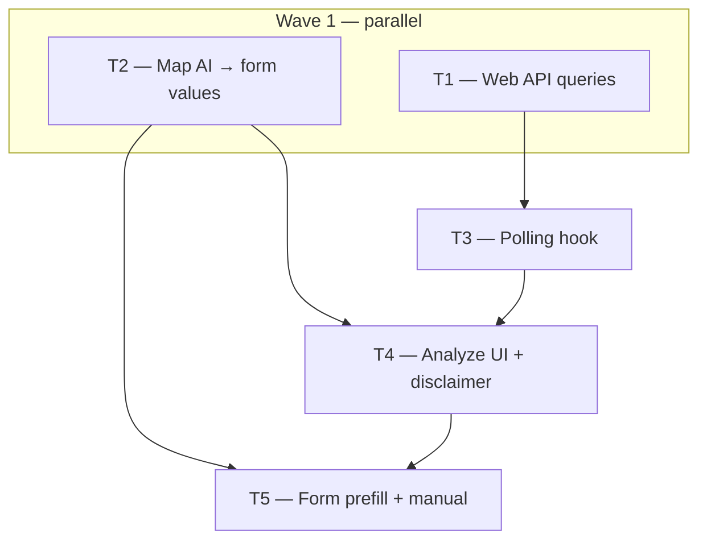

# Phase 3 — Day 30: AI UI — "Analyze photos with AI" (task pack)

**Objective:** Agent uploads photos → clicks **Analyze photos with AI** → sees job progress → form fields pre-fill as suggestions → agent reviews and saves.

**Prerequisite:** Day 28 complete on `feat/phase-3-ai-module` — async vision API:

- `POST /v1/ai/analyze-property-images` → **202 + jobId** when `ENABLE_AI_VISION=true`, **200 mock JSON** when flag off
- `GET /v1/ai/jobs/:jobId` → job status + `result` (`PropertyImageAnalysis`)
- Worker running: `pnpm --filter @propai/api worker:dev`

**Branch:** `feat/phase-3-ai-module` (same branch as Phase 3).

**References:**

- [guia-desenvolvimento-propai-os-dia-a-dia.md](../../guia-desenvolvimento-propai-os-dia-a-dia.md) — Day 30
- [REQUIREMENTS.md — Vision](../REQUIREMENTS.md#vision-photo--listing-fields)
- [PHASE-3-DAY-28-MANUAL.md](./PHASE-3-DAY-28-MANUAL.md) — async worker smoke test
- API: `apps/api/src/modules/ai/routes.ts`
- Shared schema: `packages/shared/src/ai/property-image-analysis.ts`
- Web photos: `apps/web/src/modules/properties/components/property-detail-media.tsx`
- Web form: `apps/web/src/modules/properties/components/property-form.tsx`
- Edit page: `apps/web/src/app/(dashboard)/properties/[id]/edit/page.tsx`

**Out of scope (Day 30):** WebSocket job updates (polling only), auto-save after AI, persisting `features[]` to `property_features` table (optional note in mapper), semantic search UI (Day 50), marketplace.

**UX note:** Photos live on the **property detail** page (`PropertyDetailMedia`); the editable form lives on **`/properties/[id]/edit`**. Day 30 connects the two: analyze on detail → **Apply suggestions** → prefill edit form. Agent must still click **Save changes** — no auto-publish.

---

## Execution order



| Task | Can start after | Parallel with |
| ---- | --------------- | ------------- |
| **T1** | Day 28 merged | T2 |
| **T2** | Day 28 merged | T1 |
| **T3** | T1 merged | T2 (not T4) |
| **T4** | T2 + T3 merged | — |
| **T5** | T4 merged | — |

**Minimum chats:** 2 parallel (T1, T2) → 1 (T3) → 1 (T4) → 1 (T5).

| Can run together? | Must wait for |
| ----------------- | ------------- |
| **T1 + T2** | ✅ Yes | Day 28 |
| **T3** | ❌ | T1 |
| **T4** | ❌ | T2 + T3 |
| **T5** | ❌ | T4 |

---

## Shared conventions (all tasks)

| Topic | Rule |
| ----- | ---- |
| UI language | **English (en-US)** — match existing dashboard copy |
| Button label | `Analyze photos with AI` |
| Disclaimer | *"AI-generated content — please review before publishing."* |
| Image URLs | Presigned **GET** via `GET /v1/uploads/presign-download?key=` — max 10 images |
| Async path | POST → 202 → poll `GET /v1/ai/jobs/:jobId` every ~2s until `completed` \| `failed` |
| Mock path | `ENABLE_AI_VISION=false` → POST returns **200** with mock JSON immediately (no poll) |
| Errors | Sonner toast; handle 429 (`Retry-After`), 503, 400 |
| Form apply | Suggestions only — use `form.reset()` / `setValue`; agent saves manually |
| Styling | shadcn/ui, dark tokens (`bg-card`, `border-border`, `text-muted-foreground`) — no hardcoded colors |
| TypeScript | Strict, no `any` |
| Data fetching | TanStack Query for images; `useTransition` for analyze action |

### AI → form field mapping (T2)

| AI field (`PropertyImageAnalysis`) | Form field (`CreatePropertyFormValues`) |
| ---------------------------------- | --------------------------------------- |
| `seoTitle` | `title` (if empty, or always overwrite with confirm) |
| `description` | `description` |
| `bedrooms` | `bedrooms` |
| `bathrooms` | `bathrooms` (string, e.g. `"2.5"`) |
| `sqFt` | `sqFt` |
| `suggestedPriceUSD` | `priceUsd` (when non-null) |
| `features[]` | Append bullet list to `description` **or** show read-only preview (document choice) |

Do **not** overwrite address fields from vision output.

---

## T1 — Web API queries (analyze + job status)

**Owner chat prompt:**

> Implement Phase 3 / Day 30 / **T1**: Web client queries for AI vision. Read `docs/tasks/PHASE-3-DAY-30.md`. Branch `feat/phase-3-ai-module`. In `apps/web/src/modules/properties/queries/`: create `analyze-property-images.ts` — POST `/v1/ai/analyze-property-images` with `{ imageUrls }`, parse with `@propai/shared` schemas (`analyzePropertyImagesResponseSchema` for 200, `enqueueAnalyzeImagesJobResponseSchema` for 202). Create `get-analyze-job-status.ts` — GET `/v1/ai/jobs/:jobId`, parse `analyzeImagesJobStatusResponseSchema`. Create `collect-property-image-urls.ts` — given `PropertyImageResponse[]`, call existing `presignPropertyImageDownload` per `storageKey`, return up to 10 URLs. Use `apiFetch` + `parseApiErrorResponse` patterns from other property queries. Export typed results. No UI/hooks yet.

### Do

- [ ] POST analyze with 200 vs 202 handling
- [ ] GET job status typed
- [ ] Helper to build presigned image URL list (1–10)

### Done when

- Query functions compile; follow existing query file patterns

### Files

- `apps/web/src/modules/properties/queries/analyze-property-images.ts`
- `apps/web/src/modules/properties/queries/get-analyze-job-status.ts`
- `apps/web/src/modules/properties/queries/collect-property-image-urls.ts`

---

## T2 — Map AI analysis → form values

**Owner chat prompt:**

> Implement Phase 3 / Day 30 / **T2**: Map vision JSON to property form. Read `docs/tasks/PHASE-3-DAY-30.md`. Branch `feat/phase-3-ai-module`. Create `apps/web/src/modules/properties/lib/map-ai-analysis-to-form.ts` exporting `mapAiAnalysisToFormValues(analysis: PropertyImageAnalysis, current?: Partial<CreatePropertyFormValues>): Partial<CreatePropertyFormValues>` — map seoTitle→title, description, beds, baths, sqFt, suggestedPriceUSD→priceUsd; merge features into description as bullet list. Never map address fields. Create `map-ai-analysis-to-form.test.ts` (vitest). Optional: `AI_PROPERTY_PREFILL_STORAGE_KEY` helper for sessionStorage read/write by propertyId. No UI yet.

### Do

- [ ] Pure mapper function + unit tests
- [ ] Price USD conversion from `suggestedPriceUSD`
- [ ] Bathrooms as string for form schema

### Done when

- `pnpm --filter @propai/web test` green for mapper tests (add vitest to web if missing, or colocate test runnable via root)

### Files

- `apps/web/src/modules/properties/lib/map-ai-analysis-to-form.ts`
- `apps/web/src/modules/properties/lib/map-ai-analysis-to-form.test.ts`
- `apps/web/src/modules/properties/lib/ai-prefill-storage.ts` (optional)

---

## T3 — Hook `usePropertyImageAnalysis` (polling)

**Owner chat prompt:**

> Implement Phase 3 / Day 30 / **T3**: React hook for async vision flow. Read `docs/tasks/PHASE-3-DAY-30.md`. Branch `feat/phase-3-ai-module` (T1 merged). Create `apps/web/src/modules/properties/hooks/use-property-image-analysis.ts`: state `idle | submitting | queued | processing | completed | failed`; `startAnalysis(imageUrls)` uses `useTransition`; if POST returns 200 (mock), set completed immediately; if 202, poll `getAnalyzeJobStatus` every 2s (max ~3 min) until completed/failed; expose `result: PropertyImageAnalysis | null`, `errorMessage`, `reset()`. Map API job statuses to UI states. Toast on failure. No JSX yet.

### Do

- [ ] Mock path (200) without polling
- [ ] Async path with polling + timeout
- [ ] `useTransition` for pending state

### Done when

- Hook compiles; manual test possible from a stub component

### Files

- `apps/web/src/modules/properties/hooks/use-property-image-analysis.ts`

---

## T4 — Analyze UI on property detail (button + progress + disclaimer)

**Owner chat prompt:**

> Implement Phase 3 / Day 30 / **T4**: Analyze photos UI. Read `docs/tasks/PHASE-3-DAY-30.md`. Branch `feat/phase-3-ai-module` (T2 + T3 merged). Create `apps/web/src/modules/properties/components/property-ai-analyze.tsx` (client): Button **Analyze photos with AI** disabled when 0 images or while pending; uses `usePropertyImagesQuery` + `collectPropertyImageUrls` + `usePropertyImageAnalysis`; show Badge/Alert for status (Queued, Processing, Ready, Failed); disclaimer Alert: *"AI-generated content — please review before publishing."*; on completed, show **Apply suggestions to form** button → write prefill to sessionStorage (T2 helper) → `router.push(/properties/[id]/edit)` + toast success. Wire into `property-detail-media.tsx` below upload/gallery. shadcn Button, Alert, Badge. English copy.

### Do

- [ ] Button after photos section
- [ ] Visible job progress states
- [ ] Disclaimer always visible when panel shown
- [ ] Apply navigates to edit with stored prefill

### Done when

- Detail page shows analyze flow end-to-end (with worker + flag on)

### Files

- `apps/web/src/modules/properties/components/property-ai-analyze.tsx`
- `apps/web/src/modules/properties/components/property-detail-media.tsx`

---

## T5 — Edit form prefill + manual checklist

**Owner chat prompt:**

> Implement Phase 3 / Day 30 / **T5**: Apply AI suggestions on edit form + manual doc. Read `docs/tasks/PHASE-3-DAY-30.md`. Branch `feat/phase-3-ai-module` (T4 merged). Update `PropertyForm`: optional `aiPrefill?: Partial<CreatePropertyFormValues>` — on mount, merge into defaults via `form.reset()` and show info Alert that fields were AI-suggested (same disclaimer text). Update `edit/page.tsx` to read sessionStorage prefill for propertyId (clear after apply). Create `docs/tasks/PHASE-3-DAY-30-MANUAL.md`: create property → upload 3+ photos → analyze → apply → edit fields → save draft. Document `ENABLE_AI_VISION=true` + worker. Run `pnpm typecheck`. Regression: flag off returns mock instantly.

### Do

- [ ] Form merges AI prefill without auto-submit
- [ ] Edit page consumes sessionStorage prefill once
- [ ] Manual doc with full user flow
- [ ] Typecheck green

### Done when

- **Done criteria (guide):** upload photos → AI fill → agent edits → save works

### Files

- `apps/web/src/modules/properties/components/property-form.tsx`
- `apps/web/src/app/(dashboard)/properties/[id]/edit/page.tsx`
- `docs/tasks/PHASE-3-DAY-30-MANUAL.md`

---

## Day 30 checklist

```bash
git checkout feat/phase-3-ai-module
pnpm docker:up
pnpm install

# Terminal 1 — API
pnpm --filter @propai/api dev

# Terminal 2 — worker (required when ENABLE_AI_VISION=true)
pnpm --filter @propai/api worker:dev

# Terminal 3 — web
pnpm --filter @propai/web dev

pnpm typecheck
```

**Env:**

```env
ENABLE_AI_VISION=true
GEMINI_API_KEY=<key>
REDIS_URL=redis://localhost:6379
# S3_* for uploads
```

- [ ] Property detail shows **Analyze photos with AI** when images exist
- [ ] Progress: queued → processing → completed (or failed with toast)
- [ ] Disclaimer visible
- [ ] **Apply suggestions** opens edit with pre-filled beds/baths/sqFt/price/title/description
- [ ] Agent can change values before **Save changes**
- [ ] `ENABLE_AI_VISION=false` → instant mock, no worker required
- [ ] No TypeScript errors

---

## Copy-paste prompts (quick)

### T1

```
Projeto: propai-os. Phase 3, Day 30, T1.
Branch: feat/phase-3-ai-module. Leia docs/tasks/PHASE-3-DAY-30.md.
Queries web: POST analyze-property-images (200/202), GET job status, collect presign URLs (max 10).
Sem UI. Paralelo com T2.
```

### T2

```
Projeto: propai-os. Phase 3, Day 30, T2.
Branch: feat/phase-3-ai-module. Leia docs/tasks/PHASE-3-DAY-30.md.
mapAiAnalysisToFormValues (PropertyImageAnalysis → form fields) + testes + sessionStorage helper opcional.
Sem UI. Paralelo com T1.
```

### T3

```
Projeto: propai-os. Phase 3, Day 30, T3.
Branch: feat/phase-3-ai-module (T1 na branch). Leia docs/tasks/PHASE-3-DAY-30.md.
Hook usePropertyImageAnalysis: mock 200 imediato, async 202 com polling 2s, useTransition.
Sem JSX ainda.
```

### T4

```
Projeto: propai-os. Phase 3, Day 30, T4.
Branch: feat/phase-3-ai-module (T2+T3 na branch). Leia docs/tasks/PHASE-3-DAY-30.md.
Componente property-ai-analyze na detail page: botão, progresso, disclaimer, Apply → edit.
```

### T5

```
Projeto: propai-os. Phase 3, Day 30, T5.
Branch: feat/phase-3-ai-module (T4 na branch). Leia docs/tasks/PHASE-3-DAY-30.md.
PropertyForm prefill + edit page sessionStorage + PHASE-3-DAY-30-MANUAL.md + typecheck.
```

### Full day (single chat)

```
Projeto: propai-os. Phase 3, Day 30 completo.
Branch: feat/phase-3-ai-module. Day 28 merged. Leia docs/tasks/PHASE-3-DAY-30.md.
Web: queries, mapper, polling hook, analyze UI na detail, prefill no edit form, manual doc.
```

---

## Execution summary

```
Day 28 ✅ (API async vision)
    │
    ├── T1 (queries) ──► T3 (hook) ──► T4 (UI) ──► T5 (form + manual)
    │
    └── T2 (mapper) ────────────────► T4 ─────────► T5
```

**Practical tip:** Start **T1 + T2** in parallel. Then **T3 → T4 → T5** in order. Keep the **worker** running while testing T4/T5 with `ENABLE_AI_VISION=true`.

**Interview anchor (from guide):** Rehearse this flow until flawless — it is a primary demo path alongside the real-time pipeline (Day 41–42).
