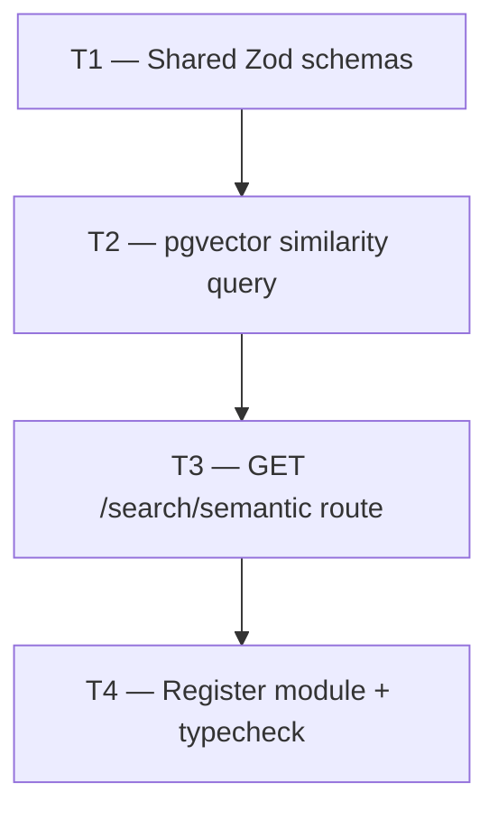

# Phase 3 — Day 31: Semantic Search API (task pack)

**Objective:** Natural language property search — `GET /search/semantic` public endpoint that embeds the query with OpenAI, runs cosine similarity against `properties.embedding`, and applies hybrid hard filters.

**Prerequisite:** Day 29 complete — `properties.embedding vector(1536)` column exists; published properties have embeddings generated by the `ai:generate-embedding` BullMQ worker.

**Branch:** `feat/phase-3-ai-module`

**References:**

- [guia-desenvolvimento-propai-os-dia-a-dia.md](../../guia-desenvolvimento-propai-os-dia-a-dia.md) — Day 31
- [PHASE-3-DAY-29.md](./PHASE-3-DAY-29.md) — pgvector + embedding column
- DB schema: `packages/db/src/schema/properties.ts` (`embedding vector(1536)`)
- Embedding service: `apps/api/src/modules/ai/generate-property-embedding.ts`
- Feature flag: `apps/api/src/lib/ai-feature-flags.ts` (`isSemanticSearchEnabled()`)
- Tenant context: `packages/db/src/tenant-context.ts` (`runInTenantContext`)
- App registration: `apps/api/src/app.ts`

**Out of scope (Day 31):** Marketplace semantic search UI (Day 50), HNSW index tuning, lead scoring (Day 32), hybrid ranking scoring weights beyond cosine distance.

**Architecture note:** Route is registered **outside** the `/v1/` prefix block (before `tenantContextPlugin`) so it is public — no session required. Tenant data isolation is enforced at the database level via PostgreSQL RLS (`runInTenantContext` with `tenantId` from query params).

---

## Execution order



| Task | Can start after | Parallel with |
| ---- | --------------- | ------------- |
| **T1** | Day 29 merged | — |
| **T2** | T1 | — |
| **T3** | T2 | — |
| **T4** | T3 | — |

---

## Shared conventions (all tasks)

| Topic | Rule |
| ----- | ---- |
| Route | `GET /search/semantic` — no `/v1/` prefix (public) |
| Auth | None required — `tenantId` from query params |
| Tenant isolation | `runInTenantContext(tenantId, ...)` → RLS enforced |
| Vector operator | pgvector `<=>` (cosine distance) |
| Relevance score | `(1 - (embedding <=> query_vector))::float` — range 0–1 |
| Feature flag | `ENABLE_SEMANTIC_SEARCH=true` → 503 when false |
| Filters | Hard constraints: `city`, `state`, `beds`, `minPrice`, `maxPrice`, `type`, `rentOrSale` |
| Result scope | Only `status = 'active'`, `soft_deleted_at IS NULL`, `embedding IS NOT NULL` |
| Max results | `limit` param, default 20, max 50 |
| TypeScript | Strict, no `any` |

---

## T1 — Shared Zod schemas

### Do

- [ ] `packages/shared/src/search/semantic-search.ts`:
  - `semanticSearchQuerySchema` — `q`, `tenantId`, `limit`, `beds`, `city`, `state`, `minPriceUsdCents`, `maxPriceUsdCents`, `type`, `rentOrSale`
  - `semanticSearchResultItemSchema` — property fields + `relevanceScore: number (0–1)`
  - `semanticSearchResponseSchema` — `{ items, query, total }`
- [ ] Export from `packages/shared/src/index.ts`

### Done when

- `pnpm --filter @propai/shared typecheck` passes

### Files

- `packages/shared/src/search/semantic-search.ts`
- `packages/shared/src/index.ts`

---

## T2 — pgvector similarity query

### Do

- [ ] `apps/api/src/modules/search/queries/semantic-property-search.ts`:
  - `runSemanticPropertySearch(params)` — runs inside `runInTenantContext`
  - Builds `WHERE` clause conditionally using `sql.join(filters, sql` AND `)`
  - Raw SQL via Drizzle `sql` template: `ORDER BY embedding <=> ${vectorLiteral}::vector`
  - Returns `SemanticSearchRow[]` with typed columns

### Done when

- TypeScript compiles without errors; query logic is correct

### Files

- `apps/api/src/modules/search/queries/semantic-property-search.ts`

---

## T3 — GET /search/semantic route

### Do

- [ ] `apps/api/src/modules/search/routes.ts`:
  - Parse `semanticSearchQuerySchema` from `request.query`
  - Guard: `isSemanticSearchEnabled()` → 503 when false
  - Call `generatePropertyEmbedding(query.q)` → `number[]`
  - Call `runSemanticPropertySearch(...)` with embedding + filters
  - Map rows → `SemanticSearchResultItem[]`
  - Return `semanticSearchResponseSchema` 200 response
  - Handle `AiProviderNotConfiguredError` → 503

### Done when

- Route handles mock path (flag off → 503) and real path (flag on → results)

### Files

- `apps/api/src/modules/search/routes.ts`
- `apps/api/src/modules/search/index.ts`

---

## T4 — Register module + typecheck

### Do

- [ ] `apps/api/src/app.ts` — import `registerSearchModule`; register **before** `tenantContextPlugin` (makes it public)
- [ ] `pnpm typecheck` — both `@propai/api` and `@propai/shared` pass

### Done when

- `GET /search/semantic?q=test&tenantId=uuid` reachable without auth (returns 503 or results)

### Files

- `apps/api/src/app.ts`

---

## Day 31 checklist

```bash
# Start API
pnpm --filter @propai/api dev

# Start worker (for embedding generation)
pnpm --filter @propai/api worker:dev

pnpm typecheck
```

**Env:**

```env
ENABLE_SEMANTIC_SEARCH=true
OPENAI_API_KEY=<key>
DATABASE_URL=<neon-url>
```

**Insomnia test — example query:**

```
GET http://localhost:3333/search/semantic?q=Quiet+neighborhood+near+a+dog+park+with+home+office+space&tenantId=<uuid>&limit=10
```

- [ ] `ENABLE_SEMANTIC_SEARCH=false` → 503
- [ ] `ENABLE_SEMANTIC_SEARCH=true`, no OPENAI_API_KEY → 503 AI provider error
- [ ] Valid request → returns array of properties ranked by `relevanceScore`
- [ ] Filter `city=Austin&state=TX` → only Austin TX properties
- [ ] Properties without embeddings excluded from results
- [ ] Route accessible without `Authorization` header (public)
- [ ] `pnpm typecheck` green

**Done criteria (from guide):** Semantic search returns relevant properties in Insomnia test.

**Example query to test:** *"Quiet neighborhood near a dog park with home office space"*
