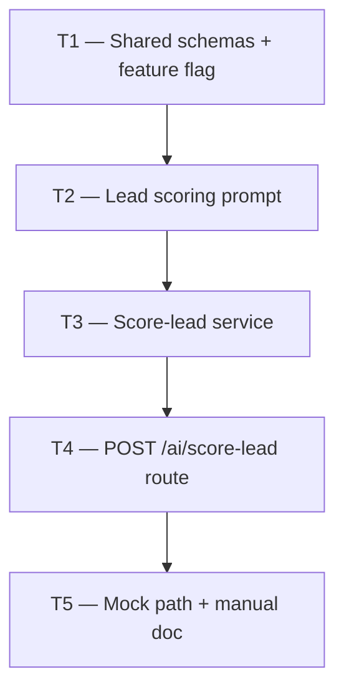

# Phase 3 — Day 32: Lead Scoring AI v1 (task pack)

**Objective:** AI assigns a priority score (0–100) to leads based on lead data and the matched property, returning a priority label (`hot` / `warm` / `cold`) and a short reasoning string.

**Prerequisite:** Day 31 complete — semantic search API working; Gemini + OpenAI providers configured.

**Branch:** `feat/phase-3-ai-module`

**References:**

- [guia-desenvolvimento-propai-os-dia-a-dia.md](../../guia-desenvolvimento-propai-os-dia-a-dia.md) — Day 32
- [PHASE-3-DAY-31.md](./PHASE-3-DAY-31.md) — semantic search API (same branch)
- AI provider (vision): `apps/api/src/lib/ai-provider.ts` (Gemini)
- AI provider (scoring/text): `apps/api/src/lib/embedding-provider.ts` (OpenAI)
- AI routes: `apps/api/src/modules/ai/routes.ts`
- Shared schemas: `packages/shared/src/ai/`
- Feature flags: `apps/api/src/lib/ai-feature-flags.ts`

**Out of scope (Day 32):** `leads` DB table (Day 36), Kanban pipeline (Day 38), persisting score to DB (wired in Day 36 — route returns score in response only for now), WebSocket score push (Day 42).

**Architecture note:** Since the `leads` table does not exist yet (Phase 4), the scoring endpoint accepts lead data inline in the request body. Score persistence will be added in Day 36 when the CRM module is built. The endpoint is designed so Day 36 can call it internally without breaking changes.

---

## Execution order



| Task | Can start after | Parallel with |
| ---- | --------------- | ------------- |
| **T1** | Day 31 merged | — |
| **T2** | T1 | — |
| **T3** | T2 | — |
| **T4** | T3 | — |
| **T5** | T4 | — |

---

## Shared conventions (all tasks)

| Topic | Rule |
| ----- | ---- |
| Route | `POST /v1/ai/score-lead` — requires auth (inside `/v1/`) |
| Permission | `properties:read` or `leads:read` — any member |
| LLM provider | OpenAI via `getOpenAiProvider()` (`embedding-provider.ts`) |
| Model | `gpt-4o-mini` default; override with `OPENAI_SCORING_MODEL` env |
| Feature flag | `ENABLE_AI_SCORING=true` — mock when false |
| Score | Integer 0–100 |
| Priority labels | `hot` (70–100), `warm` (40–69), `cold` (0–39) |
| Reasoning | Short string (1–2 sentences, English) |
| Mock | Score 72, priority `warm`, canned reasoning — no LLM call |
| Lead data | Inline in request body (no DB lookup yet) |
| Property | Fetched from DB by `propertyId` (uses `runInTenantContext`) |
| TypeScript | Strict, no `any` |

### Priority label derivation

```typescript
function derivePriority(score: number): "hot" | "warm" | "cold" {
  if (score >= 70) return "hot";
  if (score >= 40) return "warm";
  return "cold";
}
```

---

## T1 — Shared schemas + feature flag

### Do

- [ ] `packages/shared/src/ai/lead-scoring.ts`:
  - `LEAD_PRIORITIES = ["hot", "warm", "cold"]`
  - `leadPrioritySchema = z.enum(LEAD_PRIORITIES)`
  - `leadScoringLeadDataSchema` — `firstName`, `lastName`, `email`, `phone?`, `source?`, `message?`, `budgetUsdCents?`
  - `scoreleadRequestSchema` — `{ leadData: leadScoringLeadDataSchema, propertyId: z.uuid() }`
  - `scoreleadResponseSchema` — `{ score: z.number().int().min(0).max(100), priority: leadPrioritySchema, reasoning: z.string() }`
  - `MOCK_LEAD_SCORING_RESULT` — score 72, priority `warm`, canned reasoning
  - Export types
- [ ] `packages/shared/src/index.ts` — export all new symbols
- [ ] `apps/api/src/lib/ai-feature-flags.ts` — add `isAiScoringEnabled(): boolean` (checks `ENABLE_AI_SCORING`)
- [ ] `.env.example` — add `ENABLE_AI_SCORING=false`, `OPENAI_SCORING_MODEL=gpt-4o-mini`

### Done when

- `pnpm --filter @propai/shared typecheck` passes

### Files

- `packages/shared/src/ai/lead-scoring.ts`
- `packages/shared/src/index.ts`
- `apps/api/src/lib/ai-feature-flags.ts`
- `.env.example`

---

## T2 — Lead scoring prompt

### Do

- [ ] `apps/api/src/modules/ai/prompts/lead-scoring-prompt.ts`:
  - `LEAD_SCORING_SYSTEM_PROMPT` — instructs LLM to act as a real estate CRM scoring engine; score 0–100 based on intent signals, urgency, budget fit, and contact quality; output strict JSON matching schema
  - `buildLeadScoringUserPrompt(leadData, property)` — formats lead details + property info into a concise prompt context
  - All copy in US English; reference US real estate norms

### Done when

- Prompt compiles; system prompt text is clear and concise

### Files

- `apps/api/src/modules/ai/prompts/lead-scoring-prompt.ts`

---

## T3 — Score-lead service

### Do

- [ ] `apps/api/src/modules/ai/score-lead-service.ts`:
  - `scoreLeadWithAI(leadData, property)` — calls OpenAI `generateObject` with `scoreleadResponseSchema` as output schema
  - Uses `getOpenAiProvider()` + configurable model (`OPENAI_SCORING_MODEL` or `gpt-4o-mini`)
  - Throws `AiProviderNotConfiguredError` when OpenAI key missing
  - Throws `AiAnalysisParseError` on Zod validation failure
  - Derives `priority` from `score` using threshold helper

### Done when

- Service compiles; `AiProviderNotConfiguredError` thrown when no API key

### Files

- `apps/api/src/modules/ai/score-lead-service.ts`

---

## T4 — POST /ai/score-lead route

### Do

- [ ] Add to `apps/api/src/modules/ai/routes.ts`:
  - `POST /ai/score-lead`
  - `preHandler: requirePropertiesRead` (any authenticated member)
  - Parse `scoreleadRequestSchema` from body
  - **Flag off** → return `MOCK_LEAD_SCORING_RESULT` (200)
  - **Flag on** → fetch property from DB (tenant-scoped), call `scoreLeadWithAI`, return result
  - Handle `AiProviderNotConfiguredError` → 503
  - Handle `AiAnalysisParseError` → 422

### Done when

- `POST /v1/ai/score-lead` returns mock when flag off; real score when flag on

### Files

- `apps/api/src/modules/ai/routes.ts`

---

## T5 — Mock path + manual doc + typecheck

### Do

- [ ] `docs/tasks/PHASE-3-DAY-32-MANUAL.md`:
  - Insomnia collection request for `POST /v1/ai/score-lead`
  - Example body with lead data + propertyId
  - Expected response fields
  - `ENABLE_AI_SCORING=false` path (mock)
  - `ENABLE_AI_SCORING=true` path (real score)
  - Note: score storage wired in Day 36 (CRM module)
- [ ] `pnpm typecheck` both `@propai/api` and `@propai/shared` green

### Done when

- Manual doc complete; typecheck passes

### Files

- `docs/tasks/PHASE-3-DAY-32-MANUAL.md`

---

## Day 32 checklist

```bash
pnpm --filter @propai/api dev
pnpm typecheck
```

**Env:**

```env
ENABLE_AI_SCORING=false    # mock mode (no API key required)
# ENABLE_AI_SCORING=true   # real mode
# OPENAI_API_KEY=<key>
# OPENAI_SCORING_MODEL=gpt-4o-mini
```

**Insomnia — mock mode:**

```json
POST http://localhost:3333/v1/ai/score-lead
Authorization: <session-cookie>

{
  "leadData": {
    "firstName": "Sarah",
    "lastName": "Thompson",
    "email": "sarah.t@example.com",
    "phone": "(512) 555-9012",
    "source": "marketplace",
    "message": "I need to relocate to Austin by end of next month for a new job. This property looks perfect.",
    "budgetUsdCents": 64000000
  },
  "propertyId": "<active-property-uuid>"
}
```

**Expected response (mock):**

```json
{
  "score": 72,
  "priority": "warm",
  "reasoning": "Lead shows clear purchase intent with an urgent relocation timeline. Budget aligns well with the listing price."
}
```

- [ ] `ENABLE_AI_SCORING=false` → 200 mock result
- [ ] `ENABLE_AI_SCORING=true`, `OPENAI_API_KEY` set → real score returned
- [ ] Missing `propertyId` → Zod 400 error
- [ ] Invalid `email` → Zod 400 error
- [ ] No API key + flag on → 503
- [ ] Score is integer 0–100; priority matches score range
- [ ] `pnpm typecheck` green

**Done criteria (from guide):** Lead created → score computed → visible in API response.

**Note:** "Store score on lead record" (guide) — persistence wired in Day 36 when `leads` table is created. The scoring endpoint is designed to be called internally from the CRM module without breaking changes.

---

## Copy-paste prompts (quick)

### Full day (single chat)

```
Projeto: propai-os. Phase 3, Day 32 completo.
Branch: feat/phase-3-ai-module. Day 31 merged. Leia docs/tasks/PHASE-3-DAY-32.md.
API: POST /v1/ai/score-lead — score 0-100, priority hot/warm/cold, reasoning.
Schemas shared, feature flag ENABLE_AI_SCORING, OpenAI generateObject, mock quando flag off.
```

---

## Execution summary

```
Day 31 ✅ (semantic search)
    │
    T1 (schemas + flag) → T2 (prompt) → T3 (service) → T4 (route) → T5 (manual)
```
