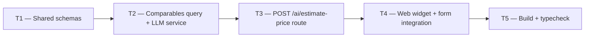

# Phase 3 — Day 33: Price estimator v1 (task pack)

**Objective:** Give brokers an AI-powered price suggestion directly on the property form, sourced from comparable active listings in the same tenant portfolio.

**Prerequisite:** Day 32 complete — lead scoring AI working; shared AI service patterns established.

**Branch:** `feat/phase-3-ai-module`

**References:**

- [guia-desenvolvimento-propai-os-dia-a-dia.md](../../guia-desenvolvimento-propai-os-dia-a-dia.md) — Day 33
- [PHASE-3-DAY-32.md](./PHASE-3-DAY-32.md) — lead scoring (same service pattern)

---

## Execution order



---

## Shared conventions

| Topic | Rule |
| ----- | ---- |
| Flag | `ENABLE_AI_PRICING=true/false` |
| Model | `OPENAI_PRICING_MODEL` (default: `gpt-4o-mini`) |
| Mock | `MOCK_PRICE_ESTIMATE` — returns when flag off |
| Units | Response always in USD (not cents); DB reads cents and converts |
| Auth | Route inside `/v1/` — requires session + `properties:write` |

---

## T1 — Shared Zod schemas

### Files

- `packages/shared/src/ai/price-estimation.ts`
- `packages/shared/src/index.ts` (exports)

### Do

- [ ] `estimatePriceRequestSchema`:
  - `city`, `state` — non-empty strings
  - `type` — `propertyTypeSchema` (single_family / condo / townhouse / multi_family)
  - `bedrooms` — int ≥ 0
  - `sqFt` — positive number
  - `rentOrSale` — `rentOrSaleSchema`
  - `excludePropertyId` — optional uuid (exclude self from comparables)
- [ ] `estimatePriceResponseSchema`:
  - `minUsd`, `maxUsd`, `midpointUsd` — positive numbers (whole USD)
  - `reasoning` — string (2–3 sentences from LLM)
  - `comparablesCount` — int ≥ 0
- [ ] `MOCK_PRICE_ESTIMATE` — satisfies `EstimatePriceResponse`
- [ ] Export types: `EstimatePriceRequest`, `EstimatePriceResponse`
- [ ] Export from `packages/shared/src/index.ts`

---

## T2 — Comparables query + LLM service

### Files

- `apps/api/src/modules/ai/prompts/price-estimation-prompt.ts`
- `apps/api/src/modules/ai/estimate-price-service.ts`
- `apps/api/src/lib/ai-feature-flags.ts` (add `isAiPricingEnabled`)

### Do

- [ ] `price-estimation-prompt.ts`:
  - `PRICE_ESTIMATION_SYSTEM_PROMPT` — instructs LLM to output `minUsd`, `maxUsd`, `midpointUsd`, `reasoning`
  - `buildPriceEstimationUserPrompt(params, comparables)` — formats subject property + comparable list
  - Handles empty comparables (note "no comparables found" so LLM falls back to market knowledge)

- [ ] `estimate-price-service.ts`:
  - `estimatePriceWithAI(tenantId, params)` — async function
  - `fetchComparables` — runs inside `runInTenantContext`; filters: same city/state/type/rentOrSale, active, not soft-deleted, has price; excludes `excludePropertyId`; LIMIT 10
  - Calls `generateObject()` with schema = `estimatePriceResponseSchema.omit({ comparablesCount: true })`
  - Appends `comparablesCount: comparables.length` to result
  - Error handling: `AiProviderNotConfiguredError`, `AiAnalysisParseError`

- [ ] `ai-feature-flags.ts`:
  - Add `isAiPricingEnabled()` — checks `ENABLE_AI_PRICING` env var

---

## T3 — POST /ai/estimate-price route

### Files

- `apps/api/src/modules/ai/routes.ts`
- `.env.example`

### Do

- [ ] `POST /ai/estimate-price`:
  - `preHandler: requirePropertiesWrite`
  - Flag off → `MOCK_PRICE_ESTIMATE` (200)
  - Flag on → `estimatePriceWithAI(tenantId, body)` → (200)
  - 503 — AI provider not configured
  - 422 — LLM parse error
- [ ] `.env.example`:
  - `ENABLE_AI_PRICING=false`
  - `# OPENAI_PRICING_MODEL=gpt-4o-mini` (comment)

---

## T4 — Web widget + form integration

### Files

- `apps/web/src/modules/properties/queries/estimate-property-price.ts`
- `apps/web/src/modules/properties/components/estimate-price-widget.tsx`
- `apps/web/src/modules/properties/components/property-form.tsx`

### Do

- [ ] `estimate-property-price.ts` — `apiFetch` POST to `/v1/ai/estimate-price`, parse with `estimatePriceResponseSchema`

- [ ] `estimate-price-widget.tsx`:
  - States: `idle → loading → success | error`
  - "Estimate price" button — disabled when city/state/sqFt missing
  - Skeleton while loading
  - Success: price range block (min–max, midpoint), reasoning text, comparables count
  - Disclaimer Alert: "Estimate only — not an appraisal."
  - "Apply $X" button → calls `onApplyPrice(midpointUsd)` to fill price field
  - "Re-estimate" button after success

- [ ] `property-form.tsx`:
  - `form.watch(["city", "state", "type", "bedrooms", "sqFt", "rentOrSale"])`
  - `canEstimatePrice` — true when city, state, sqFt are non-empty
  - `<EstimatePriceWidget>` rendered inside Details section, after bedrooms/bathrooms grid
  - `onApplyPrice` → `form.setValue("priceUsd", usd)`
  - In edit mode → `excludePropertyId: props.propertyId`

---

## T5 — Build + typecheck

### Do

```bash
cd packages/shared && npx tsc -p tsconfig.build.json   # emit .d.ts
pnpm typecheck                                          # all packages clean
```

- [ ] No TypeScript errors
- [ ] Widget renders on property create form
- [ ] Widget renders on property edit form (with excludePropertyId)
- [ ] "Estimate price" button disabled until city + state + sqFt filled

---

## Day 33 checklist

```bash
pnpm typecheck        # passes
pnpm --filter @propai/api dev
# POST http://localhost:3333/v1/ai/estimate-price → 200 (mock or real)
```

- [ ] `POST /v1/ai/estimate-price` → mock response when `ENABLE_AI_PRICING=false`
- [ ] Widget appears in Details section of property form
- [ ] "Apply $X" fills the price field with midpoint value
- [ ] Disclaimer "Estimate only — not an appraisal." visible on success

**Done criteria (from guide):** Price suggestion appears for Austin TX test property.
