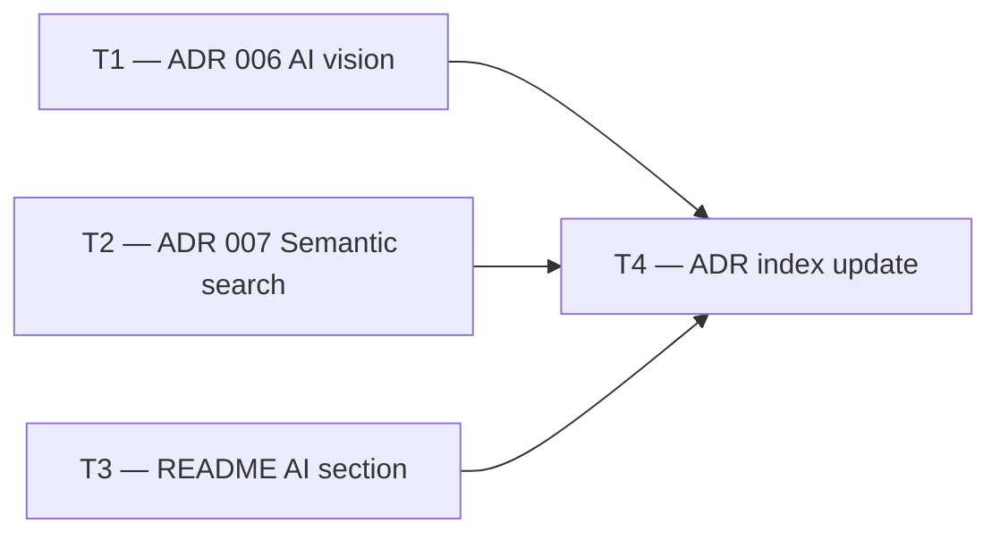

# Phase 3 — Day 34: AI documentation and ADR (task pack)

**Objective:** Document every AI architecture decision for interview storytelling, team onboarding, and future maintenance. No code changes — only documentation.

**Prerequisite:** Days 26–33 complete — all four AI features implemented and merged.

**Branch:** `feat/phase-3-ai-docs`

**References:**

- [guia-desenvolvimento-propai-os-dia-a-dia.md](../../guia-desenvolvimento-propai-os-dia-a-dia.md) — Day 34
- [ADR index](../adr/README.md)

---

## Execution order

---

## Shared conventions

| Topic | Rule |
| ----- | ---- |
| ADR numbering | Continues from 005 (object storage) → 006 vision → 007 search |
| ADR format | Follows template in `docs/adr/README.md`: Status, Date, Context, Decision, Consequences, References |
| Cost estimates | Use actual token counts from dev testing; flag assumptions clearly |
| Date | Use the actual implementation date (2026-06-13) |

---

## T1 — ADR 006: AI vision for property listings

### File

`docs/adr/006-ai-vision-listings.md`

### Do

- [ ] Status: Accepted · Date: 2026-06-13 · Context: Phase 3 Days 26–30
- [ ] Decision: Gemini Flash 2.0 + Vercel AI SDK `generateObject()` for structured listing extraction
- [ ] Architecture diagram: Browser → POST → BullMQ → Gemini worker → Redis job result → poll GET
- [ ] Model choice table: Gemini Flash vs GPT-4o Vision — cost comparison
- [ ] Output schema table: `PropertyImageAnalysis` fields (title, description, features, type, beds, baths, sqFt, condition)
- [ ] Rate limit: 10 analyses/hour/tenant (Redis sliding window) → `429` with `Retry-After`
- [ ] Security: SSRF guard via `validate-tenant-image-url.ts`
- [ ] Feature flag: `ENABLE_AI_VISION=true/false` — mock path for CI
- [ ] Cost notes: Gemini Flash $0.10/1M tokens; ~$0.001 per 10-image analysis
- [ ] Consequences: positive (time saved, structured output) + negative (latency, free tier limits)
- [ ] References: worker, queue, rate limiter, Zod schema, ADR 005 (R2)

---

## T2 — ADR 007: Semantic search with pgvector

### File

`docs/adr/007-semantic-search-pgvector.md`

### Do

- [ ] Status: Accepted · Date: 2026-06-13 · Context: Phase 3 Days 29–31
- [ ] Decision: `text-embedding-3-small` (1 536d) + pgvector `<=>` cosine distance
- [ ] Architecture diagram: publish → BullMQ worker → embed → UPDATE properties; search → embed query → cosine ORDER BY
- [ ] Model choice table: 3-small vs 3-large vs ada-002 — dimensions, cost, decision
- [ ] Endpoint spec: `GET /search/semantic` — all query params documented
- [ ] Why public route (before tenant middleware): marketplace SSR, no auth needed; RLS via `runInTenantContext`
- [ ] Relevance score formula: `(1 - (embedding <=> $v::vector))::float`
- [ ] Feature flag: `ENABLE_SEMANTIC_SEARCH=true/false`
- [ ] Cost notes: $0.02/1M tokens; 10K properties ≈ $0.04; 100K searches/month ≈ $0.20
- [ ] Consequences: positive (intent matching, hybrid filters, Neon native) + negative (backfill needed, ivfflat vs HNSW)
- [ ] References: schema, migration, worker, search query, Zod schemas, ADR 001 (RLS)

---

## T3 — README AI section

### File

`README.md`

### Do

- [ ] Add "## AI features" section before Documentation:
  - Feature table: flag · model · endpoint for all 4 AI features
  - "Enabling AI in local dev" — env vars + note about Redis dependency
  - Cost summary table: cost per operation for each feature
  - Rate limit callout: 10 analyses/hour/tenant
  - Links to ADR 006 + 007 for architecture details
- [ ] Update Documentation table: reference ADR 006 + 007

---

## T4 — ADR index update

### File

`docs/adr/README.md`

### Do

- [ ] Add rows 006 and 007 to the accepted ADR table
- [ ] Remove "006 AI workers & feature flags" from the Planned table (now superseded by the actual ADRs)

---

## Day 34 checklist

- [ ] `docs/adr/006-ai-vision-listings.md` — complete with cost table and architecture
- [ ] `docs/adr/007-semantic-search-pgvector.md` — complete with cost table and architecture
- [ ] `docs/adr/README.md` — index has rows 006 and 007
- [ ] `README.md` — AI section with feature table + cost summary visible at top of docs
- [ ] No `pnpm typecheck` needed (documentation only)

**Done criteria (from guide):** ADRs written; README AI section drafted.
