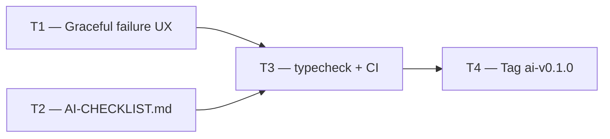

# Phase 3 — Day 35: AI buffer + tag (task pack)

**Objective:** Stabilize all four AI features, confirm graceful failure UX, and freeze Phase 3 with tag `ai-v0.1.0`.

**Prerequisite:** Days 26–34 complete — all four AI features implemented and documented.

**Branch:** `feat/phase-3-ai-stable` → merge → tag

**References:**

- [guia-desenvolvimento-propai-os-dia-a-dia.md](../../guia-desenvolvimento-propai-os-dia-a-dia.md) — Day 35
- [AI-CHECKLIST.md](../AI-CHECKLIST.md)
- [ADR 006](../adr/006-ai-vision-listings.md) · [ADR 007](../adr/007-semantic-search-pgvector.md)

---

## Execution order



---

## T1 — Handle API failures gracefully

### Do

- [x] `estimate-price-widget.tsx` — error state includes "You can still enter the price manually in the field above."
- [x] `property-ai-analyze.tsx` — failed Alert includes "You can still fill in the property details manually using the edit form."
- [ ] Verify each AI feature's failure path does NOT block the user from proceeding manually:
  - **Vision**: photo analysis fails → user navigates to edit form and types manually ✓
  - **Price estimator**: API error → price field always editable ✓
  - **Lead scoring**: 503/422 → API returns error; frontend CRM (Day 37+) will handle display ✓
  - **Semantic search**: 503 → no results shown; user can browse manually ✓

---

## T2 — AI-CHECKLIST.md 100%

### File

`docs/AI-CHECKLIST.md`

### Do

- [x] Section per feature: vision, semantic search, lead scoring, price estimation
- [x] Flag off (mock path) + flag on (real path) + failure path per feature
- [x] Cross-cutting checks: all flags off, typecheck, CI
- [x] Sign-off table at bottom
- [ ] Run through checklist locally with `ENABLE_AI_VISION=false` (all mock) — confirm no errors

---

## T3 — typecheck + CI

### Do

```bash
pnpm typecheck   # 6 packages pass
pnpm lint        # no errors
```

- [ ] Both pass on `feat/phase-3-ai-stable` before tagging

---

## T4 — Git tag ai-v0.1.0

### Do

After merging `feat/phase-3-ai-stable` → `main`:

```bash
git tag ai-v0.1.0
git push origin ai-v0.1.0
```

- [ ] GitHub Release: `ai-v0.1.0` — brief notes listing the four AI features

---

## Day 35 checklist

```bash
pnpm typecheck   # passes
pnpm lint        # passes
```

- [ ] `docs/AI-CHECKLIST.md` written and all mock-path items verifiable
- [ ] Graceful failure message visible in price estimator and photo analysis widgets
- [ ] `ai-v0.1.0` tag on GitHub

**Done criteria (from guide):** Demo flow works with `ENABLE_AI_VISION=true`.
