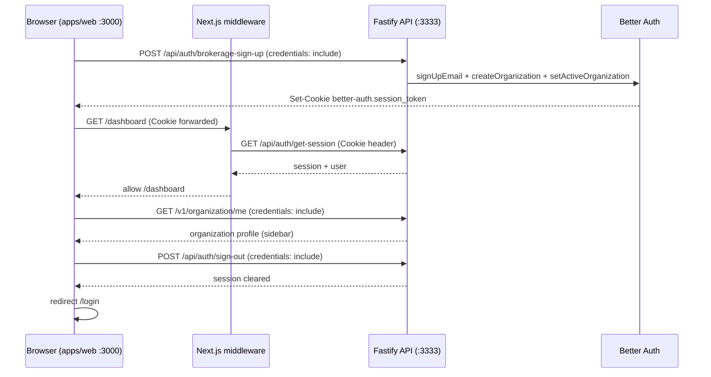

# Dashboard auth — `apps/web` (Day 19)

How the PropAI dashboard (`http://localhost:3000`) authenticates against the Fastify API (`http://localhost:3333`) using Better Auth session cookies. No Better Auth React SDK — browser `fetch` with `credentials: "include"`.

**Prerequisite:** API auth working locally (`pnpm test:api` — brokerage sign-up + sign-in + `/v1/*`).

**Related:** [api/auth-flow.md](../api/auth-flow.md) · [LOCAL-DEV.md](../LOCAL-DEV.md) · [tasks/PHASE-2-DAY-19.md](../tasks/PHASE-2-DAY-19.md)

---

## Architecture



| Layer | Responsibility |
| ----- | -------------- |
| **Auth client** (`apps/web/src/lib/auth-client.ts`) | `signInWithEmail`, `signUpBrokerage`, `getSession`, `signOut` |
| **Middleware** (`apps/web/src/middleware.ts`) | Protect `/dashboard/*`; guest redirect on `/login` / `/signup`; `/` → dashboard or login |
| **TanStack Query** | `useSessionQuery`, `useOrganizationQuery` — cached session + org profile |
| **API** | Better Auth routes under `/api/auth/*`; tenant routes under `/v1/*` |

Cookies are **HttpOnly**, **SameSite=Lax**, set on the API origin (`localhost:3333`). The dashboard on `:3000` sends them on cross-origin requests when `credentials: "include"` is set and CORS allows `http://localhost:3000`.

---

## Environment variables

Set in root `.env` (see `.env.example`). Both web and API read from the monorepo root.

| Variable | Example (local) | Used by | Purpose |
| -------- | ----------------- | ------- | ------- |
| `NEXT_PUBLIC_API_URL` | `http://localhost:3333` | Browser (`auth-client`, forms, Query) | Target for credentialed `fetch` from the dashboard |
| `API_URL` | `http://localhost:3333` | Next.js middleware (Edge) | Server-side session probe — **prefer this over public var in middleware** |
| `BETTER_AUTH_URL` | `http://localhost:3333` | API | Must match the host/port clients use for auth |
| `BETTER_AUTH_SECRET` | 32+ char secret | API | Cookie signing |
| `NEXT_PUBLIC_APP_URL` | `http://localhost:3000` | API CORS / trusted origins | Dashboard origin allowed by Better Auth |

**Staging:** point both `NEXT_PUBLIC_API_URL` and `API_URL` at the deployed API (e.g. `https://api.staging.example.com`). Add the staging web URL to API `TRUSTED_ORIGINS` (see `apps/api/src/modules/auth/better-auth.ts`).

---

## Routes

| Path | Auth | Behavior |
| ---- | ---- | -------- |
| `/` | — | Middleware → `/dashboard` or `/login` |
| `/login` | Guest | Sign in form; authenticated users → `/dashboard` |
| `/signup` | Guest | Brokerage sign-up; authenticated users → `/dashboard` |
| `/dashboard` | Required | Sidebar shell + org name from `GET /v1/organization/me` |
| `/properties` | Required | Properties list from `GET /v1/properties` (Day 22) |

---

## End-to-end flow

1. **Sign up** — `POST /api/auth/brokerage-sign-up` with `{ email, password, name, organizationName }` → `201` + session cookie + `activeOrganizationId`.
2. **Dashboard** — redirect to `/dashboard`; sidebar loads org name via `GET /v1/organization/me`.
3. **Refresh** — hard refresh on `/dashboard`; middleware re-validates session via API; user stays logged in.
4. **Sign out** — `POST /api/auth/sign-out` → invalidate client queries → redirect `/login`.
5. **Sign in** — existing user via `/login` → same cookie flow → `/dashboard`.

---

## Manual QA — local

**Dev credentials:** There is **no fixed login/password** in the repo. Create an account at http://localhost:3000/signup (or use credentials you created earlier). Optional `pnpm db:seed-dev` seeds DB rows only — **not** a Better Auth password.

**If sign-up fails:**
- **Email already registered** → use `/login` with the same email, or pick a new email.
- **Organization slug already taken** → change the brokerage name (e.g. add your city).
- **Generic error** → confirm API is up (`curl http://localhost:3333/health`) and `NEXT_PUBLIC_API_URL=http://localhost:3333` in `.env`; restart `pnpm dev` after editing `.env`.

**Setup:**

```bash
pnpm install
pnpm docker:up
pnpm db:migrate
pnpm dev
```

Ensure `.env` has `BETTER_AUTH_SECRET` (≥ 32 chars), `BETTER_AUTH_URL=http://localhost:3333`, `API_URL` and `NEXT_PUBLIC_API_URL` both `http://localhost:3333`.

**Checklist:**

- [ ] Open http://localhost:3000/signup — create a new brokerage (unique email + org name)
- [ ] Lands on http://localhost:3000/dashboard with sidebar and brokerage name in header
- [ ] Hard refresh `/dashboard` — still authenticated
- [ ] Open incognito → http://localhost:3000/dashboard — redirects to `/login`
- [ ] Sign in with same credentials — lands on `/dashboard`
- [ ] Click **Sign out** — returns to `/login`; `/dashboard` redirects to login again
- [ ] Authenticated user visiting `/login` or `/signup` — redirects to `/dashboard`

**Quick API sanity (optional):**

```bash
curl -s http://localhost:3333/health
curl -s http://localhost:3333/ready
pnpm test:api
```

---

## Manual QA — staging API

Use when the API is deployed but you run the web app locally (or staging web + staging API).

1. Set in `.env`:
   ```bash
   NEXT_PUBLIC_API_URL=https://your-staging-api.example.com
   API_URL=https://your-staging-api.example.com
   ```
2. Ensure staging API has:
   - `BETTER_AUTH_URL` matching its public URL
   - `BETTER_AUTH_SECRET` set (not the dev default)
   - Your web origin in trusted origins / CORS (e.g. `http://localhost:3000` or staging web URL)
3. Restart `pnpm --filter @propai/web dev` after env changes.
4. Repeat the local checklist against staging (sign-up may require unique emails; watch for `409` slug/email conflicts).

**Note:** Cross-site cookies in production/staging may require `Secure` cookies and HTTPS on both origins — local HTTP is fine for `:3000` → `:3333`.

---

## Troubleshooting

| Symptom | Likely cause | Fix |
| ------- | ------------ | --- |
| `/login` or `/signup` **500** — `Can't resolve '@propai/shared'` | `@propai/shared` `dist/` missing; dev started before build | Restart `pnpm dev` (Turbo runs `@propai/shared` build first). Or: `pnpm --filter @propai/shared build` |
| Login succeeds but `/dashboard` redirects to `/login` | Middleware session fetch failed; cookies not forwarded | Confirm `API_URL` in `.env`; middleware calls `GET ${API_URL}/api/auth/get-session` with `Cookie` header |
| CORS error in browser console | Web origin not trusted | API allows `http://localhost:3000`; add staging web URL to `TRUSTED_ORIGINS` |
| `401` after sign-up on `/v1/organization/me` | Cookie not sent | All API fetches must use `credentials: "include"` (already in `apiFetch`) |
| Session null / invalid cookie | `BETTER_AUTH_URL` mismatch | Must equal the **API** origin (e.g. `http://localhost:3333`), **not** the dashboard (`:3000`) |
| Sign-up `500` / DB errors | Postgres down or migrations missing | `pnpm docker:up && pnpm db:migrate` |
| Sign-up `409` | Email or org slug taken | Use new email and organization name |
| `403` on `/v1/organization/me` | No active organization | Use brokerage sign-up (sets `activeOrganizationId`), not plain email sign-up |
| `NEXT_PUBLIC_API_URL is not set` (dev) | Missing env | Copy `.env.example` → `.env`; set `NEXT_PUBLIC_API_URL=http://localhost:3333`. Restart `pnpm dev` after editing — Next inlines `NEXT_PUBLIC_*` at dev start |
| Missing / weak `BETTER_AUTH_SECRET` | API rejects or unstable sessions | Generate 32+ chars: `openssl rand -base64 32` |
| Cookies blocked | Browser privacy / third-party rules | Use same-site dev setup (`localhost:3000` + `localhost:3333`); avoid mixing IP vs hostname |

---

## Key source files

| File | Role |
| ---- | ---- |
| `apps/web/src/lib/auth-client.ts` | Auth API calls |
| `apps/web/src/lib/api-client.ts` | Credentialed fetch helper |
| `apps/web/src/middleware.ts` | Route protection |
| `apps/web/src/modules/auth/components/login-form.tsx` | Login UI |
| `apps/web/src/modules/auth/components/sign-up-form.tsx` | Brokerage sign-up UI |
| `apps/web/src/app/(dashboard)/layout.tsx` | Authenticated shell |
| `apps/web/src/components/app-sidebar.tsx` | Nav + org name |
| `apps/web/src/components/user-nav.tsx` | Sign out |

---

## Related modules

- [properties-module.md](./properties-module.md) — Day 22 list page (`GET /v1/properties`)

## Out of scope (Day 19)

- Property detail, filters, and forms (Day 23+)
- Invite accept UI
- E2E Playwright login (optional later)
- Next.js rewrite proxy for `/api/auth` (only if cookie issues persist)
